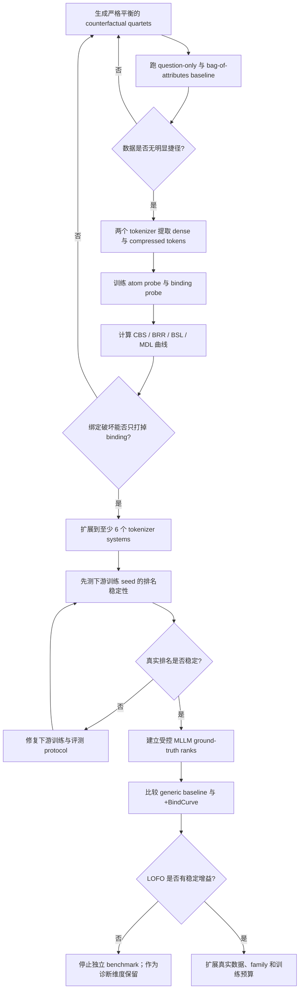

# BindCurve：视觉 Token 压缩下的预算化绑定可迁移性与 MLLM 退化预测

> 工作定位：不重新提出 binding benchmark，也不泛称首次做低成本 VLM model selection；研究在视觉 token budget \(K\) 与少量监督预算 \(b\) 下，绑定可迁移性曲线能否预测同一视觉栈的压缩退化，并为受控 MLLM 排名提供增量信号。

## 0. 先给结论

这个方向值得做一个严格的 pilot，但目前不能假设它一定能可靠预测下游 MLLM。

更准确的判断是：

- 它很可能能测出一种真实、重要且可解释的视觉失败模式：模型看见了所有属性，却把属性分配给了错误实体。
- 它有希望预测固定 LLM、connector、训练数据和训练配方时，不同视觉 tokenizer 在绑定密集型任务上的排名。
- 它单独预测任意公开 MLLM 的综合排名，成功概率较低。综合排名还受 OCR、语言知识、LLM 推理、训练数据、connector 和指令遵循影响。
- 它最现实的角色可能不是一个万能总分，而是一个“失败风险门”：绑定已经在 tokenization 阶段丢失的候选，可以被便宜地提前淘汰；绑定尚存的候选，再由 AC score、generic learnability 等指标进一步排序。

因此，这个项目真正要检验的是：

> 在控制其他因素后，绑定保留曲线是否提供 generic representation learnability 之外的新增排名信号？

如果答案是否定的，就应该停止把它发展成独立 benchmark，而不是继续加工指标。

按可信度从高到低，预测目标应排成：

1. **主目标**：同一个 encoder 和 LLM，只改变 compressor 或 \(K\)，预测下游性能下降 \(\Delta Y\)。
2. **次目标**：固定完整 MLLM 配方时，预测不同视觉 tokenization systems 在绑定密集型任务上的排名。
3. **暂不主张**：预测任意公开 MLLM 的综合排行榜。

第一项目标固定了大部分预训练和架构混杂，是最值得先验证、也最可能得到可靠结论的目标。

---

## 1. 新颖性边界：哪些已经有人做了

### 1.1 “测量实体—属性绑定”本身已经不是空白

ICML 2026 工作 [Formalizing the Binding Problem](https://arxiv.org/abs/2606.03976) 已经：

- 从信息论角度定义 feature–object binding；
- 在冻结 ViT 表征上训练 probe；
- 比较 `[CLS]`、空间 token 和不同 probe 结构；
- 使用 ColorShape、CLEVR、遮挡和自然图像属性数据；
- 测量模型表征中有多少绑定信息。

其[官方代码仓库](https://github.com/KordingLab/formalizing-the-binding-problem)也已经包含数据、activation cache 和多种 probe。

所以本项目不能声称：

- 首次提出实体—属性绑定问题；
- 首次用 probe 测量绑定信息；
- 首次构造颜色—形状绑定数据；
- 首次发现空间 token 比全局 token 更能保留绑定。

### 1.2 “绑定是 VLM/MLLM 痛点”也已有直接证据

- [Does CLIP Bind Concepts?](https://aclanthology.org/2024.findings-eacl.101/) 已用单对象、双对象和关系型合成数据 probe CLIP，发现一旦任务需要结构敏感的 concept binding，性能明显下降。
- [Understanding the Limits of Vision Language Models Through the Lens of the Binding Problem](https://proceedings.neurips.cc/paper_files/paper/2024/hash/cdcc6d47c1627350014a3076112ab824-Abstract-Conference.html) 已从 binding problem 解释多对象计数、定位和视觉类比等失败。
- [MMVP](https://arxiv.org/abs/2401.06209) 已发现 CLIP-blind image pairs，并观察到视觉 encoder 的盲点与下游 MLLM 失败具有相关性。

所以“MLLM 会发生绑定错误”也不能作为新贡献。BindCurve 必须进一步证明：**有限训练下的绑定保留曲线，对 token compression 退化或下游排名具有尚未被 generic 指标覆盖的预测价值。**

### 1.3 组合性输出评测也已有大量工作

- [Winoground](https://arxiv.org/abs/2204.03162) 用词汇完全相同但组合关系不同的图文对测试组合理解。
- [ARO](https://arxiv.org/abs/2210.01936) 测试 attribution、relation 和 word order。
- [CREPE](https://arxiv.org/abs/2212.07796) 测试 systematicity 和 productivity。
- [SugarCrepe](https://arxiv.org/abs/2306.14610) 说明组合 benchmark 很容易被语言或负样本偏差“破解”，并构造了更难利用捷径的 hard negatives。
- [MMComposition](https://arxiv.org/abs/2410.09733) 将评测扩展到更复杂的对象交互、计数和组合。

这些工作主要测完整 VLM/MLLM 的输出是否具有组合性，不直接回答视觉 tokenization bottleneck 在哪里。

### 1.4 视觉 token 压缩评测也已有邻近工作

[VTC-Bench](https://aclanthology.org/2026.acl-long.195/) 指出：通用 MLLM benchmark 中有大量对 token 压缩不敏感的简单样本，并用 downsampling 筛选压缩敏感样本。

它与本项目的区别应该明确写成：

- VTC-Bench 从现有下游题目中筛选“压缩敏感样本”，需要运行完整 MLLM；
- BindCurve 在冻结视觉 token 上测“原子特征仍在、但绑定关系丢失”的特定机制，并尝试预测尚未完整训练的 MLLM。

VTC-Bench 的 downsampling difficulty filter 仍应作为 baseline 和数据选择控制；不能把简单的 \(K\) 曲线本身当作贡献。

### 1.5 “训练前预测 VLM encoder 排名”也已有强工作

CVPR 2026 Highlight 工作 [Rethinking Model Selection in VLM Through the Lens of Gromov-Wasserstein Distance](https://arxiv.org/abs/2605.01325) 已在 19 个 vision encoders 和 60 次以上完整 VLM 训练上，使用 inference-only 的 Gromov–Wasserstein structural distance 预测最终 VLM 表现。

这意味着本项目也不能声称：

- 首次低成本预测 vision encoder / VLM 排名；
- 首次用 frozen representation 选择视觉 encoder；
- 只要比零样本分类更相关就足以构成贡献。

GW、AC、LogME、TransRate 和 PACTran 都必须作为强 baseline。BindCurve 能守住的边界是：

> task-conditioned、binding-specific、同时显式研究 token budget 与少量适配监督预算，并优先预测同一视觉栈的 compression-induced performance drop。

### 1.6 本项目可能成立的新主线

本项目不重新发明 binding probe，而是研究四个尚需验证的连接：

1. **绑定选择性损失**：tokenizer 是否保留了颜色、形状、数字等原子信息，却优先丢失了它们属于哪个实体的信息？
2. **三维崩塌曲面**：这种损失如何随视觉 token budget \(K\)、任务难度 \(d\) 和 probe 训练预算 \(b\) 变化？
3. **压缩退化预测**：同一个 encoder 只改变 \(K\) 或 compressor 时，绑定曲线下降能否预测完整 MLLM 的下游下降？
4. **下游增量预测**：上述曲线能否在 GW、AC score、generic learnability、参数量和 FLOPs 之后，继续改善未见 tokenizer family 的任务条件排名预测？

如果成功，最稳妥的贡献句应是：

> We study the cost–fidelity frontier of task-conditional transferability estimation under visual-token compression, and show that binding-selective information loss incrementally predicts controlled MLLM degradation on binding-intensive tasks.

而不是：

> We are the first to measure binding in visual representations.

---

## 2. 到底什么叫“绑定信息”

考虑一张图：

```text
红色圆形    蓝色方块
```

视觉表示可能保留了以下原子事实：

```text
存在红色
存在蓝色
存在圆形
存在方块
```

却没有可靠保留：

```text
红色属于圆形
蓝色属于方块
```

于是它可能把场景错误地重组成：

```text
蓝色圆形    红色方块
```

这就是本项目关心的绑定错误。需要严格区分四个层次：

| 层次 | 问题 | 示例 |
|---|---|---|
| Atom visibility | 单个实体或属性是否存在 | 图中是否有红色？ |
| Binding availability | token 中是否仍含“谁属于谁” | 圆形是什么颜色？ |
| Binding accessibility | 少量监督能否将绑定读出来 | 需要多少 quartet 才学会回答？ |
| MLLM use | connector 和 LLM 是否实际使用了绑定 | 完整 MLLM 能否稳定回答？ |

BindCurve 主要测中间两层，并用下游训练实验验证它们是否能预测最后一层。

---

## 3. 为什么它可能预测下游，又为什么不保证

### 3.1 它为什么可能有效

把一个受控 MLLM 写成：

```text
image
  -> dense visual representation
  -> tokenizer / compressor at budget K
  -> connector
  -> LLM
  -> answer
```

对应记号：

\[
X \xrightarrow{E} Z_{\mathrm{dense}}
\xrightarrow{C_K} Z_K
\xrightarrow{P} H
\xrightarrow{L} \hat Y.
\]

如果答案 \(Y\) 依赖绑定变量 \(\Pi\)，而视觉 tokenizer 输出 \(Z_K\) 已不包含关于 \(\Pi\) 的信息，那么冻结 tokenizer 后，后面的 connector 和 LLM 无法凭空恢复该信息。

从信息论上看，低绑定信息是一个必要性警报。Fano 不等式把条件熵与最低分类错误率联系起来，因此当 \(I(Y;Z_K)\) 很低时，任何只读取 \(Z_K\) 的下游模型都存在不可避免的错误下界。

### 3.2 它为什么不是充分条件

即使绑定信息还在，也不保证完整 MLLM 一定使用得好：

- 信息可能以非常纠缠的形式存在，需要大量训练才能读出；
- connector 容量不足；
- LLM 不擅长多实体推理；
- 下游训练数据没有教模型使用该信息；
- prompt 和答案空间引入语言偏差；
- 完整训练时解冻视觉 encoder，可能改变原有排名；
- 综合 benchmark 可能主要考察 OCR、知识或语言能力，而不是绑定。

所以理论上更合理的预测形态是：

```text
低 BindCurve  -> 强烈提示下游绑定任务会差
高 BindCurve  -> 只是通过必要条件，最终结果还由其他因素决定
```

这意味着 BindCurve 可能更适合作为一个非线性的“风险门”，而不是单独线性排序所有模型。

一个可检验的组合预测器是：

\[
\widehat Y_i
=
\widehat Y_i^{\mathrm{generic}}
-
\lambda
\max(0,\tau-\mathrm{BindRetention}_i),
\]

其中 \(\widehat Y_i^{\mathrm{generic}}\) 来自已有 representation/AC 类分数，第二项只惩罚发生明显绑定崩塌的 tokenizer。

---

## 4. 正式问题定义

令一个场景由以下变量生成：

\[
X=R(E,F,\Pi,R_s,N,d).
\]

其中：

- \(E\)：实体集合；
- \(F\)：场景中出现的原子 feature inventory，如颜色、形状、纹理、数字；
- \(\Pi\)：实体与属性或角色之间的分配关系；
- \(R_s\)：实体间空间或语义关系；
- \(N\)：背景、亮度、压缩、纹理等 nuisance；
- \(d\)：难度；
- \(R\)：renderer。

第 \(m\) 个视觉 tokenizer 在 token budget \(K\) 下输出：

\[
Z_{m,K}=T_{m,K}(X).
\]

用训练预算 \(b\) 训练一个容量受控的 probe：

\[
q_{\theta_{m,K,b}}(Y\mid Z_{m,K},Q).
\]

得到绑定曲面：

\[
\mathrm{BindCurve}_m(K,d,b).
\]

最终目标不是只比较这个曲面，而是预测完整受控 MLLM 在下游训练预算 \(B\) 和任务 \(t\) 上的表现：

\[
Y^{\mathrm{MLLM}}_{m,K,B,t}.
\]

---

## 5. 数据核心：不是 pair，而是反事实 quartet

### 5.1 为什么需要 quartet

只比较一对图像，容易混合以下因素：

- 绑定真的改变了；
- 背景、亮度或压缩也改变了；
- 图像整体像素差异变大；
- 答案标签分布出现捷径。

所以最小单位采用 \(2\times2\) 因子设计：

\[
\begin{aligned}
x_{00}&=R(E,F,\Pi,R_s,N_0,d),\\
x_{01}&=R(E,F,\Pi,R_s,N_1,d),\\
x_{10}&=R(E,F,g(\Pi,R_s),N_0,d),\\
x_{11}&=R(E,F,g(\Pi,R_s),N_1,d).
\end{aligned}
\]

其中：

- \(g\) 是 binding intervention；
- \(N_0\rightarrow N_1\) 是 nuisance intervention；
- binding intervention 改变答案；
- nuisance intervention 不改变答案。

答案满足：

\[
y_{01}=y_{00},\qquad
y_{11}=y_{10},\qquad
y_{10}=\tau_g(y_{00}).
\]

### 5.2 属性绑定例子

固定实体为“圆形”和“方块”，固定 feature inventory 为“红色”和“蓝色”：

| 图像 | 圆形 | 方块 | 背景 | 问题 | 答案 |
|---|---|---|---|---|---|
| \(x_{00}\) | 红色 | 蓝色 | 干净 | 圆形是什么颜色？ | 红色 |
| \(x_{01}\) | 红色 | 蓝色 | 有纹理 | 圆形是什么颜色？ | 红色 |
| \(x_{10}\) | 蓝色 | 红色 | 干净 | 圆形是什么颜色？ | 蓝色 |
| \(x_{11}\) | 蓝色 | 红色 | 有纹理 | 圆形是什么颜色？ | 蓝色 |

四张图始终包含：

```text
一个圆形、一个方块、一个红色、一个蓝色
```

所以只会识别“图中有什么”的 bag-of-attributes 表示无法解题。

### 5.3 数字—实体绑定例子

```text
x00: 圆形上写 3，方块上写 7
x10: 圆形上写 7，方块上写 3
q:   圆形上写的是哪个数字？
```

它同时测试：

- 小目标/文字是否可见；
- 数字是否绑定到正确对象；
- tokenizer 压缩后局部证据是否混入别的实体。

这类任务可能比单纯颜色绑定更接近实际 MLLM 痛点。

### 5.4 关系绑定例子

使用三个带稳定身份的实体，例如圆形、方块、三角形：

```text
x00: 圆形在三角形左侧，方块在右侧
x10: 方块在三角形左侧，圆形在右侧
q:   哪个形状在三角形左侧？
```

对象集合和位置集合保持相同，只交换“哪个对象占据哪个关系角色”。

### 5.5 第一版任务范围

不要第一版同时做完所有组合推理。建议：

```text
Phase 1:
  color <-> shape binding
  digit <-> shape binding

Phase 2:
  entity <-> spatial role binding

Phase 3:
  two-hop reference / relation composition
```

颜色绑定适合验证构念，数字绑定更可能区分 tokenizer，空间关系适合验证是否能迁移到 MLLM。

---

## 6. 难度轴如何设计

难度不能只写“easy / hard”，而要由可复现参数生成。

建议至少记录：

```text
n_entities
object_size_px
minimum_object_distance
occlusion_ratio
number_of_distractors
feature_sharing_degree
background_complexity
contrast
blur_sigma
jpeg_quality
renderer_family
```

第一版可以定义三档：

| 难度 | 实体数 | 遮挡 | 干扰物 | 目标尺寸 | feature sharing |
|---|---:|---:|---:|---:|---:|
| Easy | 2 | 0 | 0 | 大 | 低 |
| Medium | 3–4 | 0–10% | 2 | 中 | 中 |
| Hard | 4–6 | 10–30% | 4–8 | 小 | 高 |

但分析时应保留连续参数，不能只保留三档标签。

---

## 7. 数据拆分：必须防止 probe 记组合

随机 image split 不够。至少同时报告：

### 7.1 IID split

检查实现和基本上限。

### 7.2 Held-out composition

例如：

```text
train:
  red circle
  blue square

test:
  blue circle
  red square
```

训练和测试的原子属性都见过，但具体绑定组合未见过。

### 7.3 Held-out intervention

训练只见单次属性 swap，测试多个 swap 的组合或新的实体置换。

### 7.4 Held-out cardinality

训练 2–3 个实体，测试 4–6 个实体。

### 7.5 Held-out renderer

训练扁平矢量图，测试：

- 新字体；
- 新材质；
- 新背景；
- 不同抗锯齿与渲染引擎；
- 半合成或自然图像。

真正的主结果应来自 held-out composition 和 held-out renderer，而不是 IID split。

---

## 8. Token budget 和表示表面

### 8.1 先区分 pipeline 中的不同表面

对每个 tokenizer 必须显式标记测的是哪一层：

```text
dense encoder spatial tokens
compressed / resampled tokens
pre-quantization latents
post-quantization embeddings
LLM-projected visual tokens
```

不同表面不能混在同一张排行榜中而不加说明。

推荐把“视觉 tokenization system”定义为：

```text
encoder + selected layer + compressor/resampler + quantizer + token budget
```

而不是只写 encoder 名称。

### 8.2 两条 token-budget track

#### Native track

使用候选系统实际送入 MLLM 的 token 数和压缩方式。

这条 track 最接近真实下游预测。

#### Controlled-\(K\) track

在相同预算下比较：

\[
K\in\{16,32,64,128,\mathrm{native}\}.
\]

这条 track 用来研究曲线形态，但需要警惕：统一的 pooling/drop/merge 操作可能偏向某些架构。

所以：

- 主要预测结果使用 native operating point；
- controlled-\(K\) 用于机制分析和同 family 内比较；
- 同一 backbone 的多个 \(K\) 是重复测量，不能当作多个独立 tokenizer。

### 8.3 稠密参照点

对有明确压缩阶段的系统，同时缓存：

\[
Z_{\mathrm{dense}},\qquad Z_K.
\]

这样可以测量：

> 某个 encoder 原本含有多少绑定信息，以及 compressor 单独损失了多少。

这比只比较不同模型的绝对分数更接近因果解释。

---

## 9. Probe 设计：最少训练，但不能完全不训练

### 9.1 为什么需要小量训练

裸 token distance 无法说明表示变化是否以一种可读、可组合的形式编码了绑定。完全无训练的分数很容易被：

- 表征尺度；
- token 数量；
- hidden dimension；
- normalization；
- 不同模型的几何结构

所支配。

因此，本方案接受少量 probe 训练，但将“训多少”显式变成实验轴。

### 9.2 两种互补 probe

#### Binding-only diagnostic probe

给 probe 提供：

- visual tokens \(Z_K\)；
- query entity；
- 当前场景的 feature inventory \(F\)。

例如明确告诉 probe“本图颜色集合是红、蓝”，再问“圆形绑定哪个颜色”。这样它不必重新检测颜色是否存在，主要需要恢复 assignment。

这是一条偏 oracle 的机制诊断。

#### End-to-end binding probe

只提供：

- visual tokens \(Z_K\)；
- 问题 \(Q\)。

它必须同时识别原子 feature、定位实体并恢复绑定，更接近小型下游 readout。

两者之差可以帮助定位：

```text
原子识别失败
vs
绑定本身失败
```

### 9.3 公平的 probe 结构

一个可落地的默认方案：

```text
token features [K, D_m]
  -> parameter-free LayerNorm
  -> frozen Gaussian/JL projection to 256 dims
  -> one learned query cross-attention block
  -> linear answer head
```

要求：

- 所有 tokenizer 使用同一训练代码和超参数；
- frozen projection 使用 3 个固定随机种子；
- 不为单个 tokenizer 单独选学习率；
- 主结果固定 probe 容量；
- 另用 linear、quadratic 或更强 attention probe 做容量敏感性分析。

使用 frozen projection 的目的是避免 hidden dimension 越大就自动拥有更多 probe 参数。它也可能引入投影噪声，所以需要多个固定 projection seeds，并把 native-dimension probe 作为上限检查。

### 9.4 训练预算

建议：

\[
b\in\{16,64,256,1024,4096\}\ \text{quartets}.
\]

每个点至少 3 个训练种子。

预算单位必须是 quartet，而不是 image 数。一个 quartet 有 4 张图，避免不同实验把配对信息拆散。

---

## 10. 核心指标

### 10.1 原子可见性

训练一个 matched-capacity multi-label head，预测图中出现了哪些颜色、形状或数字：

\[
\mathrm{AtomAcc}_{m,K,d}(b).
\]

这个分数只问“有什么”，不问“属于谁”。

为了与 binding retention 使用同一尺度，也计算：

\[
\widehat I_{\mathrm{atom}}(Z_K;b)
=
H(Y_{\mathrm{atom}})
-
\mathrm{CE}_{\mathrm{test}}
\left(q_{\theta_b}(Y_{\mathrm{atom}}\mid Z_K)\right),
\]

\[
\widehat A_{m,K,d}(b)
=
\frac{\widehat I_{\mathrm{atom}}(Z_K;b)}
{H(Y_{\mathrm{atom}})}.
\]

如果使用多个独立 multi-label 原子标签，对每类标签分别计算归一化信息后再做 macro average，避免标签数较多的 feature type 自动占更大权重。

### 10.2 Binding flip accuracy

对原图和 binding-swap 图，要求答案按已知规则翻转：

\[
\mathrm{FlipAcc}
=
\frac1N
\sum_i
\mathbf 1[
\hat y(x_{00}^{(i)})=y_{00}^{(i)}
\land
\hat y(x_{10}^{(i)})=y_{10}^{(i)}
].
\]

### 10.3 Nuisance stability

\[
\mathrm{NuisanceStability}
=
\frac1N
\sum_i
\mathbf 1[
\hat y(x_{00}^{(i)})=\hat y(x_{01}^{(i)})
\land
\hat y(x_{10}^{(i)})=\hat y(x_{11}^{(i)})
].
\]

### 10.4 Strict quartet accuracy

\[
\mathrm{CBS}_{\mathrm{strict}}
=
\frac1N\sum_i
\mathbf 1[
\hat y_{00}=y_{00},
\hat y_{01}=y_{00},
\hat y_{10}=y_{10},
\hat y_{11}=y_{10}
].
\]

只有四张图全部满足干预规律，quartet 才计为正确。

### 10.5 Counterfactual margin

原答案为 \(a\)，swap 后答案为 \(b\)，定义：

\[
M_i
=
\frac12\left[
s(a,z_{00})-s(b,z_{00})
+
s(b,z_{10})-s(a,z_{10})
\right].
\]

它要求模型在 swap 前后同时向正确方向改变置信度。

### 10.6 可访问绑定信息

对 query target \(Y_{\mathrm{bind}}\)，用测试交叉熵近似剩余不确定性：

\[
\widehat I_{\mathrm{bind}}(Z_K;b)
=
H(Y_{\mathrm{bind}}\mid F)
-
\mathrm{CE}_{\mathrm{test}}
\left(q_{\theta_b}(Y_{\mathrm{bind}}\mid Z_K,Q,F)\right).
\]

为了跨任务比较，归一化为：

\[
\widehat B_{m,K,d}(b)
=
\frac{\widehat I_{\mathrm{bind}}(Z_K;b)}
{H(Y_{\mathrm{bind}}\mid F)}.
\]

主分析保留未裁剪值；画图时可以裁剪到 \([0,1]\)。

这不是“表征中真实 mutual information”的无偏估计，而是给定 probe family 和训练预算时的可访问下界。

这一信息论写法直接借鉴并扩展 [Formalizing the Binding Problem](https://arxiv.org/abs/2606.03976) 的 conditional binding diagnostic。它在本项目中应被视为 borrowed primitive / strong baseline；本项目新增的研究对象是 \(K\times d\times b\) 曲面、压缩前后保留率和下游预测，而不是该 binding 定义本身。

### 10.7 Binding retention

以同一系统的 dense/native 参照表示为分母：

\[
\mathrm{BRR}_{m}(K,d,b)
=
\frac{\max(0,\widehat B_{m,K,d}(b))}
{\max(0,\widehat B_{m,\mathrm{dense},d}(b))+\epsilon}.
\]

BRR 是 Binding Retention Ratio。

类似地定义 Atom Retention Ratio：

\[
\mathrm{ARR}_{m}(K,d,b)
=
\frac{\max(0,\widehat A_{m,K,d}(b))}
{\max(0,\widehat A_{m,\mathrm{dense},d}(b))+\epsilon}.
\]

### 10.8 绑定选择性损失

\[
\mathrm{BSL}_{m}(K,d,b)
=
\mathrm{ARR}_{m}(K,d,b)
-
\mathrm{BRR}_{m}(K,d,b).
\]

解释：

- \(\mathrm{BSL}\approx0\)：原子与绑定同步保留或同步丢失；
- \(\mathrm{BSL}>0\)：原子仍在，但绑定被选择性破坏；
- \(\mathrm{BSL}<0\)：需要检查任务难度、probe 或估计噪声。

这可能是本项目最有解释力的核心量。

### 10.9 \(K90_{\mathrm{bind}}\)

\[
K90_{\mathrm{bind}}
=
\min\{K:\mathrm{BRR}(K)\ge0.9\}.
\]

它表示保留 90% dense binding information 所需的最小视觉 token 数。

### 10.10 训练效率：MDL / prequential coding

仅看最终 probe accuracy 会忽略“需要多少监督才能读出来”。可以采用 [Information-Theoretic Probing with Minimum Description Length](https://arxiv.org/abs/2003.12298) 的 online coding 思路：

\[
L_{\mathrm{online}}
=
t_1\log |\mathcal Y|
-
\sum_{j=1}^{S-1}
\log_2 p_{\theta(D_{1:t_j})}
\left(y_{t_j:t_{j+1}}\mid z_{t_j:t_{j+1}}\right).
\]

相同准确率下：

- codelength 更短，说明绑定更容易从表示中学出；
- codelength 更长，说明信息可能存在但高度纠缠。

这能把老师提出的“到底训多少才够”变成一个正式量，而不仅是随意选 1k 样本。

---

## 11. 不要过早压成一个总分

第一版应该输出 profile：

```text
AtomAcc(K, d, b)
Binding-only B(K, d, b)
End-to-end CBS_strict(K, d, b)
BRR(K, d, b)
BSL(K, d, b)
K90_bind
online MDL
nuisance stability
```

只有在足够多 tokenizer 上验证后，才学习一个小型 rank predictor。

建议首先观察三种曲线形态：

| 曲线形态 | 解释 | 下游假设 |
|---|---|---|
| 小 \(b\) 就高，低 \(K\) 仍稳定 | 绑定清晰且抗压缩 | 小数据 MLLM 也应较好 |
| 小 \(b\) 低，大 \(b\) 变高 | 绑定存在但难读取 | 更多 connector/MLLM 训练可补偿 |
| 任意 \(b\) 都低，且 ARR 高 | 典型绑定选择性崩塌 | 增加下游训练也难完全恢复 |

---

## 12. 必须做的构念有效性检查

### 12.1 无视觉 baseline

question-only probe 和固定多数答案必须接近 chance。

### 12.2 Bag-of-attributes baseline

只给 feature inventory、不提供 token assignment 的模型必须无法解答 binding query。

### 12.3 绑定破坏阳性对照

人为破坏对象间 token assignment，同时尽量保留全局 token multiset，例如：

- 在有空间坐标的 patch token 上交换两个对象区域；
- 对 matched scenes 交换对象局部 token；
- 移除或打乱位置索引；
- 将空间 token 强制 mean pool 成一个全局 token。

一个合格指标应表现为：

```text
AtomAcc 下降很小
Binding score 明显下降
```

建议预注册：

- AtomAcc 下降不超过 5 个百分点；
- strict binding accuracy 下降至少 15 个百分点。

若做不到，当前指标可能仍在测 generic representation quality。

### 12.4 组合外泛化

主结果必须在 unseen composition / unseen renderer 上高于 chance，否则 probe 可能只记住训练组合。

### 12.5 Probe 容量敏感性

如果换一个 probe 容量就使 tokenizer 排名大幅翻转，需要同时报告：

- linear-accessible binding；
- nonlinear-recoverable binding；
- 由两者构成的区间。

此时不应发布单一确定排名。

---

## 13. 下游 MLLM 的“真实排名”怎么获得

便宜 proxy 要被证明有效，第一次仍然必须为一批 tokenizer 做昂贵的完整训练，建立 ground truth。

### 13.1 第一阶段只做受控排名

固定：

- 同一个 LLM checkpoint；
- 同一种 connector；
- 同一份训练数据和顺序；
- 同一 optimizer、LR、batch size 和训练步数；
- 同一 prompt 和答案解析；
- 同一输入分辨率与 token-budget protocol；
- 同样冻结或解冻哪些模块。

只替换：

```text
visual tokenizer system
```

否则无法判断 BindCurve 预测的是 tokenizer，还是 LLM/数据规模。

### 13.2 两个推荐的下游训练 track

#### Track A：冻结视觉 tokenizer 和 LLM

只训练统一 connector。

优点：

- 成本低；
- 容易归因；
- 与 BindCurve 的 readout accessibility 最接近。

缺点：

- 不完全代表现代 MLLM 的完整训练。

#### Track B：冻结视觉 tokenizer，训练 connector + 固定 LoRA

优点：

- 更接近实际 MLLM adaptation；
- 可测试 LLM 训练是否能补偿难读取的绑定。

第一篇工作建议以 Track A 为主，Track B 做验证。

### 13.3 下游训练数据必须独立

下游 MLLM 不能直接用 BindCurve quartet 训练，否则相关性可能只是训练—评测任务重合。

要求：

- 不共享图像；
- 不共享 renderer seed；
- 不共享问句模板；
- 最好不共享 renderer family；
- synthetic proxy 至少要预测一个真实图像或人工策划 benchmark。

### 13.4 下游评测分组

#### Binding-heavy targets

可考虑：

- GQA 中 attribute / relation / relational query 子集；
- Winoground，使用强制二选一或候选答案 log-likelihood；
- SugarCrepe 的 swap attribute / swap object / replace relation；
- MMComposition 中对象交互和复杂组合子集；
- 自建 held-out renderer 的属性、数字和空间绑定题。

#### 非绑定 control targets

至少包括：

- 单对象类别或属性存在性；
- 主要依赖语言知识的题；
- 不需要区分“谁属于谁”的简单视觉题。

BindCurve 应该对 binding-heavy targets 预测更强。如果它对所有任务同样相关，它可能只是模型规模或 generic quality 的代理。

---

## 14. 先测“真实排名本身是否稳定”

这是容易被忽略但非常重要的一步。

对每个下游训练 recipe 使用至少两个随机种子，计算不同 seed 得到的 tokenizer 排名之间的 Kendall：

\[
\tau_{\mathrm{seed}}.
\]

如果下游排名本身随 seed 大幅变化，那么任何 cheap benchmark 都不可能稳定预测它。

建议：

- \(\tau_{\mathrm{seed}}\ge0.7\)：可以研究精细排序；
- \(0.5\le\tau_{\mathrm{seed}}<0.7\)：更适合预测 top/bottom 分组；
- \(\tau_{\mathrm{seed}}<0.5\)：先修复下游训练 recipe，暂不研究 proxy。

可以把 proxy 达到的相关性除以 seed reliability ceiling，报告它解释了多少可预测排名。

---

## 15. 排名预测实验

### 15.1 候选特征

对 tokenizer \(m\) 构造：

\[
f_m=[
\mathrm{BRR},
\mathrm{BSL},
K90_{\mathrm{bind}},
\mathrm{MDL}_{\mathrm{bind}},
\mathrm{CBS}_{\mathrm{strict}},
\mathrm{NuisanceStability}
].
\]

不要一开始堆几十个相关特征。样本中的 tokenizer 数通常很少，高维 predictor 极易过拟合。

### 15.2 必须比较的 baseline

- generic linear probe / representation learnability；
- 组内已有 learnability 分数；
- [AC score](https://arxiv.org/abs/2408.16357)；
- [Gromov–Wasserstein VLM model-selection score](https://arxiv.org/abs/2605.01325)；
- [LogME](https://proceedings.mlr.press/v139/you21b.html)；
- [TransRate](https://proceedings.mlr.press/v162/huang22d.html)；
- [PACTran](https://arxiv.org/abs/2203.05126)；
- 参数量、输入分辨率、token 数、FLOPs；
- 零样本图文检索或 ImageNet 分数；
- AtomAcc；
- 只用 controlled-\(K\) 曲线的简单面积。
- VTC-Bench 风格的 downsampling sensitivity / difficulty filter。

### 15.3 真正重要的是增量预测

依次比较：

```text
M0: compute and architecture controls
M1: M0 + generic learnability / GW / AC / transferability baselines
M2: M1 + BindCurve features
```

只有 \(M2\) 在 held-out tokenizer family 上稳定优于 \(M1\)，BindCurve 才有独立价值。

### 15.4 预测器保持简单

推荐：

- ridge regression；
- 单调线性模型；
- pairwise logistic ranking；
- 带 hinge penalty 的 binding-risk gate。

不推荐使用深度 rank predictor，因为 tokenizer 数量太少。

一个简单模型：

\[
Y_{m,K,B,t}
=
\alpha_{K,B,t}
+
\beta_1\mathrm{BindCurve}_{m,K}
+
\beta_2G_m
+
\gamma^\top C_m
+
u_{\mathrm{family}(m)}
+
\epsilon,
\]

其中：

- \(G_m\) 是 generic learnability；
- \(C_m\) 是参数量、FLOPs、分辨率等控制变量；
- \(u_{\mathrm{family}(m)}\) 是 family effect。

### 15.5 必须 leave-one-family-out

同一模型的：

- 不同层；
- 不同输入分辨率；
- 不同 \(K\)；
- 不同 compressor 强度

通常高度相关，不能随机拆到 train/test 两边。

主验证应采用 leave-one-tokenizer-family-out，并按 family 做 cluster bootstrap。

### 15.6 评估指标

报告：

- Spearman \(\rho\)；
- Kendall \(\tau_b\)；
- pairwise ranking accuracy；
- top-\(k\) regret；
- held-out RMSE；
- 相对最强 baseline 的 \(\Delta\tau\)、\(\Delta\rho\) 和 \(\Delta\mathrm{RMSE}\)。

### 15.7 最强的第一目标：预测同一视觉栈的性能下降

跨完全不同 encoder 的绝对排名混合了预训练数据、模型规模、架构和跨模态兼容性。更干净的第一实验是固定：

```text
same dense encoder
same LLM
same connector
same training data and recipe
```

只改变：

```text
compressor or token budget K
```

定义 proxy 退化：

\[
\Delta P_{m,K}
=
P_{m,K}-P_{m,\mathrm{native}},
\]

以及完整 MLLM 退化：

\[
\Delta Y_{m,K,t}
=
Y_{m,K,t}-Y_{m,\mathrm{native},t}.
\]

先检验：

\[
\operatorname{rankcorr}(\Delta P,\Delta Y).
\]

推荐的 \(P\) 包括：

- \(\Delta\mathrm{BRR}\)；
- \(\Delta\mathrm{BSL}\)；
- binding MDL 的增加；
- strict quartet accuracy 的下降。

这个 within-encoder 分析有三个好处：

- 大幅减少 encoder family 混杂；
- 直接回答 benchmark 能否预测 compression robustness；
- 即使跨 encoder 绝对排名预测失败，也可能得到一个成立且实用的结果。

只有 within-encoder 的 \(\Delta\) 预测成立后，才把主结果扩展到跨 tokenizer family 的绝对排名。

### 15.8 老师提出的核心问题：训多少才够

把零训练与少量训练方法放在同一条 cost–fidelity 曲线上：

```text
b = 0:
  GW / AC / architecture-only scores

b > 0:
  BindCurve probe with {16, 64, 256, 1024, 4096} quartets
```

对每个预算 \(b\) 计算 held-out-family 排名相关：

\[
\tau_{\mathrm{pred}}(b)
=
\operatorname{Kendall}
\left(
\widehat{\operatorname{rank}}_b,
\operatorname{rank}_{\mathrm{MLLM}}
\right).
\]

同时记录真实代价：

\[
C(b)
=
\text{feature-extraction GPU-hours}
+
\text{probe-training GPU-hours}.
\]

最终报告：

```text
prediction fidelity vs GPU-hours
prediction fidelity vs labeled quartets
prediction fidelity vs percentage of a full MLLM run
```

定义“足够训练”的最小预算：

\[
b^*_{\delta}
=
\min\left\{
b:
\tau_{\mathrm{pred}}(b)
\ge
\tau_{\mathrm{pred}}(b_{\max})-\delta
\right\}.
\]

也可以定义达到预注册目标相关性的预算，例如：

\[
b^*_{0.6}
=
\min\{b:\tau_{\mathrm{pred}}(b)\ge0.6\}.
\]

这条 Pareto 曲线比“我们又提出一个静态分数”更接近项目真正的新问题：

> 从完全不训练的 GW/AC 开始，加入多少 task-conditioned binding supervision，才能获得值得付出成本的新增排名保真度？

---

## 16. 一个关键机制检验：binding load interaction

为每个下游任务定义 binding load \(L_t\)：

- 是否必须回答“哪个属性属于哪个实体”；
- 是否涉及指代、空间角色或多实体比较；
- 对实体属性做 swap 后答案是否改变；
- 单独知道属性集合是否不足以回答。

拟合：

\[
Y_{m,K,B,t}
=
\alpha
+
\beta_1\mathrm{BindCurve}_{m,K}
+
\beta_2L_t
+
\beta_3\mathrm{BindCurve}_{m,K}L_t
+\cdots.
\]

预期：

\[
\beta_3>0.
\]

如果 BindCurve 真在测绑定，它对高 binding-load 任务的预测应该显著更强。

还可以加入下游训练预算交互：

\[
Y=\cdots+\beta_4\mathrm{BindCurve}\log B.
\]

它回答：

- 更多训练能否补偿绑定难读取；
- tokenizer 排名会不会随训练预算发生反转；
- BindCurve 的低预算截距、斜率和上限分别预测哪个阶段。

---

## 17. 最小实验矩阵

### 17.1 Smoke test：只能验证流程

```text
tokenizer systems: 2
token budgets:     {32, 128, native}
tasks:             color-shape + digit-shape
difficulty:        {easy, hard}
probe budgets:     {64, 256, 1024}
probe seeds:       3
```

目标：

- quartet 数据没有捷径；
- AtomAcc 与 BindingAcc 能分离；
- 绑定破坏对照生效；
- token budget 下降时曲线合理；
- 两个 tokenizer 至少出现可解释差异。

两个 tokenizer 不能支持“预测排名”的结论。

### 17.2 Go/no-go pilot

```text
tokenizer systems: >= 6
independent families: >= 3
token budgets: {32, 128, native}
binding tasks: attribute + digit + spatial role
difficulty levels: 3
probe budgets: {16, 64, 256, 1024}
downstream train budgets: {small, large}
downstream seeds: >= 2
binding-heavy targets: >= 3
non-binding controls: >= 2
```

这一步才决定是否值得做论文规模实验。

### 17.3 论文级排名验证

建议：

- 12–20 个 tokenizer systems；
- 至少 4 个独立 family；
- 3 个下游训练预算；
- 至少一个未参与开发的真实图像 binding target；
- leave-one-family-out；
- family-clustered bootstrap；
- 预注册特征、预测器和成功阈值。

---

## 18. 成功标准与失败标准

### 18.1 构念有效性

建议在看最终测试 tokenizer 前预注册：

- question-only 与 bag-of-attributes baseline 接近 chance；
- 绑定破坏使 strict binding accuracy 下降至少 15 个百分点；
- 同时 AtomAcc 下降不超过 5 个百分点；
- unseen composition 和 unseen renderer 上明显高于 chance；
- 更少 token、更多实体、更多遮挡时整体呈合理退化；
- tokenizer 排名对 probe/projection seed 基本稳定。

### 18.2 排名预测有效性

在 leave-one-family-out 设置中，建议目标为：

- Spearman \(\rho\ge0.6\)，或 Kendall \(\tau_b\ge0.45\)；
- pairwise ranking accuracy \(\ge70\%\)；
- family-clustered bootstrap 的相关性区间下界大于 0；
- 相比最强 generic baseline，\(\Delta\tau\ge0.1\)；
- 或 held-out RMSE 至少下降 10%；
- 至少两个下游训练预算、三个 binding-heavy target 上方向一致。

这些数字不是自然定律，但必须在查看 held-out family 前固定。

### 18.3 明确停止条件

出现以下情况时，不应声称 BindCurve 能可靠预测下游：

- 控制 generic learnability、token 数、参数量后增量相关性消失；
- 相关性只来自同一模型的不同 \(K\)，跨 family 无效；
- 只能预测合成 quartet，不能预测真实图像或未见 renderer；
- probe 容量一变，tokenizer 排名就反转；
- 只预测属性存在性，不能预测 binding swap；
- 下游 rank 的 seed reliability 太低；
- 只能预测 binding 子集，却声称预测综合 MLLM 排名。

---

## 19. 推荐的实际执行顺序



用最直白的话说：

1. 先生成四张一组的交换数据。
2. 检查不看图、只看属性集合是否做不到。
3. 用两个 tokenizer 跑 token。
4. 训练很小的 probe，看原子属性和绑定是否能分开。
5. 如果这个测量本身成立，再扩到 6 个以上 tokenizer。
6. 这时才为每个 tokenizer 训练受控 MLLM，获得真实排名。
7. 检查 BindCurve 是否在已有 learnability 分数之后仍有新增预测力。

---

## 20. 工程目录建议

新仓库建议：

```text
bindcurve/
├── README.md
├── NOTICE.md
├── pyproject.toml
├── configs/
│   ├── data/
│   ├── tokenizers/
│   ├── probes/
│   └── downstream/
├── src/bindcurve/
│   ├── data/
│   │   ├── renderer.py
│   │   ├── interventions.py
│   │   ├── schema.py
│   │   └── splits.py
│   ├── tokenizers/
│   │   ├── base.py
│   │   ├── metaclip.py
│   │   ├── toklip.py
│   │   ├── unitok.py
│   │   └── vilau.py
│   ├── cache/
│   │   ├── writer.py
│   │   └── reader.py
│   ├── probes/
│   │   ├── atom.py
│   │   ├── binding.py
│   │   ├── attention.py
│   │   └── online_mdl.py
│   ├── metrics/
│   │   ├── quartet.py
│   │   ├── retention.py
│   │   └── rank_prediction.py
│   └── downstream/
│       ├── train_connector.py
│       └── evaluate.py
├── scripts/
│   ├── generate_data.py
│   ├── extract_tokens.py
│   ├── run_probes.py
│   ├── run_construct_checks.py
│   └── fit_rank_predictor.py
├── tests/
└── outputs/
```

### 20.1 统一 tokenizer 接口

```python
@dataclass
class VisualTokens:
    tokens: Tensor          # [B, K, D]
    mask: Tensor            # [B, K]
    coords: Tensor | None   # [B, K, 2] or boxes
    surface: str
    native_k: int
    model_id: str
    family_id: str
```

```python
class VisualTokenizerAdapter(Protocol):
    def encode(self, images: Tensor, surface: str) -> VisualTokens:
        ...
```

### 20.2 Quartet metadata

每条 JSONL：

```json
{
  "quartet_id": "q_000001",
  "variant": "binding1_nuisance0",
  "image_path": "images/q_000001_10.png",
  "query": "What color is the circle?",
  "answer": "blue",
  "entities": ["circle", "square"],
  "feature_inventory": {
    "color": ["red", "blue"],
    "shape": ["circle", "square"]
  },
  "binding": {
    "circle": {"color": "blue"},
    "square": {"color": "red"}
  },
  "intervention": {
    "binding_swap": true,
    "nuisance_change": false
  },
  "difficulty": {
    "n_entities": 2,
    "occlusion_ratio": 0.0,
    "object_size_px": 64
  },
  "renderer": {
    "family": "flat_vector_v1",
    "seed": 1234
  }
}
```

### 20.3 Cache manifest

每次 token extraction 记录：

```text
checkpoint hash
model config
input resolution
normalization
selected layer
surface
native K
controlled K operator
dtype
code commit
dataset manifest hash
```

否则不同实验很容易把不同 representation surface 混在一起。

---

## 21. 当前 VTBenchLab 可复用的代码

建立新仓库时，应复制并重构需要的文件，不要通过绝对路径、`PYTHONPATH`、软链接或 submodule 在运行时导入本仓库。

可参考：

### Tokenizer adapter

- `scripts/linear_probe_tokenizers/feature_extractors.py`
  - 已包含 MetaCLIP、TokLIP、UniTok、VILA-U 等 feature bundle 和加载逻辑。
- `TokBench/tokenzier_vae_scripts/image_scripts/toklip_rec_common.py`
  - TokLIP 模型加载和 semantic token 提取。
- `TokBench/tokenzier_vae_scripts/image_scripts/unitok_vae_rec.py`
  - UniTok 加载和 encode/decode 路径。
- `TokBench/tokenzier_vae_scripts/image_scripts/vilau_rec.py`
  - VILA-U tokenizer 加载。

### Probe 训练与实验协议

- `scripts/linear_probe_tokenizers/linear_probe.py`
  - 参数解析、模型注册、训练循环、checkpoint 和 protocol fingerprint。
- `scripts/linear_probe_tokenizers_bn/linear_probe.py`
  - BatchNorm + linear head 的可比 probe 变体。
- `scripts/linear_probe_tokenizers_bn/README.md`
  - 当前 probe protocol 的运行说明。

### 组合性下游 baseline

- `CLIP_benchmark/clip_benchmark/datasets/builder.py`
  - 已有 SugarCrepe 和 Winoground dataset wiring。
- `CLIP_benchmark/READMEod.md`
  - 对应 compositionality evaluation 命令。

复制到新仓库时：

1. 在 `NOTICE.md` 记录原始相对路径和本仓库 commit。
2. 保留原文件版权头和许可证要求。
3. 将 adapter 改成新仓库内部统一接口。
4. 不复制 checkpoint；通过配置指向用户单独准备的权重。
5. 对外部论文仓库先核实许可证；没有明确许可证时只参考论文并自行实现，不直接复制源码。

---

## 22. 第一周最小实现建议

### 数据

生成：

```text
10,000 base scenes
x 4 quartet variants
= 40,000 images
```

属性空间：

```text
6 colors
6 shapes
4 digits
2 backgrounds
2 object-count levels
```

先只跑：

```text
color-shape binding
digit-shape binding
```

### Tokenizer

先选两个已经有 adapter 的语义表示：

```text
MetaCLIP ViT-B/16
TokLIP-S semantic tokens
```

这一步只是 smoke test，不作排名结论。

### Probe

```text
atom multi-label linear probe
binding-only query probe
end-to-end query probe
b = {64, 256, 1024}
3 seeds
```

### 第一周必须产出的图

1. `AtomAcc vs token budget`
2. `Strict binding accuracy vs token budget`
3. `ARR vs BRR`
4. `BSL vs difficulty`
5. `probe learning curve vs b`
6. 一页 binding failure gallery

### 第一周 go/no-go

只有同时满足以下条件才继续：

- bag-of-attributes baseline 接近 chance；
- 两个 tokenizer 的 AtomAcc 都较高；
- binding 破坏操作主要降低 binding score；
- token budget 或难度变化能产生稳定、可解释的曲线；
- probe seed 不会导致结论反转。

此时仍然没有证明它能预测下游，只证明“这个量测得像绑定”。

---

## 23. 第二阶段：真正检验下游预测

扩展到至少 6 个视觉 tokenization systems 后：

1. 冻结 proxy 设计，不再根据下游结果改指标。
2. 先跑全部 BindCurve profile。
3. 为每个 system 用完全相同的 recipe 训练受控 MLLM。
4. 用两个下游 seed 检查真实排名稳定性。
5. 先拟合 generic baseline。
6. 再加入 BindCurve，做 leave-one-family-out。
7. 只在 held-out family 上判断是否成功。

预注册的核心问题只有三个：

```text
Q1: 同一 encoder 下，BindCurve 能否预测不同 K/compressor 的下游退化 Δ？
Q2: BindCurve 能否预测 binding-heavy 下游排名？
Q3: 它能否在 GW / AC / generic learnability 后提供增益？
Q4: 它对 non-binding control 的预测是否显著更弱？
```

其中 Q1 是最先判断的主问题。Q1 成立但 Q2/Q3 不成立时，项目仍可定位为 compression-robustness predictor；只有 Q2、Q3、Q4 也成立时，才能扩大为跨 tokenizer 的任务条件排名 benchmark。

---

## 24. 预期产出

### 如果结果为正

- 一个反事实 quartet 数据生成器；
- 一套跨 tokenizer 的 binding-retention protocol；
- \(K\times d\times b\) 绑定保留曲线；
- 一个经过 leave-one-family-out 验证的轻量排名 predictor；
- 一组“原子仍在、绑定已丢”的可解释失败案例；
- 关于需要多少 probe/downstream 训练才能稳定预测排名的实证结论。

### 如果结果部分为正

可能得到：

- 只能预测属性/空间绑定子任务；
- 不能预测综合 MLLM 总榜；
- 作为 generic score 的 failure-risk gate 有价值；
- 作为 tokenizer 诊断维度发布，而不声称通用排名预测。

这仍然是合理产出。

### 如果结果为负

如果 BindCurve 不能超越 generic learnability：

- 明确报告 binding 可测但没有独立预测力；
- 不继续包装成新 benchmark；
- 将结果作为一个“可解释性不等于预测性”的负结论；
- 后续可转向多维 predictor：

\[
\text{generic semantics}
+
\text{binding survival}
+
\text{OCR survival}
+
\text{compute controls}.
\]

---

## 25. 最终推荐

这个方向现在最值得做的，不是立刻训练一批 MLLM，而是先回答两个更便宜的问题：

1. 我们能否构造一个真正排除 attribute inventory 捷径的绑定测量？
2. 在同一 tokenizer 的 dense representation 和 compressed tokens 之间，是否确实出现“属性仍在、绑定先丢”的选择性崩塌？

只有这两点成立，再进入昂贵的下游排名验证。

最稳妥的研究主张是：

> BindCurve 不重新定义 binding，也不预设绑定能力足以决定 MLLM 总性能；它研究少量任务监督的成本—预测保真度前沿，并检验绑定保留是否能预测视觉 token 压缩造成的下游退化，以及是否构成对绑定密集型 MLLM 排名具有增量价值的视觉因素。
