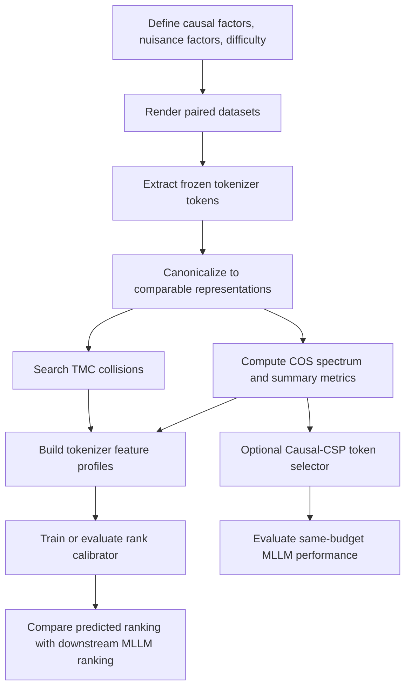

# CE-Break: Causal Evidence Breakdown Benchmark

This document summarizes the main research line for a cheap benchmark that predicts downstream MLLM ranking by measuring whether a visual tokenizer preserves answer-changing visual evidence under token budget, nuisance variation, and difficulty shifts.

The intended use is to copy this document into a new exploration repository as the project README or design note. It assumes no runtime dependency on this repository. If code from this repository is later reused, copy the relevant files into the new repository and record the original source paths.

## 1. One-Line Thesis

Downstream MLLM performance is bottlenecked not only by representation quality, but by whether the visual tokenizer keeps the causal evidence needed to answer the question after compression. A cheap benchmark should therefore measure the breakdown curve of causal visual evidence, not only generic representation learnability.

## 2. Why This Is A Good Pain Point

Many current MLLM benchmarks mix true visual reasoning with language priors, dataset shortcuts, and answerable-from-context examples. They may under-measure whether the visual tokens actually contain the decisive evidence.

Representation learnability and PCA-style analyses are useful, but they can miss the central failure mode:

- PCA captures high-variance directions, not necessarily answer-changing directions.
- Linear probing or lightweight training mixes two things: information present in tokens and how easy an adapter can extract it.
- Average downstream scores hide capability-specific failures such as OCR, spatial binding, counting, and fine attribute grounding.
- Once a tokenizer discards the evidence, later connector or LLM training cannot recover it.

So the core question becomes:

Can we cheaply predict downstream MLLM ranking by measuring how much causal, task-relevant visual evidence survives the tokenizer at different token budgets and difficulty levels?

## 3. Main Object Of Study

The benchmark compares visual tokenizers or visual encoder settings while holding the downstream recipe fixed:

- same LLM;
- same connector architecture;
- same finetuning data;
- same prompts;
- same evaluation protocol.

For a new tokenizer, the benchmark should mostly require forward passes through the frozen visual tokenizer, plus a small global calibration model trained on historical tokenizers. It should not require full downstream MLLM finetuning for every candidate.

## 4. Core Benchmark Name

Working name: CE-Break, short for Causal Evidence Breakdown.

The benchmark has two central measurements:

- COS: Causal Observability Spectrum.
- TMC: Task-conditioned Metamer Collision.

COS asks whether causal visual changes are observable after nuisance whitening.

TMC asks whether two different-answer images collapse into nearly the same token representation.

Together they produce a cheap profile that can be used to predict downstream ranking.

## 5. Data Design

Use controlled synthetic or semi-synthetic data with explicit causal factors.

Each image is generated as:

```text
I = R(z, n, s)
```

where:

- `z` is the causal factor that changes the correct answer;
- `n` is nuisance variation that should not change the answer;
- `s` is difficulty level;
- `R` is the renderer.

For every base scene, construct paired interventions:

```text
causal pair:   R(z, n, s)  vs  R(z', n, s), answer changes
nuisance pair: R(z, n, s)  vs  R(z, n', s), answer stays the same
```

Start with two domains:

- OCR: character, word, digit, font, blur, contrast, size, background.
- Spatial binding: left/right, above/below, inside/outside, object relation, distractors, occlusion.

Then expand to:

- counting;
- color or attribute binding;
- chart/table reading;
- small object grounding;
- visual comparison.

For each sample, store:

- image path;
- question;
- answer;
- causal factor `z`;
- nuisance factors `n`;
- difficulty `s`;
- evidence mask or scene graph;
- renderer and asset provenance.

Use held-out fonts, backgrounds, assets, and renderers for generalization checks.

## 6. Token Budget Axis

Evaluate each visual tokenizer under comparable token budgets:

```text
K in {16, 32, 64, 128, native}
```

Report at least three settings:

- native budget;
- equal token count;
- equal approximate FLOPs.

Different tokenizers may output different token grids or variable token sets, so representations need a canonicalization function:

```text
phi_K(E(I))
```

where `E` is the visual tokenizer and `phi_K` maps its output into a comparable representation.

Practical canonicalization choices:

- fixed-grid tokenizers: direct pooling or interpolation;
- variable-token tokenizers: ground-truth region pooling, coordinate-aware pooling, or optimal-transport matching;
- high-dimensional features: fixed random Johnson-Lindenstrauss sketch to 256 or 512 dimensions;
- covariance estimates: shrinkage normalization for stability.

## 7. COS: Causal Observability Spectrum

For each tokenizer, difficulty level, token budget, and domain, compute causal and nuisance differences:

```text
Delta_C = phi_K(E(R(z', n, s))) - phi_K(E(R(z, n, s)))
Delta_N = phi_K(E(R(z, n', s))) - phi_K(E(R(z, n, s)))
```

Estimate covariance matrices:

```text
Sigma_C = E[Delta_C Delta_C^T]
Sigma_N = E[Delta_N Delta_N^T]
```

Then solve the generalized eigenvalue problem:

```text
Sigma_C v_j = lambda_j (Sigma_N + rho I) v_j
```

The eigenvalues form a nuisance-whitened causal signal spectrum.

Interpretation:

- large `lambda_j`: causal changes are visible beyond nuisance variation;
- small `lambda_j`: causal changes are hidden or confused with nuisance variation;
- fast spectrum collapse under lower `K` or higher `s`: evidence is brittle under compression/difficulty.

This is the key difference from PCA:

- PCA asks where representation variance is large.
- COS asks where answer-changing evidence is observable after removing nuisance directions.

## 8. COS Summary Metrics

From the spectrum, compute:

```text
CVol_d(K, s) = mean_j log(1 + lambda_j)
```

This is the causal evidence volume for domain `d`.

Also compute:

```text
p_j = lambda_j / sum_j lambda_j
r_eff = exp(-sum_j p_j log p_j)
```

This is the effective causal rank.

Additional metrics:

- `K90`: smallest token budget retaining 90 percent of native causal volume;
- breakdown threshold `s*`: difficulty where causal evidence drops below a pre-registered threshold;
- evidence locality: how much causal signal lies inside the annotated evidence region;
- off-target leakage: how much causal signal appears in irrelevant regions;
- cross-renderer stability: whether the profile survives held-out rendering styles.

## 9. TMC: Task-Conditioned Metamer Collision

COS measures average observability. TMC searches for concrete failures.

For an anchor image `x`, search for a different-answer image that is closest in the tokenizer representation:

```text
x^-_* = argmin_{y' != y, n'} d_W(E(x), E(R(y', n', s)))
```

where `d_W` is a nuisance-whitened distance.

Define:

```text
rho_meta(x) =
  min different-answer distance /
  median same-answer nuisance distance
```

If `rho_meta(x) < 1`, then a different-answer image is closer than ordinary nuisance variation. This is a dangerous collision because the downstream model may not be able to separate the two cases reliably.

Implementation should search on-manifold:

- first retrieve candidates from a procedural bank;
- then refine with CMA-ES, Bayesian optimization, or another constrained search;
- avoid optimizing from arbitrary noise images.

Report:

- collision rate;
- median `rho_meta`;
- worst-case examples;
- whether collisions predict actual downstream MLLM errors.

## 10. Cheap Rank Prediction

For tokenizer `i`, build a feature profile:

```text
f_i = [
  CVol by domain and K,
  r_eff by domain and K,
  K90,
  breakdown threshold s*,
  evidence locality,
  TMC collision rate,
  optional external scores such as AC score
]
```

Use historical tokenizers with known downstream scores to train a small monotone rank calibrator:

```text
P(Y_i > Y_j) = sigmoid(w^T (f_i - f_j)), with w >= 0
```

The benchmark target is not necessarily one universal score. Prefer capability-specific prediction:

- OCR rank;
- spatial reasoning rank;
- counting rank;
- attribute binding rank;
- average rank only as a secondary summary.

Important experimental question:

How many trained reference tokenizers are needed before the cheap benchmark predicts downstream rank well?

Evaluate calibration size:

```text
M in {0, 4, 8, 12, 16, ...}
```

Use leave-one-family-out validation when possible, so the benchmark is not only memorizing tokenizer families.

## 11. Optional Method Hook: Causal-CSP Token Selection

The benchmark can also produce an algorithmic method.

Use the COS generalized eigenvectors as task-relevant directions. For each visual token `t`, compute a causal relevance score:

```text
r_t(q) = sum_d w_d(q) || W_d^T (z_t - mu_{N,d}) ||^2
```

where:

- `W_d` are causal-observability directions for domain `d`;
- `w_d(q)` maps the question to relevant domains;
- `z_t` is token `t`;
- `mu_N` is nuisance mean.

Select tokens using:

- high causal relevance;
- diversity via DPP, k-center, or spatial coverage;
- optional evidence-region prior during analysis, not during final blind evaluation.

Compare against:

- random token selection;
- average pooling;
- PCA-based selection;
- attention-based selection;
- existing visual token compression methods.

This gives the project both a benchmark contribution and a concrete performance hook.

## 12. Minimal Pilot

The smallest useful pilot:

```text
domains:       OCR + spatial binding
tokenizers:    2 to 4 visual tokenizers
budgets:       K = {32, 64, 128, native}
samples:       about 500 base scenes per domain
nuisance:      3 renders per base scene
difficulty:    5 levels
downstream:    fixed small MLLM finetuning recipe
```

Pipeline:



## 13. Engineering Plan

Suggested new repository layout:

```text
ce_break/
  configs/
  data/
    renderers/
      ocr/
      spatial/
    schema.py
  extractors/
  alignment/
  metrics/
    cos.py
    metamer.py
    threshold.py
    locality.py
  selectors/
    causal_csp.py
  calibration/
  evaluation/
  scripts/
  tests/
```

Core commands to support:

```text
generate data
extract tokens
canonicalize tokens
compute cos
search metamers
fit rank calibrator
run downstream finetuning
evaluate predictions
```

Recommended file formats:

- metadata: JSONL or Parquet;
- images: PNG/WebP;
- token caches: safetensors, HDF5, or WebDataset shards;
- metrics: JSON plus CSV summary;
- configs: YAML.

## 14. Baselines

Compare CE-Break against:

- raw token count or image resolution;
- PCA explained variance and PCA effective rank;
- representation learnability metrics;
- AC score or similar visual representation score;
- CKA/reconstruction similarity;
- linear probe accuracy;
- raw causal distance without nuisance whitening;
- downstream score after tiny connector training.

The key claim should be:

CE-Break predicts downstream rank better because it measures task-causal evidence preservation under nuisance and compression, not generic visual representation quality.

## 15. Success Criteria

Engineering success:

- causal pairs and nuisance pairs are generated correctly;
- shuffled labels collapse COS;
- swapped causal/nuisance definitions collapse or invert the spectrum;
- repeated seeds produce stable metric rankings;
- held-out fonts/assets/renderers do not destroy the signal.

Research success:

- on 12 to 16 tokenizer or setting variants, CE-Break reaches Kendall tau >= 0.6 with downstream capability-specific ranking;
- CE-Break improves Kendall tau by at least 0.1 over the strongest baseline;
- pairwise rank prediction accuracy reaches about 75 percent or higher;
- TMC collision examples correspond to real downstream MLLM errors;
- benchmark cost is about 1 to 5 percent of full downstream training cost;
- Causal-CSP improves same-token-budget performance or preserves performance at lower token budget.

These numbers are targets for a serious paper-level version, not promises for the first smoke test.

## 16. Falsification Tests

The idea should be considered weak if:

- COS only correlates with token count;
- PCA or simple linear probes predict downstream ranking equally well;
- TMC collisions look visually meaningless or off-manifold;
- rank prediction fails under leave-one-family-out validation;
- capability-specific metrics do not predict matching capability-specific downstream tasks;
- the benchmark only works on synthetic data and collapses on held-out renderers or real edited examples.

## 17. Main Risks And Fixes

High-dimensional covariance instability:

Use random projection, covariance shrinkage, dual eigensolvers, and multiple seeds.

Tokenizer alignment mismatch:

Report fixed-grid and variable-token tracks separately; use coordinate-aware pooling or optimal transport only when needed.

Synthetic artifact overfitting:

Hold out fonts, assets, backgrounds, and renderers; add a small real-image edited validation set.

Metric becomes just another trainable proxy:

Keep the main tokenizer evaluation training-free; only train a small historical rank calibrator.

Metamer search finds unnatural images:

Constrain search to procedural renderers and real asset banks.

One scalar hides capability structure:

Report capability-specific profiles first and aggregate score second.

## 18. Expected Outputs

A good first-stage project should produce:

- a controlled causal visual dataset;
- a tokenizer extraction and caching pipeline;
- COS metrics across token budget and difficulty;
- TMC collision examples;
- rank prediction results against trained downstream MLLMs;
- baseline comparisons;
- optional Causal-CSP token selection results;
- a small gallery of interpretable failure cases.

## 19. Literature Anchors

Useful anchor works:

- MMStar: evaluates whether multimodal benchmarks require real visual dependence. https://proceedings.neurips.cc/paper_files/paper/2024/hash/2f8ee6a3d766b426d2618e555b5aeb39-Abstract-Conference.html
- VTC-Bench: studies visual token compression for MLLMs. https://aclanthology.org/2026.acl-long.195/
- VisionZip: visual token compression for vision-language models. https://openaccess.thecvf.com/content/CVPR2025/html/Yang_VisionZip_Longer_is_Better_but_Not_Necessary_in_Vision_Language_CVPR_2025_paper.html
- Common Spatial Patterns: generalized eigenvalue method for discriminative signal directions. https://pmc.ncbi.nlm.nih.gov/articles/PMC4441303/
- Nonlinear observability: connects observability and system identification ideas. https://arxiv.org/abs/2402.14711
- Model metamers: studies perceptually different inputs with similar model representations. https://proceedings.neurips.cc/paper/2019/hash/ac27b77292582bc293a51055bfc994ee-Abstract.html
- AEPsych: adaptive psychophysics for threshold estimation. https://arxiv.org/abs/2104.09549
- LMM-JND: just-noticeable-difference style evaluation for large multimodal models. https://arxiv.org/abs/2507.00490

## 20. Main Contribution Sentence

CE-Break proposes a cheap, interpretable benchmark for visual tokenizers by measuring when answer-changing visual evidence becomes unobservable under nuisance variation, token compression, and increasing difficulty, and by validating whether that causal breakdown profile predicts downstream MLLM ranking.
