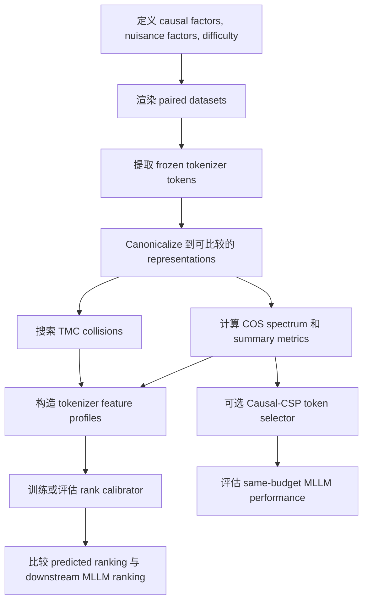

# CE-Break：因果证据崩塌基准

这份文档总结一条 cheap benchmark 的主线：通过测量视觉 tokenizer 在 token budget、干扰变化和难度变化下，是否保留了会改变答案的视觉证据，来预测下游 MLLM 的排名。

这份文档适合之后复制到一个新的探索仓库，作为 README 或 design note。它不假设新仓库会运行时依赖当前仓库。如果之后复用当前仓库的代码，建议把相关文件复制到新仓库，并记录原始路径。

## 1. 一句话 thesis

下游 MLLM 的性能瓶颈不只是视觉表征好不好，而是视觉 tokenizer 在压缩之后是否还保留了回答问题所需的因果证据。因此，一个 cheap benchmark 应该测量因果视觉证据的崩塌曲线，而不只是测量通用 representation learnability。

## 2. 为什么这是一个更命中痛点的问题

很多现有 MLLM benchmark 混合了真实视觉推理、语言先验、数据集捷径，以及一些即使不认真看图也能答的样本。它们可能低估了一个关键问题：视觉 token 里到底有没有真正决定答案的证据。

Representation learnability 和 PCA 类分析当然有价值，但它们容易错过一个中心失败模式：

- PCA 捕捉的是高方差方向，不一定是会改变答案的方向。
- Linear probe 或轻量训练会混合两个因素：token 里是否有信息，以及 adapter 是否容易把信息取出来。
- 平均下游分数会掩盖能力维度上的失败，例如 OCR、空间绑定、计数、细粒度属性 grounding。
- 一旦 tokenizer 把证据丢掉，后面的 connector 或 LLM 训练无法凭空恢复。

所以核心问题变成：

我们能否通过测量不同 token budget 和难度下，多少任务因果视觉证据在 tokenizer 后仍然可见，来便宜地预测下游 MLLM 排名？

## 3. 主要研究对象

这个 benchmark 比较视觉 tokenizer 或视觉 encoder 设置，同时固定下游 recipe：

- 相同 LLM；
- 相同 connector 结构；
- 相同 finetuning 数据；
- 相同 prompt；
- 相同 evaluation protocol。

对于一个新的 tokenizer，benchmark 主要应该只需要跑 frozen visual tokenizer 的 forward pass，再加上一个用历史 tokenizer 训练出来的小型全局校准模型。它不应该要求每个候选 tokenizer 都做完整下游 MLLM finetuning。

## 4. Benchmark 名称

工作名：CE-Break，即 Causal Evidence Breakdown。

这个 benchmark 有两个核心测量：

- COS：Causal Observability Spectrum，因果可观测谱。
- TMC：Task-conditioned Metamer Collision，任务条件下的 metamer 碰撞。

COS 问的是：经过 nuisance whitening 之后，因果视觉变化是否仍然可观测。

TMC 问的是：两个答案不同的图像，是否会坍缩到几乎相同的 token representation。

两者合在一起形成一个便宜的 tokenizer profile，用来预测下游排名。

## 5. 数据设计

使用带有显式因果因素的可控合成或半合成数据。

每张图像生成为：

```text
I = R(z, n, s)
```

其中：

- `z` 是会改变正确答案的因果因素；
- `n` 是不应该改变答案的 nuisance variation；
- `s` 是难度等级；
- `R` 是 renderer。

对每个 base scene，构造两类 paired intervention：

```text
causal pair:   R(z, n, s)  vs  R(z', n, s), answer changes
nuisance pair: R(z, n, s)  vs  R(z, n', s), answer stays the same
```

先从两个 domain 开始：

- OCR：字符、单词、数字、字体、模糊、对比度、尺寸、背景。
- Spatial binding：左/右、上/下、内/外、物体关系、干扰物、遮挡。

之后再扩展到：

- 计数；
- 颜色或属性绑定；
- 图表/表格读取；
- 小物体 grounding；
- 视觉比较。

每个样本存储：

- image path；
- question；
- answer；
- causal factor `z`；
- nuisance factors `n`；
- difficulty `s`；
- evidence mask 或 scene graph；
- renderer 和 asset provenance。

用 held-out fonts、backgrounds、assets 和 renderers 做泛化检查。

## 6. Token budget 轴

在可比较的 token budget 下评估每个 visual tokenizer：

```text
K in {16, 32, 64, 128, native}
```

至少报告三种设置：

- native budget；
- equal token count；
- equal approximate FLOPs。

不同 tokenizer 可能输出不同 token grid 或 variable token set，所以 representation 需要一个 canonicalization function：

```text
phi_K(E(I))
```

其中 `E` 是 visual tokenizer，`phi_K` 把输出映射到可比较的 representation。

可用的 canonicalization 方式：

- fixed-grid tokenizer：直接 pooling 或 interpolation；
- variable-token tokenizer：ground-truth region pooling、coordinate-aware pooling，或 optimal-transport matching；
- 高维特征：固定随机 Johnson-Lindenstrauss sketch 到 256 或 512 维；
- covariance estimate：用 shrinkage normalization 提高稳定性。

## 7. COS：Causal Observability Spectrum

对每个 tokenizer、difficulty level、token budget 和 domain，计算 causal difference 与 nuisance difference：

```text
Delta_C = phi_K(E(R(z', n, s))) - phi_K(E(R(z, n, s)))
Delta_N = phi_K(E(R(z, n', s))) - phi_K(E(R(z, n, s)))
```

估计 covariance matrices：

```text
Sigma_C = E[Delta_C Delta_C^T]
Sigma_N = E[Delta_N Delta_N^T]
```

然后求解 generalized eigenvalue problem：

```text
Sigma_C v_j = lambda_j (Sigma_N + rho I) v_j
```

这些 eigenvalues 形成一个 nuisance-whitened causal signal spectrum。

解释方式：

- `lambda_j` 大：因果变化在 nuisance variation 之外仍然可见；
- `lambda_j` 小：因果变化被隐藏，或者和 nuisance variation 混在一起；
- 低 `K` 或高 `s` 下 spectrum 快速 collapse：说明证据对压缩或难度很脆弱。

这和 PCA 的关键区别是：

- PCA 问 representation 哪些方向方差大。
- COS 问去掉 nuisance 方向后，哪些 answer-changing evidence 仍然可观测。

## 8. COS 汇总指标

从 spectrum 计算：

```text
CVol_d(K, s) = mean_j log(1 + lambda_j)
```

这是 domain `d` 的 causal evidence volume。

再计算：

```text
p_j = lambda_j / sum_j lambda_j
r_eff = exp(-sum_j p_j log p_j)
```

这是 effective causal rank。

额外指标：

- `K90`：保留 90% native causal volume 所需的最小 token budget；
- breakdown threshold `s*`：causal evidence 低于预注册阈值的难度；
- evidence locality：多少 causal signal 落在标注的 evidence region 内；
- off-target leakage：多少 causal signal 出现在无关区域；
- cross-renderer stability：这个 profile 是否能在 held-out rendering style 下保持稳定。

## 9. TMC：Task-Conditioned Metamer Collision

COS 测的是平均可观测性。TMC 搜索具体失败案例。

对一张 anchor image `x`，搜索一个答案不同但在 tokenizer representation 里最近的图像：

```text
x^-_* = argmin_{y' != y, n'} d_W(E(x), E(R(y', n', s)))
```

其中 `d_W` 是 nuisance-whitened distance。

定义：

```text
rho_meta(x) =
  min different-answer distance /
  median same-answer nuisance distance
```

如果 `rho_meta(x) < 1`，说明一个答案不同的图像比普通 nuisance variation 还近。这是危险碰撞，因为下游模型可能无法稳定地区分这两种情况。

实现时应该做 on-manifold search：

- 先从 procedural bank 里检索 candidate；
- 再用 CMA-ES、Bayesian optimization 或其他 constrained search refine；
- 避免从任意 noise image 开始优化。

报告：

- collision rate；
- median `rho_meta`；
- worst-case examples；
- collisions 是否能预测真实下游 MLLM 错误。

## 10. 便宜的 rank prediction

对 tokenizer `i`，构造 feature profile：

```text
f_i = [
  CVol by domain and K,
  r_eff by domain and K,
  K90,
  breakdown threshold s*,
  evidence locality,
  TMC collision rate,
  optional external scores such as AC score
]
```

用已经知道下游分数的历史 tokenizers，训练一个很小的 monotone rank calibrator：

```text
P(Y_i > Y_j) = sigmoid(w^T (f_i - f_j)), with w >= 0
```

benchmark 的目标不一定是一个 universal score。更推荐做 capability-specific prediction：

- OCR rank；
- spatial reasoning rank；
- counting rank；
- attribute binding rank；
- average rank 只作为次要 summary。

一个重要实验问题是：

需要多少个已经训练过的 reference tokenizers，cheap benchmark 才能较好预测下游 rank？

评估 calibration size：

```text
M in {0, 4, 8, 12, 16, ...}
```

条件允许时使用 leave-one-family-out validation，避免 benchmark 只是记住 tokenizer family。

## 11. 可选方法 hook：Causal-CSP Token Selection

这个 benchmark 也可以自然导出一个算法方法。

把 COS 的 generalized eigenvectors 当作 task-relevant directions。对每个 visual token `t`，计算 causal relevance score：

```text
r_t(q) = sum_d w_d(q) || W_d^T (z_t - mu_{N,d}) ||^2
```

其中：

- `W_d` 是 domain `d` 的 causal-observability directions；
- `w_d(q)` 把 question 映射到相关 domain；
- `z_t` 是 token `t`；
- `mu_N` 是 nuisance mean。

选择 token 时结合：

- 高 causal relevance；
- DPP、k-center 或 spatial coverage 带来的 diversity；
- 分析阶段可用 evidence-region prior，最终 blind evaluation 不用。

对比方法：

- random token selection；
- average pooling；
- PCA-based selection；
- attention-based selection；
- existing visual token compression methods。

这样项目既有 benchmark contribution，也有一个具体的 performance hook。

## 12. 最小 pilot

最小可用 pilot：

```text
domains:       OCR + spatial binding
tokenizers:    2 to 4 visual tokenizers
budgets:       K = {32, 64, 128, native}
samples:       about 500 base scenes per domain
nuisance:      3 renders per base scene
difficulty:    5 levels
downstream:    fixed small MLLM finetuning recipe
```

Pipeline：



## 13. 工程计划

建议新仓库结构：

```text
ce_break/
  configs/
  data/
    renderers/
      ocr/
      spatial/
    schema.py
  extractors/
  alignment/
  metrics/
    cos.py
    metamer.py
    threshold.py
    locality.py
  selectors/
    causal_csp.py
  calibration/
  evaluation/
  scripts/
  tests/
```

核心命令：

```text
generate data
extract tokens
canonicalize tokens
compute cos
search metamers
fit rank calibrator
run downstream finetuning
evaluate predictions
```

推荐文件格式：

- metadata：JSONL 或 Parquet；
- images：PNG/WebP；
- token caches：safetensors、HDF5 或 WebDataset shards；
- metrics：JSON 加 CSV summary；
- configs：YAML。

## 14. Baselines

CE-Break 需要对比：

- raw token count 或 image resolution；
- PCA explained variance 和 PCA effective rank；
- representation learnability metrics；
- AC score 或类似 visual representation score；
- CKA/reconstruction similarity；
- linear probe accuracy；
- raw causal distance without nuisance whitening；
- tiny connector training 后的 downstream score。

核心 claim 应该是：

CE-Break 更能预测下游 rank，因为它测量的是 nuisance 和 compression 下 task-causal evidence 是否被保留，而不是 generic visual representation quality。

## 15. 成功标准

工程成功：

- causal pairs 和 nuisance pairs 生成正确；
- shuffled labels 会让 COS collapse；
- 交换 causal/nuisance 定义会让 spectrum collapse 或 invert；
- repeated seeds 产生稳定的 metric ranking；
- held-out fonts/assets/renderers 不会破坏信号。

研究成功：

- 在 12 到 16 个 tokenizer 或 setting variants 上，CE-Break 对 capability-specific downstream ranking 达到 Kendall tau >= 0.6；
- CE-Break 相比最强 baseline，Kendall tau 至少提升 0.1；
- pairwise rank prediction accuracy 达到约 75% 或更高；
- TMC collision examples 对应真实 downstream MLLM errors；
- benchmark 成本约为完整 downstream training 的 1% 到 5%；
- Causal-CSP 提升 same-token-budget performance，或在更低 token budget 下保持性能。

这些数字是 serious paper-level version 的目标，不是第一次 smoke test 的承诺。

## 16. Falsification tests

如果出现以下情况，这个想法就应该被认为较弱：

- COS 只和 token count 相关；
- PCA 或简单 linear probe 同样能预测 downstream ranking；
- TMC collisions 看起来视觉上无意义，或者 off-manifold；
- rank prediction 在 leave-one-family-out validation 下失败；
- capability-specific metrics 无法预测对应 capability-specific downstream tasks；
- benchmark 只在 synthetic data 上有效，到 held-out renderers 或 real edited examples 就崩。

## 17. 主要风险与修正

高维 covariance 不稳定：

使用 random projection、covariance shrinkage、dual eigensolvers 和 multiple seeds。

Tokenizer alignment mismatch：

fixed-grid 和 variable-token tracks 分开报告；只在需要时使用 coordinate-aware pooling 或 optimal transport。

Synthetic artifact overfitting：

hold out fonts、assets、backgrounds 和 renderers；加入一个小规模 real-image edited validation set。

Metric 变成另一个 trainable proxy：

保持主 tokenizer evaluation training-free；只训练一个小型 historical rank calibrator。

Metamer search 找到不自然图像：

把搜索限制在 procedural renderers 和 real asset banks 上。

单个 scalar 掩盖能力结构：

优先报告 capability-specific profiles，aggregate score 只放第二位。

## 18. 预期产出

一个好的第一阶段项目应该产出：

- 一个 controlled causal visual dataset；
- tokenizer extraction 和 caching pipeline；
- 跨 token budget 和 difficulty 的 COS metrics；
- TMC collision examples；
- 和 trained downstream MLLMs 对齐的 rank prediction results；
- baseline comparisons；
- 可选 Causal-CSP token selection results；
- 一小组可解释 failure cases gallery。

## 19. 文献锚点

有用的 anchor works：

- MMStar：评估 multimodal benchmarks 是否真的需要 visual dependence。 https://proceedings.neurips.cc/paper_files/paper/2024/hash/2f8ee6a3d766b426d2618e555b5aeb39-Abstract-Conference.html
- VTC-Bench：研究 MLLMs 的 visual token compression。 https://aclanthology.org/2026.acl-long.195/
- VisionZip：vision-language models 的 visual token compression。 https://openaccess.thecvf.com/content/CVPR2025/html/Yang_VisionZip_Longer_is_Better_but_Not_Necessary_in_Vision_Language_CVPR_2025_paper.html
- Common Spatial Patterns：用于 discriminative signal directions 的 generalized eigenvalue 方法。 https://pmc.ncbi.nlm.nih.gov/articles/PMC4441303/
- Nonlinear observability：连接 observability 和 system identification 思路。 https://arxiv.org/abs/2402.14711
- Model metamers：研究 perceptually different inputs with similar model representations。 https://proceedings.neurips.cc/paper/2019/hash/ac27b77292582bc293a51055bfc994ee-Abstract.html
- AEPsych：用于 threshold estimation 的 adaptive psychophysics。 https://arxiv.org/abs/2104.09549
- LMM-JND：面向 large multimodal models 的 just-noticeable-difference style evaluation。 https://arxiv.org/abs/2507.00490

## 20. 主贡献句

CE-Break 提出一个便宜且可解释的 visual tokenizer benchmark：它测量 answer-changing visual evidence 在 nuisance variation、token compression 和 increasing difficulty 下何时变得不可观测，并验证这种 causal breakdown profile 是否能预测下游 MLLM ranking。
