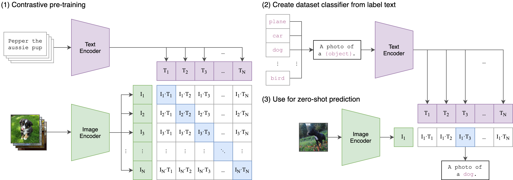

# CLIP

[[Blog]](https://openai.com/blog/clip/) [[Paper]](https://arxiv.org/abs/2103.00020) [[Model Card]](model-card.md) [[Colab]](https://colab.research.google.com/github/openai/clip/blob/master/notebooks/Interacting_with_CLIP.ipynb)

CLIP (Contrastive Language-Image Pre-Training) is a neural network trained on a variety of (image, text) pairs. It can be instructed in natural language to predict the most relevant text snippet, given an image, without directly optimizing for the task, similarly to the zero-shot capabilities of GPT-2 and 3. We found CLIP matches the performance of the original ResNet50 on ImageNet “zero-shot” without using any of the original 1.28M labeled examples, overcoming several major challenges in computer vision.


## Approach




## Usage

First, [install PyTorch 1.7.1](https://pytorch.org/get-started/locally/) (or later) and torchvision, as well as small additional dependencies, and then install this repo as a Python package. On a CUDA GPU machine, the following will do the trick:

```bash
$ conda install --yes -c pytorch pytorch=1.7.1 torchvision cudatoolkit=11.0
$ pip install ftfy regex tqdm
$ pip install git+https://github.com/openai/CLIP.git
```

Replace `cudatoolkit=11.0` above with the appropriate CUDA version on your machine or `cpuonly` when installing on a machine without a GPU.

```python
import torch
import clip
from PIL import Image

device = "cuda" if torch.cuda.is_available() else "cpu"
model, preprocess = clip.load("ViT-B/32", device=device)

image = preprocess(Image.open("CLIP.png")).unsqueeze(0).to(device)
text = clip.tokenize(["a diagram", "a dog", "a cat"]).to(device)

with torch.no_grad():
    image_features = model.encode_image(image)
    text_features = model.encode_text(text)
    
    logits_per_image, logits_per_text = model(image, text)
    probs = logits_per_image.softmax(dim=-1).cpu().numpy()

print("Label probs:", probs)  # prints: [[0.9927937  0.00421068 0.00299572]]
```


## API

The CLIP module `clip` provides the following methods:

#### `clip.available_models()`

Returns the names of the available CLIP models.

#### `clip.load(name, device=..., jit=False)`

Returns the model and the TorchVision transform needed by the model, specified by the model name returned by `clip.available_models()`. It will download the model as necessary. The `name` argument can also be a path to a local checkpoint.

The device to run the model can be optionally specified, and the default is to use the first CUDA device if there is any, otherwise the CPU. When `jit` is `False`, a non-JIT version of the model will be loaded.

#### `clip.tokenize(text: Union[str, List[str]], context_length=77)`

Returns a LongTensor containing tokenized sequences of given text input(s). This can be used as the input to the model

---

The model returned by `clip.load()` supports the following methods:

#### `model.encode_image(image: Tensor)`

Given a batch of images, returns the image features encoded by the vision portion of the CLIP model.

#### `model.encode_text(text: Tensor)`

Given a batch of text tokens, returns the text features encoded by the language portion of the CLIP model.

#### `model(image: Tensor, text: Tensor)`

Given a batch of images and a batch of text tokens, returns two Tensors, containing the logit scores corresponding to each image and text input. The values are cosine similarities between the corresponding image and text features, times 100.


## More Examples

### Zero-Shot Prediction

The code below performs zero-shot prediction using CLIP, as shown in Appendix B in the paper. This example takes an image from the [CIFAR-100 dataset](https://www.cs.toronto.edu/~kriz/cifar.html), and predicts the most likely labels among the 100 textual labels from the dataset.

```python
import os
import clip
import torch
from torchvision.datasets import CIFAR100

# Load the model
device = "cuda" if torch.cuda.is_available() else "cpu"
model, preprocess = clip.load('ViT-B/32', device)

# Download the dataset
cifar100 = CIFAR100(root=os.path.expanduser("~/.cache"), download=True, train=False)

# Prepare the inputs
image, class_id = cifar100[3637]
image_input = preprocess(image).unsqueeze(0).to(device)
text_inputs = torch.cat([clip.tokenize(f"a photo of a {c}") for c in cifar100.classes]).to(device)

# Calculate features
with torch.no_grad():
    image_features = model.encode_image(image_input)
    text_features = model.encode_text(text_inputs)

# Pick the top 5 most similar labels for the image
image_features /= image_features.norm(dim=-1, keepdim=True)
text_features /= text_features.norm(dim=-1, keepdim=True)
similarity = (100.0 * image_features @ text_features.T).softmax(dim=-1)
values, indices = similarity[0].topk(5)

# Print the result
print("\nTop predictions:\n")
for value, index in zip(values, indices):
    print(f"{cifar100.classes[index]:>16s}: {100 * value.item():.2f}%")
```

The output will look like the following (the exact numbers may be slightly different depending on the compute device):

```
Top predictions:

           snake: 65.31%
          turtle: 12.29%
    sweet_pepper: 3.83%
          lizard: 1.88%
       crocodile: 1.75%
```

Note that this example uses the `encode_image()` and `encode_text()` methods that return the encoded features of given inputs.


### Linear-probe evaluation

The example below uses [scikit-learn](https://scikit-learn.org/) to perform logistic regression on image features.

```python
import os
import clip
import torch

import numpy as np
from sklearn.linear_model import LogisticRegression
from torch.utils.data import DataLoader
from torchvision.datasets import CIFAR100
from tqdm import tqdm

# Load the model
device = "cuda" if torch.cuda.is_available() else "cpu"
model, preprocess = clip.load('ViT-B/32', device)

# Load the dataset
root = os.path.expanduser("~/.cache")
train = CIFAR100(root, download=True, train=True, transform=preprocess)
test = CIFAR100(root, download=True, train=False, transform=preprocess)


def get_features(dataset):
    all_features = []
    all_labels = []
    
    with torch.no_grad():
        for images, labels in tqdm(DataLoader(dataset, batch_size=100)):
            features = model.encode_image(images.to(device))

            all_features.append(features)
            all_labels.append(labels)

    return torch.cat(all_features).cpu().numpy(), torch.cat(all_labels).cpu().numpy()

# Calculate the image features
train_features, train_labels = get_features(train)
test_features, test_labels = get_features(test)

# Perform logistic regression
classifier = LogisticRegression(random_state=0, C=0.316, max_iter=1000, verbose=1)
classifier.fit(train_features, train_labels)

# Evaluate using the logistic regression classifier
predictions = classifier.predict(test_features)
accuracy = np.mean((test_labels == predictions).astype(float)) * 100.
print(f"Accuracy = {accuracy:.3f}")
```

Note that the `C` value should be determined via a hyperparameter sweep using a validation split.

#### ImageNet k-shot tokenizer baseline (VTBenchLab)

This workspace adds `linear_probe_tokenizers.py`, a frozen-feature ImageNet-1K
benchmark for UniTok, TokLIP-S, TokLIP-L, VILA-U, and MetaCLIP. Its default
`clip-paper-v1` protocol follows Appendix A.3 of the CLIP paper: an L-BFGS
logistic-regression head, at most 1,000 iterations, and a parametric search for
L2 regularization over `C=1e-6...1e6`. The search starts at seven two-decade
anchors and bisects around the selection peak until reaching eight steps per
decade. Exact ties select the smaller `C`.

The CLIP paper did not release its ImageNet train/selection indices. To make
the protocol reproducible, this implementation adopts the official DINOv2
logistic-regression convention: `torch.randperm(seed=0)` reserves the first
10% of ImageNet train (128,116 images) for selecting C. Balanced, nested
1/2/4/8/16-shot support sets are sampled only from the remaining 1,153,051
images. The selection images are never added to the final few-shot classifier.
All tokenizers share the same persisted split indices and use feature
extraction batch size 100.

ImageNet's official split names matter here: `val/` contains 50,000 labeled
images and is used only for final Top-1/Top-5 reporting. The official ILSVRC
`test` split contains 100,000 images whose labels are not public, so it is not
used. Results from this implementation should therefore be described as a
**CLIP-paper-aligned, fully specified reproduction**, not as a reproduction of
CLIP's unpublished split.

Run every tokenizer with support seeds 0, 1, and 2:

```bash
bash run_tokenizer_kshot_linear.sh
```

Run selected tokenizers:

```bash
bash run_tokenizer_kshot_linear.sh unitok metaclip
```

Run one model with the parameters written explicitly:

```bash
conda run --no-capture-output -n TokBench python linear_probe_tokenizers.py \
  --model unitok --protocol clip-paper-v1 \
  --shots 1 2 4 8 16 --seed 0 \
  --selection-seed 0 --selection-fraction 0.1 \
  --batch-size 100 --max-iter 1000 --tol 1e-4
```

Feature caches record the model/checkpoint manifest, preprocessing, split,
protocol, and extraction batch size. A mismatched cache is rejected unless
`--overwrite-features` is explicitly supplied. Results are resumable only when
their complete protocol hash matches.

New results are written under
`outputs/imagenet_kshot_linear_clip_paper_v1/`. Per-seed summaries and an
aggregate mean/population-standard-deviation table are generated after the
launcher completes. Existing fixed-C results under
`outputs/imagenet_kshot_linear_clip/` are left untouched. The old behavior is
still available with `--protocol clip-readme-fixed --c 0.316` and should be
reported as a README-example baseline rather than the paper protocol.


#### PASCAL VOC 2007 multi-label tokenizer baseline (VTBenchLab)

`linear_probe_voc2007.py` evaluates UniTok, VILA-U, MetaCLIP, TokLIP-S, and
TokLIP-L as frozen feature extractors on the 20-label PASCAL VOC 2007
classification task. The protocol is based primarily on Kornblith et al.,
[Do Better ImageNet Models Transfer Better?](https://openaccess.thecvf.com/content_CVPR_2019/papers/Kornblith_Do_Better_ImageNet_Models_Transfer_Better_CVPR_2019_paper.pdf),
and its
[supplementary material](https://openaccess.thecvf.com/content_CVPR_2019/supplemental/Kornblith_Do_Better_ImageNet_CVPR_2019_supplemental.pdf).
The [VOC2007 development kit](https://www.robots.ox.ac.uk/~vgg/projects/pascal/VOC/voc2007/htmldoc/)
defines the final metric.

The exact settings are:

- official train (2,501), val (2,510), and test (4,952) splits;
- 20 independent binary L2 logistic regressions, because VOC classification is
  a multi-label presence/absence task rather than a single-label softmax task;
- label `1` is positive, `-1` is negative, and `0` (difficult) is ignored per
  class, matching `VOCevalcls.m`;
- no data augmentation, no feature normalization, and no center crop: the
  entire image is resized bicubically to each tokenizer's native input size;
- L-BFGS with one shared regularization value selected by validation 11-point
  mAP from 45 values `lambda=10**np.linspace(-6, 5, 45)`;
- the search runs from strong to weak regularization with warm starts and uses
  the sklearn mapping `C=1/lambda`; exact validation ties choose larger lambda;
- the selected head is refit on train+val and evaluated once on test; and
- final reporting is the arithmetic mean of the 20 official VOC2007 11-point
  AP values, in percent.

The paper does not specify solver stopping limits. `max_iter=1000` follows the
[OpenAI CLIP linear-probe example](https://github.com/openai/CLIP), and
`tol=1e-4` is the sklearn default and matches the ImageNet tokenizer probe in
this workspace. Feature extraction uses batch size 100 from that CLIP example.
The default 8 data workers follows the local DINOv2 full-shot evaluator.
DINOv2's SGD learning rates, 10 epochs, and 1,250-iteration epoch length are
not used: those configure its augmented single-label linear head, whereas this
benchmark follows the paper's convex L-BFGS classifier. Thus `--batch-size`
below controls only frozen-feature extraction; there is no classifier epoch,
learning rate, SGD momentum, or minibatch size.

The current downloads are raw official archives. Extract them explicitly; the
benchmark never unpacks or modifies dataset archives itself:

```bash
cd /cache/ma-user/VTBenchLab
mkdir -p data/voc2007
tar -xf data/voc2007_raw/VOCdevkit_08-Jun-2007.tar -C data/voc2007
tar -xf data/voc2007_raw/VOCtrainval_06-Nov-2007.tar -C data/voc2007
tar -xf data/voc2007_raw/VOCtest_06-Nov-2007.tar -C data/voc2007
```

Run all five tokenizers:

```bash
cd /cache/ma-user/VTBenchLab/CLIP
bash run_tokenizer_voc2007_linear.sh
```

Run selected tokenizers:

```bash
bash run_tokenizer_voc2007_linear.sh unitok toklipl
```

Run one model with all score-affecting CLI values visible:

```bash
conda run --no-capture-output -n TokBench \
  python linear_probe_voc2007.py \
  --model unitok \
  --data-root ../data/voc2007/VOCdevkit/VOC2007 \
  --output-root ../outputs/voc2007_multilabel_linear_kornblith_v1 \
  --batch-size 100 \
  --num-workers 8 \
  --max-iter 1000 \
  --tol 1e-4 \
  --seed 0
```

Reuse completed train/val/test feature caches and run only the CPU probing
stage:

```bash
PROBE_ONLY=1 bash run_tokenizer_voc2007_linear.sh unitok
```

Regenerate only the comparison tables from completed model results:

```bash
conda run --no-capture-output -n TokBench \
  python summarize_tokenizer_voc2007.py \
  --output-root ../outputs/voc2007_multilabel_linear_kornblith_v1
```

Feature caches and per-class regularization paths are resumable only when their
protocol fingerprints match. Use `OVERWRITE_FEATURES=1` or
`OVERWRITE_PROBE=1` to replace the corresponding artifacts explicitly. A
forward-only check is available with `SMOKE_TEST=1`; it does not write probe
results.

Outputs are written under
`outputs/voc2007_multilabel_linear_kornblith_v1/`. `summary.md` and
`summary.csv` contain one test mAP per tokenizer; `per_class_ap.csv` and
`per_class_ap.md` contain all 20 AP values. Each model directory also contains
`results.json`, `linear_head.npz`, feature/search caches, and official-format
`voc_results/comp1_cls_test_<class>.txt` files that can be checked independently
with `VOCevalcls.m`.


## See Also

* [OpenCLIP](https://github.com/mlfoundations/open_clip): includes larger and independently trained CLIP models up to ViT-G/14
* [Hugging Face implementation of CLIP](https://huggingface.co/docs/transformers/model_doc/clip): for easier integration with the HF ecosystem
