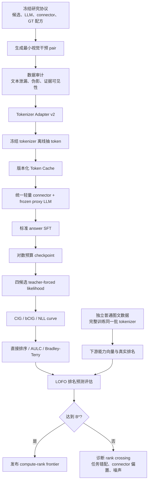

# Causal Visual Learning Curve

> A low-cost training protocol for predicting the downstream ranking of visual tokenizers in multimodal large language models.

## 0. 文档用途

这是一份用于创建独立新仓库的研究与工程规格，不是 VTBenchLab 的现有功能说明。

后续建立新仓库时：

1. 将本文件复制为新仓库根目录的 `README.md`。
2. 将需要复用的 VTBenchLab 代码复制到新仓库并修改。
3. 新仓库不得在运行时通过 `PYTHONPATH`、软链接、submodule 或绝对路径直接导入 VTBenchLab。
4. 复制代码时保留原项目许可证、版权头和来源说明，并在新仓库的 `NOTICE.md` 中记录源路径、原 commit 和主要修改。

本文将项目简称为 **CVLC**，将核心反事实分数简称为 **CIG**。

---

## 1. 一句话概括

CVLC 不试图用一个完全不训练的静态分数预测 MLLM 排名，而是回答：

> 在固定视觉—语言接口下，一个视觉 tokenizer 所包含的视觉证据，需要多少训练才能被语言模型正确读出；它的早期学习轨迹能否预测完整训练后的下游排名？

最小实验闭环是：

```text
两个视觉 tokenizer
        │
        ├── 便宜分支：少量反事实视觉 pair + 小 LLM + 轻量 connector
        │              → CIG learning curve → 预测谁更好
        │
        └── 昂贵分支：独立普通图文数据 + 固定完整训练配方
                       → 下游 benchmark 分数 → 得到真实胜负

比较“便宜分支的预测”与“昂贵分支的真实胜负”是否一致。
```

两个 tokenizer 只能做工程 smoke test 和二元胜负检查。要研究“排名预测”，至少需要 8 个 tokenizer 设置、4 个独立 family；论文级验证建议 16 个以上设置和 leave-one-family-out 评估。

---

## 2. 研究边界

### 2.1 第一版研究对象

第一版只比较视觉 tokenizer/视觉表征设置，不比较任意异构 MLLM。

一个候选设置包括：

- tokenizer checkpoint；
- 读取层；
- 输入分辨率；
- continuous、pre-quant、post-quant 等 representation surface；
- 是否保留 CLS/register token；
- 视觉 token 数和压缩策略。

固定以下因素：

- LLM family 和 checkpoint；
- prompt template；
- connector family；
- 输出视觉 token 数；
- 训练数据及其顺序；
- optimizer、LR、batch size 和训练步数；
- 下游评测集合和聚合规则。

### 2.2 主实验冻结边界

主 proxy 中：

- 冻结视觉 tokenizer；
- 冻结 LLM；
- 只训练统一轻量 connector。

这使 CVLC 主要测量：

> 视觉表示中的任务相关信息，在固定接口下被 LLM 读出的速度。

这不是完全纯粹的“表示信息量”，而是 **表示信息 × connector 可读性 × 小预算适配性**。这正是下游 MLLM 实际需要的性质。

### 2.3 不应过度声称的内容

- “因果”指输入图像上的受控语义干预，不代表已经识别 SGD 的因果效应。
- CVLC 的结论默认只适用于预注册的 connector 和训练协议。
- 若完整训练中解冻 tokenizer，问题会变成“表示质量 + finetunability”，需要另开 track。
- 若同时改变 LLM、训练数据和 tokenizer，视觉 proxy 不可能独立解释最终差异。

---

## 3. 正式问题定义

设第 \(i\) 个冻结视觉 tokenizer 为 \(E_i\)，固定语言模型为 \(L\)，预算 \(b\) 下训练得到的 connector 为 \(P_{i,b}\)：

\[
M_{i,b}=L_{\mathrm{frozen}}\circ P_{i,b}\circ E_{i,\mathrm{frozen}}.
\]

完整目标训练后，tokenizer \(i\) 在能力域 \(d\) 上的下游表现为：

\[
Y_{i,d}=\operatorname{Score}_d(M^{\mathrm{full}}_{i,B}).
\]

CVLC 给定早期曲线：

\[
\{S_i(b_1),S_i(b_2),\ldots,S_i(b_k)\},\qquad b_k\ll B,
\]

预测：

\[
\operatorname{rank}\{Y_i\}_{i=1}^{T}.
\]

主要研究问题：

1. 训练到哪个最小预算后，排名开始稳定？
2. 单个低预算 CIG 是否已经足够，还是必须使用 slope/AUC？
3. 因果视觉训练是否优于等算力的普通随机图文训练？
4. 哪些 tokenizer 是 early learner，哪些是 late bloomer？
5. 规律能否跨 tokenizer family、LLM 尺度和 connector 迁移？

---

## 4. 反事实数据单元

每个基本单元为：

\[
x=(I^0,I^1,q,a^0,a^1,z,R,p).
\]

- \(I^0,I^1\)：来自同一基础场景，只改变一个影响答案的视觉变量；
- \(q\)：两侧完全相同的问题和 prompt；
- \(a^0,a^1\)：两侧正确答案，且 \(a^0\neq a^1\)；
- \(z\)：被干预的视觉变量；
- \(R\)：证据区域 mask/bbox；
- \(p\)：renderer、模板、资产、随机种子等 provenance。

例子：

```text
q: Which side is the red circle on?
I0: 红圆在左，蓝方块在右；a0 = left
I1: 红圆在右，蓝方块在左；a1 = right
```

相比独立生成两张图，更推荐在同一场景中交换两个属性或位置，因为这更容易保持：

- 物体数量；
- 背景和相机；
- 颜色直方图；
- 整体视觉复杂度；
- 问题措辞和答案词频。

---

## 5. 核心分数 CIG

### 5.1 候选答案分数

使用 teacher forcing 计算长度归一化 log-likelihood：

\[
\ell_{i,b}(a\mid I,q)
=
\frac{1}{|\operatorname{tok}(a)|}
\sum_{k=1}^{|\operatorname{tok}(a)|}
\log p_{i,b}(a_k\mid I,q,a_{<k}).
\]

必须统一：

- prompt template；
- answer 前导空格；
- BOS/EOS；
- answer loss mask；
- tokenizer 和长度归一化；
- candidate order averaging。

### 5.2 两个正确方向的 margin

\[
m^0_{i,b}
=
\ell(a^0\mid I^0,q)-\ell(a^1\mid I^0,q),
\]

\[
m^1_{i,b}
=
\ell(a^1\mid I^1,q)-\ell(a^0\mid I^1,q).
\]

### 5.3 Causal Intervention Gain

\[
\operatorname{CIG}_{i,b}(x)
=
\frac{m^0_{i,b}+m^1_{i,b}}{2}.
\]

等价的 difference-in-differences 写法：

\[
\operatorname{CIG}
=
\frac12\left[
\ell(a^0|I^0)-\ell(a^0|I^1)
+
\ell(a^1|I^1)-\ell(a^1|I^0)
\right].
\]

性质：

- 模型完全忽略图像时，理论上 CIG 为 0；
- 模型随图像改变但方向错误时，CIG 为负；
- 相同问题和相同候选答案集合使静态答案偏好在差分中抵消。

跨模型 logit scale 差异较大时，同时报告：

\[
\operatorname{bCIG}
=
\frac12\left[
\tanh\left(\frac{m^0}{2}\right)
+
\tanh\left(\frac{m^1}{2}\right)
\right]\in[-1,1].
\]

辅助指标：

\[
\operatorname{PairExact}
=
\mathbf 1[m^0>0\land m^1>0],
\]

\[
\operatorname{SoftPairAcc}
=
\frac{\sigma(m^0)+\sigma(m^1)}{2}.
\]

PairExact 可解释性强，但训练早期过于离散，因此不能作为唯一学习曲线。

---

## 6. Causal Visual Learning Curve

能力域 \(d\) 的曲线：

\[
S_{i,d}(b)
=
\mathbb E_{x\in D_d}[\operatorname{bCIG}_{i,b}(x)].
\]

先做能力域 macro-average，再做总分：

\[
S_i(b)=\frac1{|D|}\sum_d S_{i,d}(b).
\]

零训练点仅是随机 connector 的共同参考，不能解释为静态表示质量。学习响应为：

\[
R_{i,d}(b)=S_{i,d}(b)-S_{i,d}(0).
\]

建议曲线特征：

```text
CIG/bCIG 当前值
相对 b=0 的 response
对 log-compute 的早期 slope
log-budget AULC
answer NLL
PairExact / SoftPairAcc
seed variance
null/shuffle CIG
```

log-budget AULC：

\[
\operatorname{AULC}_i
=
\frac{1}{u_K-u_1}
\sum_{k=1}^{K-1}
\frac{S_i(b_k)+S_i(b_{k+1})}{2}
(u_{k+1}-u_k),
\]

其中：

\[
u_k=\log(1+C(b_k)/C_0).
\]

---

## 7. 数据设计

### 7.1 第一版能力域

| 能力域 | 干预例子 | 主要控制变量 |
|---|---|---|
| 物体/属性/绑定 | 两个物体交换颜色、材质、形状 | 颜色集合、物体数量、布局不变 |
| 数量/小物体 | \(n\leftrightarrow n+1\) | 背景、尺寸、密度、遮挡 |
| 空间/几何 | 左右、上下、内外、相交、远近 | 同一 scene graph 和相机 |
| OCR/数字/符号 | 字符置换、数字替换、运算符变化 | 字体、字符数、glyph 布局 |
| Chart/Document/Diagram | 交换柱高、标签、表格值、箭头 | 版式和视觉密度固定 |
| 状态/动作 | 开关、满空、完整/破损、方向 | 局部编辑和 evidence mask |

`prior-conflict` 单独建轨道，例如蓝色草莓或异常大小关系。不要把“没有看清图”与“拒绝违背常识”混成同一个分数。

视频在图像版稳定后再做 Phase II：时间反转、帧顺序交换、出现/消失、状态变化和动作方向。

### 7.2 数据规模

#### Smoke test

- 2 个 tokenizer；
- count + OCR 两域；
- 1K train pairs；
- 128–256 validation pairs；
- 只验证 adapter、cache、训练和 scorer。

#### Pilot

- 8 个 tokenizer 设置，至少 4 个 family；
- 16K train pairs；
- 2K validation-fast；
- 5K–8K test；
- 3 个 connector initialization seeds。

#### 论文版

- 最低 16 个设置、6 个 family；
- 若学习 ranker，理想为 24–30 个设置、8 个 family；
- 50K–100K train pairs；
- 5K–10K validation；
- 约 10K hidden/dynamic test。

建议组成：

- 60% 程序化精确渲染；
- 20% 真实图局部对称编辑；
- 20% 未见模板、renderer、字体或自然互补图外推。

### 7.3 数据 schema

使用 Parquet 保存元数据，图像使用普通对象文件或 WebDataset：

```text
pair_id
domain / subtype / difficulty
image_0_uri / image_1_uri
image_0_sha256 / image_1_sha256
question
answer_0 / answer_1
candidate_set
template_id
generator_name / generator_version
render_seed
source_asset_ids / source_license
intervention_type
intervention_value_0 / intervention_value_1
evidence_bbox / evidence_mask_uri
scene_graph_json
split / split_axes
```

### 7.4 切分原则

必须按 group 切分，而不是随机按最终图片切分：

- base scene/scene graph；
- source asset；
- question template family；
- renderer；
- font family；
- intervention subtype；
- source dataset。

### 7.5 数据验收

正式 test pair 建议满足：

- human/oracle 双侧正确率 (>95\%\)；
- question-only 模型接近机会水平；
- image-only “哪一侧被编辑”分类器 AUC (le 0.55)；
- 程序生成样本 evidence mask 外像素差异接近 0；
- null-image 与 shuffled-image CIG 的置信区间覆盖 0；
- 答案、干预方向和候选位置严格平衡；
- 至少 500–1000 对进行多人双侧人工检查。

主指标使用语义反事实 pair。blank image、no-image、随机图、blur/noise 只作诊断，因为这些操作会引入不同程度的 OOD 输入或结构变化。

---

## 8. Tokenizer Adapter v2

不能只返回 pooled `[B,D]`。空间、OCR、小物体能力需要完整 token sequence：

```python
@dataclass
class TokenBatch:
    values: Tensor | None       # [B, N, D]
    ids: Tensor | None          # [B, N]
    mask: BoolTensor            # [B, N]
    coords: Tensor              # [B, N, 2] or [B, N, 3]
    special_mask: BoolTensor
    grid_shape: tuple | None
    surface: str                # final_patch/post_quant/pre_quant
    input_size: tuple
    metadata: dict
```

每个 adapter 必须实现：

```python
preprocess(image_or_video)
encode(pixel_values) -> TokenBatch
dequantize(ids) -> values       # if applicable
fingerprint() -> dict
estimate_encoder_flops()
```

每个 tokenizer 配置必须固定：

- checkpoint 和 SHA256；
- 原代码 commit；
- 输入分辨率、mean/std；
- 读取层；
- CLS/register token 策略；
- representation surface；
- codebook/post-quant projection；
- 预期 token 数、维度和 grid；
- 推理 dtype。

### 8.1 连续 tokenizer

使用官方 MLLM 接口层或预注册的最后 patch sequence。不能使用 mean pooling 作为主结果。

### 8.2 离散 tokenizer

至少区分：

- pre-quant latent；
- code ID；
- codebook lookup 后的 quantized embedding；
- post-quant projection 后的 embedding。

理解型 MLLM 主 track 推荐使用官方 codebook lookup/post-quant embedding。若重新训练随机 ID embedding，测到的会混入重新学习 codebook 语义的成本。

### 8.3 坐标

query resampler 对 token permutation 本身不敏感，因此必须增加固定坐标：

- grid token：2D sin-cos；
- video token：time + 2D；
- 1D tokenizer：归一化 sequence coordinate；
- CLS/register：独立 type embedding。

---

## 9. Proxy 模型

建议主架构：

```text
TokenBatch.values
→ per-token LayerNorm
→ Linear(D_tokenizer, 512)
→ coordinate/type embedding
→ 2-layer Perceiver Resampler, K=32, d=512, 8 heads
→ 2-layer MLP
→ LLM hidden size
→ frozen 0.5B causal LLM
```

训练参数仅包括：

- input normalization/projection；
- coordinate/type projection；
- resampler；
- LLM projection。

必须在启动时 assert tokenizer 和 LLM 全部冻结。

冻结 LLM 参数不代表 LLM 没有训练计算。梯度仍需穿过 LLM 返回视觉 prefix，因此必须报告实际 FLOPs/GPU-hours，不能只报告 trainable parameter 数。

### 9.1 公平性轨道

1. `fixed-K`：所有 tokenizer 压缩成 32 个视觉 token，主结果；
2. `native-token`：保留原生 token 数，代表部署效果；
3. `equal-FLOPs`：按实测训练/推理 FLOPs 对齐。

### 9.2 Connector sensitivity

主结果使用统一轻量 Perceiver。至少在 4–6 个 tokenizer 上增加一种对照：

- parameter-free 2D adaptive pooling + MLP；或
- 更接近现有 GVT 的深 Perceiver。

若换 connector 后排名大幅翻转，结论必须降级为 connector-specific。

---

## 10. 训练协议

主 loss 使用标准 answer SFT：

\[
\mathcal L_{\mathrm{SFT}}
=
-\frac12\left[
\sum_k\log p(a_k^0|I^0,q,a^0_{<k})
+
\sum_k\log p(a_k^1|I^1,q,a^1_{<k})
\right].
\]

不能在主实验中直接优化 CIG；CIG/margin loss 只作 ablation。

初始训练配置：

```text
bf16
global batch = 32 or 64 pairs
AdamW
betas = (0.9, 0.95)
weight decay = 0.01
gradient clip = 1.0
fixed 32-step warmup, then constant LR
3 bridge initialization seeds
```

LR 只在 2–3 个 development tokenizer 上从 `{1e-4, 3e-4, 1e-3}` 选择一次，随后锁定。不能为每个 tokenizer 单独调参而不计入 benchmark 成本。

建议 pair-exposure checkpoint：

\[
b\in\{0,512,2048,8192,32768,131072\}.
\]

主协议进行一次持续训练，在上述预算点保存 checkpoint。scheduler horizon 始终按最大预算定义。

在少量 tokenizer 上增加 `budget-optimized` ablation：每个短预算独立训练并使用自己的完整 schedule，检查 prefix checkpoint 是否被 warmup/长期 schedule 系统性压低。

同时记录：

- unique causal pairs；
- supervised example exposures；
- optimizer steps；
- vision-language token 数；
- 实测 FLOPs/GPU-hours；
- 峰值显存和吞吐。

另做 data-diversity curve：

```text
unique pair 数：256 / 1K / 4K / 16K
固定总 exposure 或固定 epoch
```

用于区分“更多优化步”与“更多独特视觉干预”。

---

## 11. Token cache

不同 tokenizer 可在各自环境中抽取特征，再通过统一 cache 接入 CVLC：

```text
Tokenizer-specific conda/container
            ↓
标准化 TokenBatch cache
            ↓
统一 CVLC bridge/LLM 环境
```

不要强迫所有旧 tokenizer 依赖在同一个 Python 环境中共存。

缓存格式建议：

- continuous token：fp16/bf16 safetensors shards；
- discrete token：int16/int32 ID + codebook fingerprint；
- variable length：flat values + offsets；
- Parquet index：`image_sha → shard, offset`；
- 每 shard checksum，临时文件完整写入后 atomic rename。

cache key 至少包含：

```text
image_sha
tokenizer_checkpoint_sha
tokenizer_code_commit
surface
layer
preprocess_config
input_resolution
dtype
adapter_protocol_version
```

随机抽取样本比较 online/cache 的 token count、mask、coords、cosine similarity 和 max absolute error。

---

## 12. Full-training ground truth

建立 CVLC 的第一批实验必须让主候选全部跑到完整目标，否则没有无偏 ground truth。Successive Halving 只能在 CVLC 被证明可靠以后用于未来新候选。

### 12.1 GT-A：机制隔离标签

- tokenizer 冻结；
- LLM 冻结；
- 与 proxy 相同 connector family；
- 使用独立的普通图文对齐/多模态 QA 数据训练到收敛；
- 在独立下游 benchmark 上评测。

GT-A 回答：

> 早期因果视觉学习速度，能否预测完整 connector learning 的排名？

这是第一版最重要、也最容易控制的 ground truth。

### 12.2 GT-B：现实 MLLM 标签

- tokenizer 冻结；
- Stage 1：只训练 connector 做图文对齐；
- Stage 2：connector + 固定 rank LLM LoRA 做 instruction tuning；
- 所有 tokenizer 使用相同 LLM、数据、顺序、步数和 optimizer。

GT-B 回答：

> 便宜 proxy 能否预测现实 instruction-tuned MLLM 的排名？

推荐尺度：

```text
proxy LLM: 同家族 0.5B
main target: 同家族 1.5B–3B
scale-transfer: 选 8–12 个 tokenizer 跑 7B
```

### 12.3 下游能力向量

不要只保存一个总分：

\[
Y_i=
(Y_{i,\mathrm{general}},
Y_{i,\mathrm{OCR}},
Y_{i,\mathrm{spatial}},
Y_{i,\mathrm{count}},
Y_{i,\mathrm{chart}},
Y_{i,\mathrm{hallucination}}).
\]

每项同时报告：

\[
Y^{\mathrm{raw}}_{i,d}=\operatorname{Accuracy}_{i,d},
\]

\[
Y^{\mathrm{visual}}_{i,d}
=
\operatorname{Score}^{\mathrm{image}}_{i,d}
-
\operatorname{Score}^{\mathrm{shuffle/null}}_{i,d}.
\]

完整训练数据必须与 CIG validation/test 在 asset、模板、renderer 和来源上隔离。否则只能证明模型学会了 probe 数据，而不能证明能够预测下游。

---

## 13. 排名预测

方法从简单到复杂排列，任何复杂方法都必须超过前面的 compute–decision frontier：

1. 静态 AC、reconstruction、linear probe；
2. 等算力普通随机图文 micro-training；
3. 直接按 `CIG@b` 排名；
4. log-AULC、response、slope；
5. ridge regression；
6. Bradley–Terry pairwise ranker；
7. power law、Bayesian learning-curve extrapolation。

Bradley–Terry：

\[
P(Y_i>Y_j)
=
\sigma\left(\beta^\top(z_i-z_j)\right).
\]

tokenizer 数量较少时不建议直接使用神经网络 ranker。

主切分为 leave-one-tokenizer-family-out，不能把同一家族的不同尺寸随机拆入训练集和测试集。

---

## 14. 统计指标

报告：

- Kendall \(\tau_b\)；
- Spearman；
- resolvable-pair decision accuracy；
- Recall@1/3；
- NDCG@3；
- top-k regret；
- budget × budget rank stability；
- tokenizer pair crossover。

若完整训练分数差小于 seed/eval noise，不应强行区分：

\[
\mathcal P_{\mathrm{res}}
=
\{(i,j):|Y_i-Y_j|>\delta_{ij}\}.
\]

\[
\operatorname{DA}(b)
=
\frac1{|\mathcal P_{\mathrm{res}}|}
\sum_{(i,j)\in\mathcal P_{\mathrm{res}}}
\mathbf1[
\operatorname{sign}(\hat Y_i(b)-\hat Y_j(b))
=
\operatorname{sign}(Y_i-Y_j)].
\]

归一化 top-3 regret：

\[
\operatorname{NR@3}
=
\frac{
\max_iY_i-
\max_{i\in\operatorname{Top3}(\hat Y)}Y_i
}{
\max_iY_i-
\min_iY_i
}.
\]

置信区间按 tokenizer family、task、seed 和 base scene 做 hierarchical/cluster bootstrap。不能把所有 tokenizer pair 当作独立 Bernoulli 样本。

---

## 15. 成功标准

建议在查看主测试结果前预注册：

\[
B^\star=\min_b
\begin{cases}
\text{point Kendall }\tau_b\ge0.70,\\
\operatorname{LCB}_{95\%}(\tau_b)>0.50,\\
\operatorname{DA}_{\mathrm{res}}\ge0.80,\\
\operatorname{Recall@3}\ge0.90,\\
\operatorname{UCB}_{95\%}(\operatorname{NR@3})\le0.10,\\
C_{\mathrm{proxy}}(b)/C_{\mathrm{full}}\le0.05.
\end{cases}
\]

还应要求：

- 相比最强 static/equal-cost baseline，\(\Delta\tau\ge0.10\)，paired bootstrap CI 不跨 0；
- leave-one-family-out 仍成立；
- proxy seed 间 rank Kendall \(\ge0.8\)；
- 至少在两个 target scale 或 recipe 上不出现系统性反转。

### 15.1 Smoke/Pilot gate

投入昂贵 GT-B 前先确认：

- 真实 pair CIG 随训练上升；
- null/shuffled CIG 接近 0；
- 两个 tokenizer 的 cheap winner 与 GT-A winner 一致；
- 8-tokenizer pilot 在 10% 成本内达到 point \(\tau\ge0.5\)；
- 至少优于 zero-training baseline；
- synthetic 和 real-edit test 趋势一致。

若这些不成立，先诊断数据、connector 或能力配比，不应直接扩大完整训练矩阵。

---

## 16. 实验流程图



---

## 17. 实施阶段

| 阶段 | 规模 | 主要产出 | 通过条件 |
|---|---:|---|---|
| P0 协议冻结 | 3–5 天 | estimand、候选、预算、成功标准 | 不根据结果改主 metric |
| P1 工程 smoke | 1–2 周 | Adapter、cache、trainer、CIG scorer | 两 tokenizer 跑通，null CIG≈0 |
| P2 数据 pilot | 2–3 周 | 16K pair 六域数据与审计报告 | human/oracle>95%，artifact AUC≤0.55 |
| P3 8-tokenizer pilot | 2–4 周 | CVLC curves、GT-A、rank crossing | 达到 pilot gate |
| P4 主实验 | 计算相关 | 16–30 设置、完整 GT-A、LOFO | 达到 \(B^\star\) |
| P5 现实外推 | 计算相关 | GT-B、7B anchors、connector ablation | 跨尺度/recipe 保持 |
| P6 发布 | 2–3 周 | 数据、代码、图表、protocol card | 全链路可复现 |
| P7 视频扩展 | 后续 | temporal CVLC | 图像版稳定后启动 |

---

## 18. 新仓库目录建议

```text
cvlc/
  adapters/
    base_v2.py
    continuous/
    discrete/
    registry.py
  data/
    schema.py
    generators/
    audits/
    build_dataset.py
  cache/
    extract.py
    reader.py
    manifest.py
  models/
    bridge.py
    resampler.py
    scorer.py
  train/
    runner.py
    budget_callback.py
  eval/
    likelihood.py
    cig.py
    downstream.py
  rank/
    fit.py
    bootstrap.py
  configs/
    tokenizers/
    protocols/
    data/
    targets/
  tests/
```

运行输出：

```text
outputs/cvlc/{protocol_id}/{tokenizer}/{seed}/
  resolved_config.yaml
  fingerprints.json
  environment.txt
  train.jsonl
  curve.parquet
  per_example_scores.parquet
  checkpoints/budget_*.safetensors
  resource_usage.json
```

计划中的 CLI 接口可以设计为：

```bash
python -m cvlc.data.build_dataset --config configs/data/smoke.yaml
python -m cvlc.cache.extract --tokenizer configs/tokenizers/clip_l14.yaml
python -m cvlc.train.runner --config configs/protocols/proxy_smoke.yaml
python -m cvlc.eval.cig --run outputs/cvlc/.../resolved_config.yaml
python -m cvlc.rank.fit --curves analysis/curves.parquet --ground-truth analysis/full_gt.parquet
```

以上是接口约定，不代表当前 VTBenchLab 已经提供这些命令。

---

## 19. VTBenchLab 参考代码与复制规则

当前 VTBenchLab 已有部分可复用骨架。新仓库实现时应复制必要代码并去除项目耦合，不能直接从 VTBenchLab import。

| 用途 | VTBenchLab 源路径 | 新仓库建议位置 | 处理方式 |
|---|---|---|---|
| tokenizer 抽象接口 | [`GVT/gvt/gvt/modules/visual_tokenizers/base.py`](GVT/gvt/gvt/modules/visual_tokenizers/base.py) | `cvlc/adapters/base_v2.py` | 复制后扩展为 `TokenBatch` v2 |
| tokenizer 注册表 | [`GVT/gvt/gvt/modules/visual_tokenizers/registry.py`](GVT/gvt/gvt/modules/visual_tokenizers/registry.py) | `cvlc/adapters/registry.py` | 复制设计，不复制 placeholder 逻辑 |
| GVT 视觉—LLM 桥 | [`GVT/gvt/gvt/modules/modeling_gvt.py`](GVT/gvt/gvt/modules/modeling_gvt.py) | `cvlc/models/bridge.py` | 参考调用链，拆掉 Lightning/GVT 耦合 |
| Perceiver Resampler | [`GVT/gvt/gvt/modules/visual_modules/perceiver.py`](GVT/gvt/gvt/modules/visual_modules/perceiver.py) | `cvlc/models/resampler.py` | 复制并缩成 `d=512, depth=2` 主配置 |
| 现有冻结/K 配置 | [`GVT/gvt/gvt/config.py`](GVT/gvt/gvt/config.py) | `cvlc/configs/protocols/` | 只参考默认值和字段语义 |
| tokenizer 加载与预处理 | [`scripts/linear_probe_tokenizers/feature_extractors.py`](scripts/linear_probe_tokenizers/feature_extractors.py) | `cvlc/adapters/continuous/`、`discrete/` | 复制各模型 loader，但改为返回 token sequence |
| 线性 probe baseline | [`scripts/linear_probe_tokenizers/linear_probe.py`](scripts/linear_probe_tokenizers/linear_probe.py) | `baselines/linear_probe.py` | 复制后作为 static baseline |

需要注意：

- `visual_tokenizers/base.py` 当前只约定连续 `[B,N,D]`，缺少 mask、coords、surface 和离散 ID；
- `visual_tokenizers/registry.py` 当前 CLIP、DINOv2、custom 仍是 placeholder；
- `modeling_gvt.py` 当前桥为较重的 `d=1024, depth=6` Perceiver，适合作为外部 ablation，不建议直接作为 cheap proxy 主桥；
- `feature_extractors.py` 当前主要输出 CLS/mean-pooled `[B,D]`，只能复用加载器和 preprocessing，不能复用最终 readout；
- 复制任何代码前必须核对相应目录和上游 checkpoint 的许可证。

新仓库建议加入 `NOTICE.md`：

```text
Source repository: VTBenchLab
Source commit: <commit sha>
Copied files/components: <list>
Original paths: <list>
Modifications: <summary>
License: <license identifiers>
```

---

## 20. Baselines 与关键消融

### 20.1 必做 baselines

- random ranking；
- reconstruction metrics，如 PSNR/SSIM/LPIPS/rFID；
- kNN/linear probe；
- AC alignment/correspondence；
- zero-step CIG；
- 等算力普通随机图文 micro-training；
- 单预算 CIG；
- AULC/slope；
- 简单 power-law 或饱和曲线。

### 20.2 必做消融

- 无反事实配对，只用普通 VQA；
- 无双向 CIG，只测 factual image；
- factual/counterfactual 比例变化；
- procedural vs real-edit；
- 去掉每个能力域；
- answer/candidate permutation；
- null image、shuffled image、random image；
- fixed-K vs native-token vs equal-FLOPs；
- lightweight Perceiver vs pooling connector；
- frozen LLM vs rank-8 LoRA；
- 0.5B vs 1.5B proxy；
- prefix checkpoint vs budget-optimized schedule。

最重要的对照是：

> 相同训练 FLOPs 下，因果 pair micro-training 是否比从完整普通图文数据中随机抽取一个小子集更能预测最终排名？

如果两者相当，贡献主要是“少量训练预测”；如果因果数据显著更好，才支持“因果视觉学习曲线”的数据设计价值。

---

## 21. 失败模式

| 失败模式 | 诊断 | 处理 |
|---|---|---|
| 学到 renderer/编辑痕迹 | synthetic 高、real-edit 低；side classifier AUC 高 | 对称渲染、跨 renderer split、加入自然编辑 test |
| 只测 connector compatibility | 换 connector 排名翻转 | 固定主 connector，报告 sensitivity |
| token 数越多天然越强 | CIG 与 token 数高度相关 | fixed-K、equal-FLOPs、native 三轨 |
| 离散 tokenizer 不公平 | ID surface 很差，post-quant 正常 | surface 分轨，禁止混排 |
| 早期 rank crossing 严重 | \(\tau(b)\) 非单调 | 报最小稳定预算，不强行宣称极小预算 |
| proxy task 与下游错配 | OCR 可预测，general VQA 不可预测 | 预测能力向量，避免强行单总分 |
| seed 噪声过大 | connector seed 排名反复 | 3 seeds，提高最小预算 |
| full GT 本身不稳定 | full seeds 排名互换 | ties、重复 anchor、报告噪声上限 |
| family leakage | random split 好，LOFO 崩 | leave-one-family-out 为主 |
| cache 污染 | checkpoint 变化仍命中旧 cache | 全链路 fingerprint/hash |
| paired crop 丢失证据 | 某域训练始终随机 | pair-shared transform + bbox visibility gate |

负结果同样有研究价值。例如：没有统一 \(B^\star\)，但 OCR、空间和语义各自存在不同的最小预算；或者早期曲线只能在 family 内预测。这些结论比强行拟合一个不稳定总分更可信。

---

## 22. 预期产出

- `CVCounterfactual` 数据集、生成器和 hidden test；
- Tokenizer Adapter v2；
- tokenizer-specific cache extractor；
- 统一 CVLC trainer/scorer；
- tokenizer × budget × seed × capability 的 curve tensor；
- full-training ground-truth matrix；
- family-held-out rank predictor；
- compute–rank frontier；
- rank braid/crossover 图；
- capability-specific \(B^\star\)；
- top-k recall/regret；
- reproducibility protocol card；
- late-bloomer 和失败案例分析。

可能的论文标题：

> **Training a Little Tells a Lot: Causal Visual Learning Curves for Predicting MLLM Tokenizer Rankings**

---

## 23. 文献路线

### 23.1 视觉 tokenizer 与静态代理

- [Law of Vision Representation in MLLMs / AC Score](https://arxiv.org/abs/2408.16357)：alignment 与 correspondence 可低成本预测视觉表示的 MLLM 表现，是 CVLC 最重要的静态 baseline。
- [What Makes for Good Visual Tokenizers for Large Language Models?](https://arxiv.org/abs/2305.12223)：语义理解和细粒度感知对视觉预训练方式的需求不同。

### 23.2 小模型与早期曲线预测

- [DataDecide](https://proceedings.mlr.press/v267/magnusson25a.html)：单个小尺度排序和连续 likelihood 是很强的 compute-decision baseline，复杂 scaling law 不一定更好。
- [Predicting LLM Reasoning Performance with Small Proxy Model / rBridge](https://arxiv.org/abs/2509.21013)：proxy 指标需要同时贴近训练目标和目标任务。
- [Learning to Rank Learning Curves](https://proceedings.mlr.press/v119/wistuba20a.html)：用 pairwise ranking 从部分曲线预测最终排序。
- [LC-PFN](https://proceedings.neurips.cc/paper_files/paper/2023/hash/3f1a5e8bfcc3005724d246abe454c1e5-Abstract-Conference.html)：带不确定性的 Bayesian learning-curve extrapolation。

### 23.3 视觉必要性、反事实和语言先验

- [MMStar](https://proceedings.neurips.cc/paper_files/paper/2024/hash/2f8ee6a3d766b426d2618e555b5aeb39-Abstract-Conference.html)：现有 benchmark 中存在大量不需要图像或可能泄漏的样本。
- [VQA v2](https://openaccess.thecvf.com/content_cvpr_2017/html/Goyal_Making_the_v_CVPR_2017_paper.html)：相同问题配视觉相似但答案不同的互补图像。
- [Counterfactual VQA](https://openaccess.thecvf.com/content/CVPR2021/html/Niu_Counterfactual_VQA_A_Cause-Effect_Look_at_Language_Bias_CVPR_2021_paper.html)：用反事实推断分离问题到答案的语言直接效应。
- [COCO-Counterfactuals](https://proceedings.neurips.cc/paper_files/paper/2023/hash/e14e4cb8266184ceb234973dfe07faed-Abstract-Datasets_and_Benchmarks.html)：自动构建配对图文反事实数据。
- [Pixels Versus Priors / Visual CounterFact](https://arxiv.org/abs/2505.17127)：用视觉反常事实检验像素证据与世界知识先验冲突。
- [Probing Visual Language Priors / ViLP](https://proceedings.mlr.press/v267/luo25b.html)：OOD 图像与问答用于检验模型是否真正依赖视觉。

### 23.4 冻结模型与 connector

- [BLIP-2](https://arxiv.org/abs/2301.12597)：冻结视觉 encoder 和 LLM、训练轻量桥的范式。
- [Flamingo](https://arxiv.org/abs/2204.14198)：使用 Perceiver 处理视觉序列并形成固定数量视觉表示。
- [LLaVA](https://arxiv.org/abs/2304.08485)：alignment + visual instruction tuning 的 full-target 参考配方。
- [DeCo](https://arxiv.org/abs/2405.20985)：视觉 token 压缩和语义抽象不应被混为一谈。
- [TokenPacker](https://arxiv.org/abs/2407.02392)：projector 的局部信息保留与压缩方式会影响 MLLM 表现。

---

## 24. 核心论文叙事

以下四件事不同：

\[
\text{visual necessity}
\neq
\text{visual sensitivity}
\neq
\text{correct causal grounding}
\neq
\text{visual learnability}.
\]

- visual necessity：题目是否必须看图；
- visual sensitivity：换图后输出是否变化；
- correct causal grounding：换图后是否沿正确答案方向变化；
- visual learnability：这种正确视觉依赖随训练预算增长得多快。

CVLC 的核心贡献应当是最后一项，并用前三项作为数据和指标控制。

与 AC Score 的清晰区别：

- AC 主要描述视觉表示的静态 alignment/correspondence；
- CVLC 描述视觉证据在固定 MLLM 接口中的学习速度、rank crossover 和最小充分预算；
- 最关键实验是 CVLC 是否在相同算力下超过 AC、linear probe、重建指标和普通随机 micro-training。
