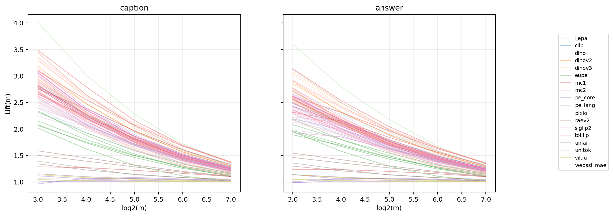

# E3：全池三协议评估

## 覆盖审计

补齐 qwen3/qwen2.5/smollm2 三列之前，主结论只使用 MLLM_Avg（n=79）。
PC1 与 MLLM_Avg_matched 使用完全相同的模型池；PC1 与未匹配的 MLLM_Avg 不可直接解释为仅更换目标。

| 目标 | 指标 | caption n / family | answer n / family |
|---|---|---:|---:|
| MLLM_Avg | Lift_8 | 79 / clip:1, dino:4, dinov2:4, dinov3:1, eupe:6, ijepa:1, mc1:9, mc2:15, pe_core:5, pe_lang:3, pixio:4, raev2:1, siglip2:15, toklip:2, uniar:1, unitok:1, vilau:1, webssl_mae:5 | 79 / clip:1, dino:4, dinov2:4, dinov3:1, eupe:6, ijepa:1, mc1:9, mc2:15, pe_core:5, pe_lang:3, pixio:4, raev2:1, siglip2:15, toklip:2, uniar:1, unitok:1, vilau:1, webssl_mae:5 |
| MLLM_Avg | Lift_16 | 79 / clip:1, dino:4, dinov2:4, dinov3:1, eupe:6, ijepa:1, mc1:9, mc2:15, pe_core:5, pe_lang:3, pixio:4, raev2:1, siglip2:15, toklip:2, uniar:1, unitok:1, vilau:1, webssl_mae:5 | 79 / clip:1, dino:4, dinov2:4, dinov3:1, eupe:6, ijepa:1, mc1:9, mc2:15, pe_core:5, pe_lang:3, pixio:4, raev2:1, siglip2:15, toklip:2, uniar:1, unitok:1, vilau:1, webssl_mae:5 |
| MLLM_Avg | Lift_32 | 79 / clip:1, dino:4, dinov2:4, dinov3:1, eupe:6, ijepa:1, mc1:9, mc2:15, pe_core:5, pe_lang:3, pixio:4, raev2:1, siglip2:15, toklip:2, uniar:1, unitok:1, vilau:1, webssl_mae:5 | 79 / clip:1, dino:4, dinov2:4, dinov3:1, eupe:6, ijepa:1, mc1:9, mc2:15, pe_core:5, pe_lang:3, pixio:4, raev2:1, siglip2:15, toklip:2, uniar:1, unitok:1, vilau:1, webssl_mae:5 |
| MLLM_Avg | Lift_64 | 79 / clip:1, dino:4, dinov2:4, dinov3:1, eupe:6, ijepa:1, mc1:9, mc2:15, pe_core:5, pe_lang:3, pixio:4, raev2:1, siglip2:15, toklip:2, uniar:1, unitok:1, vilau:1, webssl_mae:5 | 79 / clip:1, dino:4, dinov2:4, dinov3:1, eupe:6, ijepa:1, mc1:9, mc2:15, pe_core:5, pe_lang:3, pixio:4, raev2:1, siglip2:15, toklip:2, uniar:1, unitok:1, vilau:1, webssl_mae:5 |
| MLLM_Avg | Lift_128 | 79 / clip:1, dino:4, dinov2:4, dinov3:1, eupe:6, ijepa:1, mc1:9, mc2:15, pe_core:5, pe_lang:3, pixio:4, raev2:1, siglip2:15, toklip:2, uniar:1, unitok:1, vilau:1, webssl_mae:5 | 79 / clip:1, dino:4, dinov2:4, dinov3:1, eupe:6, ijepa:1, mc1:9, mc2:15, pe_core:5, pe_lang:3, pixio:4, raev2:1, siglip2:15, toklip:2, uniar:1, unitok:1, vilau:1, webssl_mae:5 |
| MLLM_Avg | m50 | 79 / clip:1, dino:4, dinov2:4, dinov3:1, eupe:6, ijepa:1, mc1:9, mc2:15, pe_core:5, pe_lang:3, pixio:4, raev2:1, siglip2:15, toklip:2, uniar:1, unitok:1, vilau:1, webssl_mae:5 | 79 / clip:1, dino:4, dinov2:4, dinov3:1, eupe:6, ijepa:1, mc1:9, mc2:15, pe_core:5, pe_lang:3, pixio:4, raev2:1, siglip2:15, toklip:2, uniar:1, unitok:1, vilau:1, webssl_mae:5 |
| MLLM_Avg | m90 | 79 / clip:1, dino:4, dinov2:4, dinov3:1, eupe:6, ijepa:1, mc1:9, mc2:15, pe_core:5, pe_lang:3, pixio:4, raev2:1, siglip2:15, toklip:2, uniar:1, unitok:1, vilau:1, webssl_mae:5 | 79 / clip:1, dino:4, dinov2:4, dinov3:1, eupe:6, ijepa:1, mc1:9, mc2:15, pe_core:5, pe_lang:3, pixio:4, raev2:1, siglip2:15, toklip:2, uniar:1, unitok:1, vilau:1, webssl_mae:5 |
| MLLM_Avg | VSA | 79 / clip:1, dino:4, dinov2:4, dinov3:1, eupe:6, ijepa:1, mc1:9, mc2:15, pe_core:5, pe_lang:3, pixio:4, raev2:1, siglip2:15, toklip:2, uniar:1, unitok:1, vilau:1, webssl_mae:5 | 79 / clip:1, dino:4, dinov2:4, dinov3:1, eupe:6, ijepa:1, mc1:9, mc2:15, pe_core:5, pe_lang:3, pixio:4, raev2:1, siglip2:15, toklip:2, uniar:1, unitok:1, vilau:1, webssl_mae:5 |
| MLLM_Avg | LAR_64 | 79 / clip:1, dino:4, dinov2:4, dinov3:1, eupe:6, ijepa:1, mc1:9, mc2:15, pe_core:5, pe_lang:3, pixio:4, raev2:1, siglip2:15, toklip:2, uniar:1, unitok:1, vilau:1, webssl_mae:5 | 79 / clip:1, dino:4, dinov2:4, dinov3:1, eupe:6, ijepa:1, mc1:9, mc2:15, pe_core:5, pe_lang:3, pixio:4, raev2:1, siglip2:15, toklip:2, uniar:1, unitok:1, vilau:1, webssl_mae:5 |
| MLLM_Avg | probe_epoch1 | 79 / clip:1, dino:4, dinov2:4, dinov3:1, eupe:6, ijepa:1, mc1:9, mc2:15, pe_core:5, pe_lang:3, pixio:4, raev2:1, siglip2:15, toklip:2, uniar:1, unitok:1, vilau:1, webssl_mae:5 | 79 / clip:1, dino:4, dinov2:4, dinov3:1, eupe:6, ijepa:1, mc1:9, mc2:15, pe_core:5, pe_lang:3, pixio:4, raev2:1, siglip2:15, toklip:2, uniar:1, unitok:1, vilau:1, webssl_mae:5 |
| MLLM_Avg | retrieval-ImageNet | 46 / clip:1, ijepa:1, mc1:9, mc2:15, raev2:1, siglip2:15, toklip:2, unitok:1, vilau:1 | 46 / clip:1, ijepa:1, mc1:9, mc2:15, raev2:1, siglip2:15, toklip:2, unitok:1, vilau:1 |
| MLLM_Avg | CKA | 46 / clip:1, ijepa:1, mc1:9, mc2:15, raev2:1, siglip2:15, toklip:2, unitok:1, vilau:1 | 46 / clip:1, ijepa:1, mc1:9, mc2:15, raev2:1, siglip2:15, toklip:2, unitok:1, vilau:1 |
| MLLM_Avg | pretrain_loss | 46 / clip:1, ijepa:1, mc1:9, mc2:15, raev2:1, siglip2:15, toklip:2, unitok:1, vilau:1 | 46 / clip:1, ijepa:1, mc1:9, mc2:15, raev2:1, siglip2:15, toklip:2, unitok:1, vilau:1 |
| MLLM_Avg | A_score | 68 / clip:1, dino:4, dinov2:4, dinov3:1, eupe:1, ijepa:1, mc1:9, mc2:15, pe_core:5, pe_lang:2, pixio:4, raev2:1, siglip2:15, webssl_mae:5 | 68 / clip:1, dino:4, dinov2:4, dinov3:1, eupe:1, ijepa:1, mc1:9, mc2:15, pe_core:5, pe_lang:2, pixio:4, raev2:1, siglip2:15, webssl_mae:5 |
| MLLM_Avg | RankMe | 79 / clip:1, dino:4, dinov2:4, dinov3:1, eupe:6, ijepa:1, mc1:9, mc2:15, pe_core:5, pe_lang:3, pixio:4, raev2:1, siglip2:15, toklip:2, uniar:1, unitok:1, vilau:1, webssl_mae:5 | 79 / clip:1, dino:4, dinov2:4, dinov3:1, eupe:6, ijepa:1, mc1:9, mc2:15, pe_core:5, pe_lang:3, pixio:4, raev2:1, siglip2:15, toklip:2, uniar:1, unitok:1, vilau:1, webssl_mae:5 |
| MLLM_Avg | eff_rank | 79 / clip:1, dino:4, dinov2:4, dinov3:1, eupe:6, ijepa:1, mc1:9, mc2:15, pe_core:5, pe_lang:3, pixio:4, raev2:1, siglip2:15, toklip:2, uniar:1, unitok:1, vilau:1, webssl_mae:5 | 79 / clip:1, dino:4, dinov2:4, dinov3:1, eupe:6, ijepa:1, mc1:9, mc2:15, pe_core:5, pe_lang:3, pixio:4, raev2:1, siglip2:15, toklip:2, uniar:1, unitok:1, vilau:1, webssl_mae:5 |
| MLLM_Avg_matched | Lift_8 | 22 / clip:1, ijepa:1, mc1:4, mc2:4, raev2:1, siglip2:11 | 22 / clip:1, ijepa:1, mc1:4, mc2:4, raev2:1, siglip2:11 |
| MLLM_Avg_matched | Lift_16 | 22 / clip:1, ijepa:1, mc1:4, mc2:4, raev2:1, siglip2:11 | 22 / clip:1, ijepa:1, mc1:4, mc2:4, raev2:1, siglip2:11 |
| MLLM_Avg_matched | Lift_32 | 22 / clip:1, ijepa:1, mc1:4, mc2:4, raev2:1, siglip2:11 | 22 / clip:1, ijepa:1, mc1:4, mc2:4, raev2:1, siglip2:11 |
| MLLM_Avg_matched | Lift_64 | 22 / clip:1, ijepa:1, mc1:4, mc2:4, raev2:1, siglip2:11 | 22 / clip:1, ijepa:1, mc1:4, mc2:4, raev2:1, siglip2:11 |
| MLLM_Avg_matched | Lift_128 | 22 / clip:1, ijepa:1, mc1:4, mc2:4, raev2:1, siglip2:11 | 22 / clip:1, ijepa:1, mc1:4, mc2:4, raev2:1, siglip2:11 |
| MLLM_Avg_matched | m50 | 22 / clip:1, ijepa:1, mc1:4, mc2:4, raev2:1, siglip2:11 | 22 / clip:1, ijepa:1, mc1:4, mc2:4, raev2:1, siglip2:11 |
| MLLM_Avg_matched | m90 | 22 / clip:1, ijepa:1, mc1:4, mc2:4, raev2:1, siglip2:11 | 22 / clip:1, ijepa:1, mc1:4, mc2:4, raev2:1, siglip2:11 |
| MLLM_Avg_matched | VSA | 22 / clip:1, ijepa:1, mc1:4, mc2:4, raev2:1, siglip2:11 | 22 / clip:1, ijepa:1, mc1:4, mc2:4, raev2:1, siglip2:11 |
| MLLM_Avg_matched | LAR_64 | 22 / clip:1, ijepa:1, mc1:4, mc2:4, raev2:1, siglip2:11 | 22 / clip:1, ijepa:1, mc1:4, mc2:4, raev2:1, siglip2:11 |
| MLLM_Avg_matched | probe_epoch1 | 22 / clip:1, ijepa:1, mc1:4, mc2:4, raev2:1, siglip2:11 | 22 / clip:1, ijepa:1, mc1:4, mc2:4, raev2:1, siglip2:11 |
| MLLM_Avg_matched | retrieval-ImageNet | 22 / clip:1, ijepa:1, mc1:4, mc2:4, raev2:1, siglip2:11 | 22 / clip:1, ijepa:1, mc1:4, mc2:4, raev2:1, siglip2:11 |
| MLLM_Avg_matched | CKA | 22 / clip:1, ijepa:1, mc1:4, mc2:4, raev2:1, siglip2:11 | 22 / clip:1, ijepa:1, mc1:4, mc2:4, raev2:1, siglip2:11 |
| MLLM_Avg_matched | pretrain_loss | 22 / clip:1, ijepa:1, mc1:4, mc2:4, raev2:1, siglip2:11 | 22 / clip:1, ijepa:1, mc1:4, mc2:4, raev2:1, siglip2:11 |
| MLLM_Avg_matched | A_score | 22 / clip:1, ijepa:1, mc1:4, mc2:4, raev2:1, siglip2:11 | 22 / clip:1, ijepa:1, mc1:4, mc2:4, raev2:1, siglip2:11 |
| MLLM_Avg_matched | RankMe | 22 / clip:1, ijepa:1, mc1:4, mc2:4, raev2:1, siglip2:11 | 22 / clip:1, ijepa:1, mc1:4, mc2:4, raev2:1, siglip2:11 |
| MLLM_Avg_matched | eff_rank | 22 / clip:1, ijepa:1, mc1:4, mc2:4, raev2:1, siglip2:11 | 22 / clip:1, ijepa:1, mc1:4, mc2:4, raev2:1, siglip2:11 |
| PC1 | Lift_8 | 22 / clip:1, ijepa:1, mc1:4, mc2:4, raev2:1, siglip2:11 | 22 / clip:1, ijepa:1, mc1:4, mc2:4, raev2:1, siglip2:11 |
| PC1 | Lift_16 | 22 / clip:1, ijepa:1, mc1:4, mc2:4, raev2:1, siglip2:11 | 22 / clip:1, ijepa:1, mc1:4, mc2:4, raev2:1, siglip2:11 |
| PC1 | Lift_32 | 22 / clip:1, ijepa:1, mc1:4, mc2:4, raev2:1, siglip2:11 | 22 / clip:1, ijepa:1, mc1:4, mc2:4, raev2:1, siglip2:11 |
| PC1 | Lift_64 | 22 / clip:1, ijepa:1, mc1:4, mc2:4, raev2:1, siglip2:11 | 22 / clip:1, ijepa:1, mc1:4, mc2:4, raev2:1, siglip2:11 |
| PC1 | Lift_128 | 22 / clip:1, ijepa:1, mc1:4, mc2:4, raev2:1, siglip2:11 | 22 / clip:1, ijepa:1, mc1:4, mc2:4, raev2:1, siglip2:11 |
| PC1 | m50 | 22 / clip:1, ijepa:1, mc1:4, mc2:4, raev2:1, siglip2:11 | 22 / clip:1, ijepa:1, mc1:4, mc2:4, raev2:1, siglip2:11 |
| PC1 | m90 | 22 / clip:1, ijepa:1, mc1:4, mc2:4, raev2:1, siglip2:11 | 22 / clip:1, ijepa:1, mc1:4, mc2:4, raev2:1, siglip2:11 |
| PC1 | VSA | 22 / clip:1, ijepa:1, mc1:4, mc2:4, raev2:1, siglip2:11 | 22 / clip:1, ijepa:1, mc1:4, mc2:4, raev2:1, siglip2:11 |
| PC1 | LAR_64 | 22 / clip:1, ijepa:1, mc1:4, mc2:4, raev2:1, siglip2:11 | 22 / clip:1, ijepa:1, mc1:4, mc2:4, raev2:1, siglip2:11 |
| PC1 | probe_epoch1 | 22 / clip:1, ijepa:1, mc1:4, mc2:4, raev2:1, siglip2:11 | 22 / clip:1, ijepa:1, mc1:4, mc2:4, raev2:1, siglip2:11 |
| PC1 | retrieval-ImageNet | 22 / clip:1, ijepa:1, mc1:4, mc2:4, raev2:1, siglip2:11 | 22 / clip:1, ijepa:1, mc1:4, mc2:4, raev2:1, siglip2:11 |
| PC1 | CKA | 22 / clip:1, ijepa:1, mc1:4, mc2:4, raev2:1, siglip2:11 | 22 / clip:1, ijepa:1, mc1:4, mc2:4, raev2:1, siglip2:11 |
| PC1 | pretrain_loss | 22 / clip:1, ijepa:1, mc1:4, mc2:4, raev2:1, siglip2:11 | 22 / clip:1, ijepa:1, mc1:4, mc2:4, raev2:1, siglip2:11 |
| PC1 | A_score | 22 / clip:1, ijepa:1, mc1:4, mc2:4, raev2:1, siglip2:11 | 22 / clip:1, ijepa:1, mc1:4, mc2:4, raev2:1, siglip2:11 |
| PC1 | RankMe | 22 / clip:1, ijepa:1, mc1:4, mc2:4, raev2:1, siglip2:11 | 22 / clip:1, ijepa:1, mc1:4, mc2:4, raev2:1, siglip2:11 |
| PC1 | eff_rank | 22 / clip:1, ijepa:1, mc1:4, mc2:4, raev2:1, siglip2:11 | 22 / clip:1, ijepa:1, mc1:4, mc2:4, raev2:1, siglip2:11 |

## MLLM_Avg

### caption

| 指标 | 全表 Spearman | 一族一个 Spearman | top-1 regret (k=5) |
|---|---:|---:|---:|
| Lift_8 | 0.257 | -0.038 ± 0.126 | 6.493 |
| Lift_16 | 0.279 | -0.038 ± 0.135 | 6.738 |
| Lift_32 | 0.296 | -0.013 ± 0.135 | 6.768 |
| Lift_64 | 0.322 | -0.011 ± 0.134 | 6.580 |
| Lift_128 | 0.378 | 0.025 ± 0.143 | 6.169 |
| m50 | -0.532 | -0.309 ± 0.136 | 12.252 |
| m90 | -0.541 | -0.235 ± 0.138 | 11.773 |
| VSA | 0.117 | 0.074 ± 0.170 | 8.500 |
| LAR_64 | 0.355 | -0.007 ± 0.116 | 6.240 |
| probe_epoch1 | 0.731 | 0.361 ± 0.118 | 1.690 |
| retrieval-ImageNet | 0.893 | 0.476 ± 0.158 | 0.256 |
| CKA | 0.879 | 0.797 ± 0.080 | 0.656 |
| pretrain_loss | 0.890 | 0.747 ± 0.083 | 0.620 |
| A_score | 0.932 | 0.909 ± 0.043 | 0.970 |
| RankMe | 0.422 | 0.055 ± 0.148 | 5.836 |
| eff_rank | 0.386 | 0.045 ± 0.108 | 5.513 |

组合 regret：probe_epoch1=1.505, probe_epoch1+Lift_64=1.805, probe_epoch1+m50=1.814, probe_epoch1+VSA=1.481, probe_epoch1+A_score=0.856

### answer

| 指标 | 全表 Spearman | 一族一个 Spearman | top-1 regret (k=5) |
|---|---:|---:|---:|
| Lift_8 | 0.106 | -0.112 ± 0.130 | 8.252 |
| Lift_16 | 0.168 | -0.084 ± 0.134 | 7.839 |
| Lift_32 | 0.241 | -0.028 ± 0.134 | 7.406 |
| Lift_64 | 0.294 | -0.015 ± 0.133 | 6.867 |
| Lift_128 | 0.373 | 0.025 ± 0.143 | 6.201 |
| m50 | -0.614 | -0.371 ± 0.139 | 12.730 |
| m90 | -0.614 | -0.317 ± 0.115 | 12.159 |
| VSA | 0.592 | 0.560 ± 0.134 | 4.571 |
| LAR_64 | 0.550 | 0.194 ± 0.126 | 3.552 |
| probe_epoch1 | 0.731 | 0.358 ± 0.119 | 1.681 |
| retrieval-ImageNet | 0.893 | 0.476 ± 0.159 | 0.249 |
| CKA | 0.879 | 0.798 ± 0.083 | 0.659 |
| pretrain_loss | 0.890 | 0.747 ± 0.082 | 0.605 |
| A_score | 0.932 | 0.908 ± 0.043 | 0.936 |
| RankMe | 0.422 | 0.053 ± 0.150 | 5.722 |
| eff_rank | 0.386 | 0.041 ± 0.105 | 5.438 |

组合 regret：probe_epoch1=1.704, probe_epoch1+Lift_64=1.850, probe_epoch1+m50=1.886, probe_epoch1+VSA=1.433, probe_epoch1+A_score=0.809

## MLLM_Avg_matched

### caption

| 指标 | 全表 Spearman | 一族一个 Spearman | top-1 regret (k=5) |
|---|---:|---:|---:|
| Lift_8 | -0.109 | -0.517 ± 0.135 | 8.616 |
| Lift_16 | -0.127 | -0.530 ± 0.127 | 8.646 |
| Lift_32 | -0.063 | -0.368 ± 0.173 | 7.275 |
| Lift_64 | -0.031 | -0.385 ± 0.148 | 7.415 |
| Lift_128 | 0.076 | -0.186 ± 0.216 | 5.385 |
| m50 | -0.016 | 0.104 ± 0.264 | 4.283 |
| m90 | -0.396 | -0.175 ± 0.171 | 7.113 |
| VSA | 0.478 | 0.237 ± 0.160 | 3.997 |
| LAR_64 | -0.029 | -0.470 ± 0.166 | 7.722 |
| probe_epoch1 | 0.927 | 0.577 ± 0.183 | 0.238 |
| retrieval-ImageNet | 0.943 | 0.638 ± 0.138 | 0.203 |
| CKA | 0.799 | 0.840 ± 0.122 | 0.656 |
| pretrain_loss | 0.800 | 0.850 ± 0.114 | 0.674 |
| A_score | 0.751 | 0.916 ± 0.103 | 1.335 |
| RankMe | 0.072 | -0.185 ± 0.206 | 5.548 |
| eff_rank | -0.037 | -0.527 ± 0.121 | 8.587 |

组合 regret：probe_epoch1=0.248, probe_epoch1+Lift_64=0.194, probe_epoch1+m50=0.425, probe_epoch1+VSA=0.296, probe_epoch1+A_score=0.570

### answer

| 指标 | 全表 Spearman | 一族一个 Spearman | top-1 regret (k=5) |
|---|---:|---:|---:|
| Lift_8 | -0.339 | -0.647 ± 0.165 | 8.754 |
| Lift_16 | -0.283 | -0.555 ± 0.144 | 8.728 |
| Lift_32 | -0.179 | -0.453 ± 0.158 | 7.629 |
| Lift_64 | -0.040 | -0.373 ± 0.157 | 7.334 |
| Lift_128 | 0.073 | -0.180 ± 0.213 | 5.529 |
| m50 | -0.390 | -0.426 ± 0.235 | 6.737 |
| m90 | -0.392 | -0.181 ± 0.139 | 7.827 |
| VSA | 0.794 | 0.710 ± 0.155 | 1.012 |
| LAR_64 | 0.378 | 0.182 ± 0.137 | 5.615 |
| probe_epoch1 | 0.927 | 0.580 ± 0.182 | 0.231 |
| retrieval-ImageNet | 0.943 | 0.637 ± 0.139 | 0.201 |
| CKA | 0.799 | 0.843 ± 0.121 | 0.653 |
| pretrain_loss | 0.800 | 0.851 ± 0.114 | 0.683 |
| A_score | 0.751 | 0.919 ± 0.098 | 1.343 |
| RankMe | 0.072 | -0.184 ± 0.203 | 5.547 |
| eff_rank | -0.037 | -0.528 ± 0.121 | 8.605 |

组合 regret：probe_epoch1=0.244, probe_epoch1+Lift_64=0.202, probe_epoch1+m50=0.376, probe_epoch1+VSA=0.473, probe_epoch1+A_score=0.619

## PC1

### caption

| 指标 | 全表 Spearman | 一族一个 Spearman | top-1 regret (k=5) |
|---|---:|---:|---:|
| Lift_8 | -0.011 | -0.502 ± 0.131 | 2.638 |
| Lift_16 | -0.082 | -0.526 ± 0.126 | 2.749 |
| Lift_32 | -0.019 | -0.360 ± 0.164 | 2.322 |
| Lift_64 | 0.002 | -0.374 ± 0.145 | 2.341 |
| Lift_128 | 0.095 | -0.182 ± 0.224 | 1.784 |
| m50 | 0.064 | 0.114 ± 0.267 | 1.452 |
| m90 | -0.370 | -0.192 ± 0.161 | 2.389 |
| VSA | 0.509 | 0.260 ± 0.144 | 1.231 |
| LAR_64 | -0.072 | -0.465 ± 0.156 | 2.444 |
| probe_epoch1 | 0.879 | 0.566 ± 0.202 | 0.169 |
| retrieval-ImageNet | 0.923 | 0.641 ± 0.137 | 0.139 |
| CKA | 0.746 | 0.843 ± 0.120 | 0.219 |
| pretrain_loss | 0.746 | 0.828 ± 0.122 | 0.313 |
| A_score | 0.726 | 0.909 ± 0.103 | 0.525 |
| RankMe | 0.094 | -0.177 ± 0.226 | 1.778 |
| eff_rank | 0.047 | -0.508 ± 0.107 | 2.710 |

组合 regret：probe_epoch1=0.169, probe_epoch1+Lift_64=0.150, probe_epoch1+m50=0.224, probe_epoch1+VSA=0.160, probe_epoch1+A_score=0.258

### answer

| 指标 | 全表 Spearman | 一族一个 Spearman | top-1 regret (k=5) |
|---|---:|---:|---:|
| Lift_8 | -0.232 | -0.627 ± 0.163 | 2.723 |
| Lift_16 | -0.208 | -0.554 ± 0.144 | 2.715 |
| Lift_32 | -0.139 | -0.453 ± 0.154 | 2.453 |
| Lift_64 | -0.012 | -0.376 ± 0.161 | 2.295 |
| Lift_128 | 0.100 | -0.182 ± 0.220 | 1.767 |
| m50 | -0.293 | -0.386 ± 0.250 | 2.289 |
| m90 | -0.351 | -0.191 ± 0.113 | 2.742 |
| VSA | 0.853 | 0.727 ± 0.150 | 0.286 |
| LAR_64 | 0.368 | 0.186 ± 0.118 | 1.717 |
| probe_epoch1 | 0.879 | 0.563 ± 0.202 | 0.166 |
| retrieval-ImageNet | 0.923 | 0.642 ± 0.138 | 0.137 |
| CKA | 0.746 | 0.841 ± 0.121 | 0.222 |
| pretrain_loss | 0.746 | 0.824 ± 0.124 | 0.308 |
| A_score | 0.726 | 0.908 ± 0.103 | 0.521 |
| RankMe | 0.094 | -0.180 ± 0.225 | 1.758 |
| eff_rank | 0.047 | -0.508 ± 0.108 | 2.704 |

组合 regret：probe_epoch1=0.163, probe_epoch1+Lift_64=0.158, probe_epoch1+m50=0.218, probe_epoch1+VSA=0.174, probe_epoch1+A_score=0.248

## Lift(m) 曲线

## 混杂检查

- caption: rho(d, Lift_64)=0.141; rho(d, m50)=0.110; rho(n_tokens, Lift_64)=0.057.
- answer: rho(d, Lift_64)=0.120; rho(d, m50)=0.153; rho(n_tokens, Lift_64)=0.029.

## 停止判据

- caption/MLLM_Avg: (1)=False, (2)=True, (3)=True; 路线失败=False。
- answer/MLLM_Avg: (1)=False, (2)=True, (3)=True; 路线失败=False。
- caption/MLLM_Avg_matched: (1)=True, (2)=True, (3)=False; 路线失败=False。
- answer/MLLM_Avg_matched: (1)=False, (2)=True, (3)=False; 路线失败=False。
- caption/PC1: (1)=False, (2)=True, (3)=False; 路线失败=False。
- answer/PC1: (1)=False, (2)=True, (3)=False; 路线失败=False。

所有置信区间、家族 F、n>=4 族内相关和覆盖审计见 `e3.json`。
