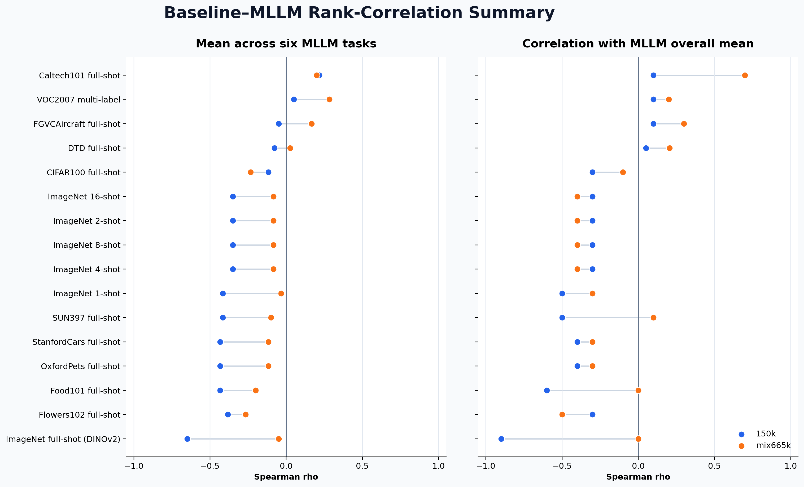
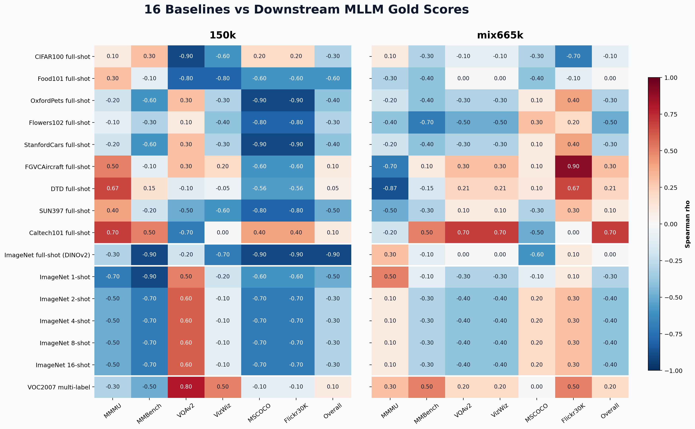

# 16 个 tokenizer baseline 与下游 MLLM 金标准的相关性分析

## 结论摘要

- 按两个 MLLM 设置、12 个任务相关系数的宏平均，最高的是 **Caltech101 full-shot**（ρ=0.21）。
- 对截图中的总体平均值，150k 相关性最高的是 **Caltech101 full-shot、VOC2007 multi-label、FGVCAircraft full-shot**（并列，ρ=0.10）；mix665k 最高的是 **Caltech101 full-shot**（ρ=0.70）。
- 16 个 baseline 中，任务宏平均为正的数量分别为：150k **2/16**，mix665k **4/16**。两个 MLLM 设置给出的 tokenizer 排名并不完全一致，因此同一 baseline 在两个设置上的相关性可能明显变化。
- 每个相关系数都只基于 5 个 tokenizer；结果适合比较排序趋势，不应被当作稳定的统计显著性结论。

## 主要观察

1. **Caltech101 full-shot 是相对最稳定的代理指标**：两套设置的六任务宏平均分别为 0.22 和 0.20；它与 mix665k Overall 的相关性达到 0.70。但它在 150k VQAv2 上为 -0.70，说明即使最佳 baseline 也不是跨任务一致的代理。
2. **VOC2007 multi-label 的综合排名为第 2**，并且具有最高的 mix665k 六任务宏平均（ρ=0.28）；它对 150k VQAv2 达到 0.80、对 VizWiz 达到 0.50。这说明多标签物体语义可能比部分单标签分类任务更接近 MLLM 所需能力。
3. **FGVCAircraft 对 mix665k Flickr30K 很强（ρ=0.90）**，但对同一设置的 MMMU 为 -0.70；单任务的高相关不能直接推广到总体能力。
4. **ImageNet full-shot 统一取 10-epoch checkpoint（iter 12499；TokLIP 日志为等价的 12500）**。其排名为 TokLIP-L > UniTok > VILA-U > TokLIP-S > MetaCLIP；修正后的相关性与用户上周截图完全一致。
5. **ImageNet 2/4/8/16-shot 的 Spearman 结果完全相同**。原因是这四个 shot 下五个 tokenizer 的相对排名没有发生变化；Spearman 只看名次，不看分差增长。1-shot 的名次略有不同，因此相关矩阵不同。
6. **两套 MLLM 金标准的排序差异是主导因素**：Overall 仅 ρ=0.10，MMMU 为 -0.80，MMBench 为 0.00。若目标是预测特定训练配置，应该分别选择 baseline，而不是期待一个全局代理指标。
7. **多数 baseline 的任务宏平均为负**，表明传统分类 linear probing 排名整体上不能稳定代表当前下游 MLLM 排名；这也提示语言对齐、视觉 token 接口和训练数据可能比单纯分类可分性更关键。

## 分析口径

16 项包含 9 个下游 full-shot linear probing、旧 DINOv2 协议的 ImageNet full-shot、5 个 ImageNet K-shot，以及 VOC2007 multi-label。所有指标方向均为越高越好。旧 ImageNet full-shot 与 K-shot 的分类器、特征组合和训练长度不同，因此它的相关性可以参与横向排名，但不能解释为 K-shot 曲线的同协议终点。

对每个 baseline，取 5 个 tokenizer 的 baseline 分数向量，分别与一个 MLLM setting 下 MMMU、MMBench、VQAv2、VizWiz、MSCOCO、Flickr30K 和截图总体均值的 5-tokenizer 分数向量计算 Spearman ρ。任务宏平均只平均六个具体任务的 ρ，不包含 Overall。并列值使用平均排名。

## Spearman 公式与 ImageNet full-shot 审计

实际计算使用 `scipy.stats.spearmanr`：先分别把 baseline 分数和 MLLM 分数转换为排名，再计算两个排名向量的 Pearson 相关，即 `ρs = Corr(rank(x), rank(y))`。无并列排名时，它等价于 `ρs = 1 - 6 Σdᵢ² / [n(n²-1)]`；这里 `n=5`。存在并列值时使用平均排名，并采用前一个通用定义。所有数据先按 tokenizer 名称对齐，而不是依赖 CSV 行顺序。

ImageNet full-shot 文件包含多个 checkpoint。此前脚本错误地读取每个文件的最后一条记录，导致混用了 10、约 96 和 100 epoch。现统一选取 10-epoch 记录：

| Tokenizer | Selected iter | 10-epoch Top-1 | 10-epoch rank | Last stored iter | Last stored Top-1 |
|---|---|---|---|---|---|
| UniTok | 12499 | 78.34 | 2.00 | 125000 | 80.62 |
| VILA-U | 12499 | 77.84 | 3.00 | 118749 | 83.58 |
| TokLIP-S | 12500 | 77.72 | 4.00 | 12500 | 77.72 |
| TokLIP-L | 12500 | 80.75 | 1.00 | 12500 | 80.75 |
| MetaCLIP | 12499 | 77.69 | 5.00 | 125000 | 80.60 |

对应的 ImageNet full-shot Spearman 为：150k `[-0.3, -0.9, -0.2, -0.7, -0.9, -0.9, -0.9]`，mix665k `[0.3, -0.1, 0.0, 0.0, -0.6, 0.1, 0.0]`，顺序为 MMMU、MMBench、VQAv2、VizWiz、MSCOCO、Flickr30K、Overall。

## 三类 linear probing 的实际设置

### 1. Full-shot single-label linear probing

- 冻结 tokenizer/backbone，只训练线性分类头；训练使用模型原生分辨率。UniTok、VILA-U、TokLIP-S 为 256，TokLIP-L 为 384，MetaCLIP 使用其 timm 原生配置。
- `batch_size=128`、`num_workers=8`；训练增强为 bicubic RandomResizedCrop 和 `p=0.5` 水平翻转，验证使用 resize + center crop。
- 优化器为 SGD，`momentum=0.9`、`weight_decay=0`，cosine learning-rate schedule。并行训练 1/4-block、是否 avg-pool 和 13 个基础学习率（`1e-5` 到 `0.1`，按 global batch/256 缩放）的分类头，再按验证集选择最佳头。
- 本报告的 ImageNet full-shot 固定使用 10 epochs × 1250 iterations/epoch，即 iter 12499/12500。其余 full-shot 数据集按本地 launcher 设置：CIFAR100/Food101 20 epochs，OxfordPets/StanfordCars/FGVCAircraft/Caltech101 100，Flowers102/DTD 200，SUN397 15；每个 epoch 的迭代数为 `ceil(train_samples/128)`。

### 2. ImageNet few-shot linear probing

- 使用平衡且嵌套的 1/2/4/8/16-shot support set；本报告取 support seed 0。ImageNet train 的固定 10%（128,116 张）只用于选择正则化，support 从其余 90% 中采样，最终只在官方 50k validation 上报告。
- 特征使用确定性的模型原生 resize + center crop，不做训练增强，也不做特征 L2 normalization。`batch_size=100`、`num_workers=8` 仅用于 GPU 特征提取。
- 分类器为 sklearn multinomial LogisticRegression，solver 为 L-BFGS，`max_iter=1000`、`tol=1e-4`。它是全批 CPU 求解，没有 minibatch 和 epoch 参数。
- C 从 `10^-6 ... 10^6` 的 7 个初始锚点开始，并在最优区域二分到 0.125 decade 分辨率；按 selection Top-1 选择，完全并列时取更小的 C。

### 3. VOC2007 multi-label linear probing

- 使用官方 train/val/test（2,501/2,510/4,952），冻结相同特征面；整张图 bicubic resize 到模型原生尺寸，不做 crop、增强或特征 normalization。`batch_size=100`、`num_workers=8` 同样只用于特征提取。
- 对 20 个类别分别训练二元 L2 LogisticRegression（L-BFGS），`max_iter=1000`、`tol=1e-4`；没有 epoch、学习率或分类器 minibatch。difficult 标签 0 按类别忽略。
- 在 45 个 `lambda=10^[5,...,-6]` 上以 strong-to-weak 顺序 warm start，使用 validation 11-point mAP 选择一个共享 lambda，并列时取更大的 lambda；随后在 train+val 重拟合，在 test 上报告官方 VOC2007 11-point mAP。

## 汇总排名

| Rank | Baseline | 150k task macro | 150k overall | mix665k task macro | mix665k overall | Two-setting task macro |
|---|---|---|---|---|---|---|
| 1 | Caltech101 full-shot | 0.22 | 0.10 | 0.20 | 0.70 | 0.21 |
| 2 | VOC2007 multi-label | 0.05 | 0.10 | 0.28 | 0.20 | 0.17 |
| 3 | FGVCAircraft full-shot | -0.05 | 0.10 | 0.17 | 0.30 | 0.06 |
| 4 | DTD full-shot | -0.08 | 0.05 | 0.03 | 0.21 | -0.03 |
| 5 | CIFAR100 full-shot | -0.12 | -0.30 | -0.23 | -0.10 | -0.17 |
| 6 | ImageNet 2-shot | -0.35 | -0.30 | -0.08 | -0.40 | -0.22 |
| 7 | ImageNet 4-shot | -0.35 | -0.30 | -0.08 | -0.40 | -0.22 |
| 8 | ImageNet 8-shot | -0.35 | -0.30 | -0.08 | -0.40 | -0.22 |
| 9 | ImageNet 16-shot | -0.35 | -0.30 | -0.08 | -0.40 | -0.22 |
| 10 | ImageNet 1-shot | -0.42 | -0.50 | -0.03 | -0.30 | -0.22 |
| 11 | SUN397 full-shot | -0.42 | -0.50 | -0.10 | 0.10 | -0.26 |
| 12 | OxfordPets full-shot | -0.43 | -0.40 | -0.12 | -0.30 | -0.27 |
| 13 | StanfordCars full-shot | -0.43 | -0.40 | -0.12 | -0.30 | -0.27 |
| 14 | Food101 full-shot | -0.43 | -0.60 | -0.20 | 0.00 | -0.32 |
| 15 | Flowers102 full-shot | -0.38 | -0.30 | -0.27 | -0.50 | -0.32 |
| 16 | ImageNet full-shot (DINOv2) | -0.65 | -0.90 | -0.05 | 0.00 | -0.35 |

## 完整相关性热力图

红色为正相关，蓝色为负相关；ρ=1 表示 tokenizer 排名完全一致，ρ=-1 表示完全相反。

## 每个 MLLM 指标对应的最佳 baseline

| MLLM metric | 150k best baseline | 150k rho | mix665k best baseline | mix665k rho |
|---|---|---|---|---|
| MMMU | Caltech101 full-shot | 0.70 | ImageNet 1-shot | 0.50 |
| MMBench | Caltech101 full-shot | 0.50 | Caltech101 full-shot, VOC2007 multi-label | 0.50 |
| VQAv2 | VOC2007 multi-label | 0.80 | Caltech101 full-shot | 0.70 |
| VizWiz | VOC2007 multi-label | 0.50 | Caltech101 full-shot | 0.70 |
| MSCOCO | Caltech101 full-shot | 0.40 | Flowers102 full-shot | 0.30 |
| Flickr30K | Caltech101 full-shot | 0.40 | FGVCAircraft full-shot | 0.90 |
| Overall | FGVCAircraft full-shot, Caltech101 full-shot, VOC2007 multi-label | 0.10 | Caltech101 full-shot | 0.70 |

## 两个 MLLM 金标准自身的排名一致性

| MLLM metric | 150k vs mix665k rho |
|---|---|
| MMMU | -0.80 |
| MMBench | 0.00 |
| VQAv2 | -0.20 |
| VizWiz | 0.30 |
| MSCOCO | 0.30 |
| Flickr30K | -0.30 |
| Overall | 0.10 |

该表直接比较同一任务在 150k 与 mix665k 下的 tokenizer 排名。如果该值较低或为负，就不能期待某个视觉 baseline 同时高度预测两个设置。

## MLLM 金标准原始数据

| MLLM setting | Tokenizer | MMMU | MMBench | VQAv2 | VizWiz | MSCOCO | Flickr30K | Overall |
|---|---|---|---|---|---|---|---|---|
| 150k | UniTok | 24.30 | 38.10 | 1.89 | 0.84 | 19.60 | 19.91 | 17.44 |
| 150k | VILA-U | 28.90 | 47.99 | 5.84 | 1.19 | 19.36 | 19.33 | 20.44 |
| 150k | TokLIP-S | 22.60 | 45.79 | 29.86 | 5.41 | 21.67 | 21.56 | 24.48 |
| 150k | TokLIP-L | 27.90 | 31.50 | 11.88 | 2.12 | 18.05 | 18.23 | 18.28 |
| 150k | MetaCLIP | 37.30 | 55.68 | 7.00 | 37.54 | 22.51 | 23.16 | 30.53 |
| mix665k | UniTok | 38.60 | 57.14 | 61.48 | 19.04 | 24.34 | 25.19 | 37.63 |
| mix665k | VILA-U | 33.80 | 47.25 | 55.50 | 13.14 | 26.82 | 27.08 | 33.93 |
| mix665k | TokLIP-S | 35.60 | 47.99 | 49.45 | 12.50 | 27.16 | 25.82 | 33.09 |
| mix665k | TokLIP-L | 35.20 | 59.71 | 63.97 | 20.18 | 25.00 | 29.92 | 38.99 |
| mix665k | MetaCLIP | 34.80 | 62.27 | 67.75 | 25.37 | 25.08 | 27.28 | 40.43 |

## 16 项 baseline 原始分数

| Tokenizer | CIFAR100 full-shot | Food101 full-shot | OxfordPets full-shot | Flowers102 full-shot | StanfordCars full-shot | FGVCAircraft full-shot | DTD full-shot | SUN397 full-shot | Caltech101 full-shot | ImageNet full-shot (DINOv2) | ImageNet 1-shot | ImageNet 2-shot | ImageNet 4-shot | ImageNet 8-shot | ImageNet 16-shot | VOC2007 multi-label |
|---|---|---|---|---|---|---|---|---|---|---|---|---|---|---|---|---|
| UniTok | 86.48 | 92.81 | 93.08 | 97.27 | 92.15 | 52.36 | 81.01 | 82.63 | 95.93 | 78.34 | 40.10 | 52.19 | 62.26 | 67.86 | 71.58 | 88.76 |
| VILA-U | 86.39 | 94.23 | 94.41 | 99.27 | 93.46 | 63.85 | 83.35 | 83.41 | 95.71 | 77.84 | 39.10 | 53.34 | 64.23 | 70.14 | 73.61 | 88.73 |
| TokLIP-S | 84.35 | 89.40 | 93.32 | 98.21 | 93.41 | 62.86 | 81.01 | 80.67 | 93.18 | 77.72 | 47.01 | 59.15 | 67.72 | 72.39 | 74.97 | 90.32 |
| TokLIP-L | 82.36 | 92.70 | 94.60 | 98.88 | 94.01 | 67.54 | 82.71 | 82.69 | 93.50 | 80.75 | 48.53 | 62.49 | 71.00 | 75.86 | 78.47 | 91.85 |
| MetaCLIP | 86.31 | 91.74 | 93.02 | 97.19 | 92.14 | 62.89 | 81.33 | 82.47 | 97.77 | 77.69 | 33.17 | 45.56 | 56.47 | 63.52 | 68.43 | 90.04 |

## 完整 Spearman 矩阵

### 150k

| Baseline | MMMU | MMBench | VQAv2 | VizWiz | MSCOCO | Flickr30K | Overall |
|---|---|---|---|---|---|---|---|
| CIFAR100 full-shot | 0.10 | 0.30 | -0.90 | -0.60 | 0.20 | 0.20 | -0.30 |
| Food101 full-shot | 0.30 | -0.10 | -0.80 | -0.80 | -0.60 | -0.60 | -0.60 |
| OxfordPets full-shot | -0.20 | -0.60 | 0.30 | -0.30 | -0.90 | -0.90 | -0.40 |
| Flowers102 full-shot | -0.10 | -0.30 | 0.10 | -0.40 | -0.80 | -0.80 | -0.30 |
| StanfordCars full-shot | -0.20 | -0.60 | 0.30 | -0.30 | -0.90 | -0.90 | -0.40 |
| FGVCAircraft full-shot | 0.50 | -0.10 | 0.30 | 0.20 | -0.60 | -0.60 | 0.10 |
| DTD full-shot | 0.67 | 0.15 | -0.10 | -0.05 | -0.56 | -0.56 | 0.05 |
| SUN397 full-shot | 0.40 | -0.20 | -0.50 | -0.60 | -0.80 | -0.80 | -0.50 |
| Caltech101 full-shot | 0.70 | 0.50 | -0.70 | 0.00 | 0.40 | 0.40 | 0.10 |
| ImageNet full-shot (DINOv2) | -0.30 | -0.90 | -0.20 | -0.70 | -0.90 | -0.90 | -0.90 |
| ImageNet 1-shot | -0.70 | -0.90 | 0.50 | -0.20 | -0.60 | -0.60 | -0.50 |
| ImageNet 2-shot | -0.50 | -0.70 | 0.60 | -0.10 | -0.70 | -0.70 | -0.30 |
| ImageNet 4-shot | -0.50 | -0.70 | 0.60 | -0.10 | -0.70 | -0.70 | -0.30 |
| ImageNet 8-shot | -0.50 | -0.70 | 0.60 | -0.10 | -0.70 | -0.70 | -0.30 |
| ImageNet 16-shot | -0.50 | -0.70 | 0.60 | -0.10 | -0.70 | -0.70 | -0.30 |
| VOC2007 multi-label | -0.30 | -0.50 | 0.80 | 0.50 | -0.10 | -0.10 | 0.10 |

### mix665k

| Baseline | MMMU | MMBench | VQAv2 | VizWiz | MSCOCO | Flickr30K | Overall |
|---|---|---|---|---|---|---|---|
| CIFAR100 full-shot | 0.10 | -0.30 | -0.10 | -0.10 | -0.30 | -0.70 | -0.10 |
| Food101 full-shot | -0.30 | -0.40 | 0.00 | 0.00 | -0.40 | -0.10 | 0.00 |
| OxfordPets full-shot | -0.20 | -0.40 | -0.30 | -0.30 | 0.10 | 0.40 | -0.30 |
| Flowers102 full-shot | -0.40 | -0.70 | -0.50 | -0.50 | 0.30 | 0.20 | -0.50 |
| StanfordCars full-shot | -0.20 | -0.40 | -0.30 | -0.30 | 0.10 | 0.40 | -0.30 |
| FGVCAircraft full-shot | -0.70 | 0.10 | 0.30 | 0.30 | 0.10 | 0.90 | 0.30 |
| DTD full-shot | -0.87 | -0.15 | 0.21 | 0.21 | 0.10 | 0.67 | 0.21 |
| SUN397 full-shot | -0.50 | -0.30 | 0.10 | 0.10 | -0.30 | 0.30 | 0.10 |
| Caltech101 full-shot | -0.20 | 0.50 | 0.70 | 0.70 | -0.50 | 0.00 | 0.70 |
| ImageNet full-shot (DINOv2) | 0.30 | -0.10 | 0.00 | 0.00 | -0.60 | 0.10 | 0.00 |
| ImageNet 1-shot | 0.50 | -0.10 | -0.30 | -0.30 | -0.10 | 0.10 | -0.30 |
| ImageNet 2-shot | 0.10 | -0.30 | -0.40 | -0.40 | 0.20 | 0.30 | -0.40 |
| ImageNet 4-shot | 0.10 | -0.30 | -0.40 | -0.40 | 0.20 | 0.30 | -0.40 |
| ImageNet 8-shot | 0.10 | -0.30 | -0.40 | -0.40 | 0.20 | 0.30 | -0.40 |
| ImageNet 16-shot | 0.10 | -0.30 | -0.40 | -0.40 | 0.20 | 0.30 | -0.40 |
| VOC2007 multi-label | 0.30 | 0.50 | 0.20 | 0.20 | 0.00 | 0.50 | 0.20 |

## 数据与可复现文件

- [截图转录的 MLLM 金标准](./mllm_gold_scores.csv)
- [16 项 baseline 宽表](./baseline_scores.csv)
- [baseline tidy 数据](./baseline_scores_tidy.csv)
- [16 项 baseline 排名（1 为最好）](./baseline_ranks.csv)
- [MLLM 金标准排名（1 为最好）](./mllm_gold_ranks.csv)
- [ImageNet full-shot checkpoint 审计](./imagenet_full_checkpoint_audit.csv)
- [全部逐项 Spearman 与 p 值](./spearman_correlations.csv)
- [16 项 baseline 汇总](./baseline_correlation_summary.csv)
- [每个金标准指标的最佳 baseline](./best_baseline_by_gold_metric.csv)
- [两个 MLLM 设置自身的一致性](./gold_scale_agreement.csv)
- [分析脚本](./analyze_correlations.py)
- [Full-shot DINOv2 linear evaluator](../../dinov2/dinov2/eval/linear.py)
- [Full-shot dataset/epoch 设置](../../dinov2/knn_tools/linear_dataset_common.sh)
- [Few-shot 实现](../../CLIP/linear_probe_tokenizers.py)
- [VOC multi-label 实现](../../CLIP/linear_probe_voc2007.py)

## 解读限制

1. 样本量只有 5 个 tokenizer，单次名次交换就会显著改变 ρ；报告保留 p 值数据，但不依据 p 值做强结论。
2. 同一 tokenizer 在两个 MLLM 设置中的相对强弱会受训练数据规模和任务构成影响，baseline–gold 相关性不是 tokenizer 的固有常数。
3. 相关性衡量排序一致性，不代表 baseline 分数与 MLLM 绝对性能之间存在因果关系。
