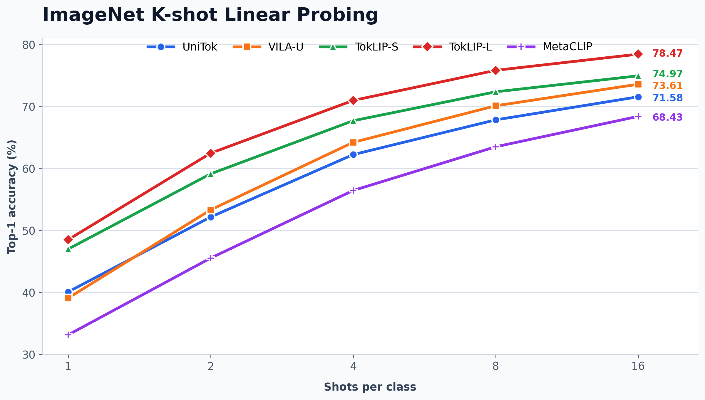
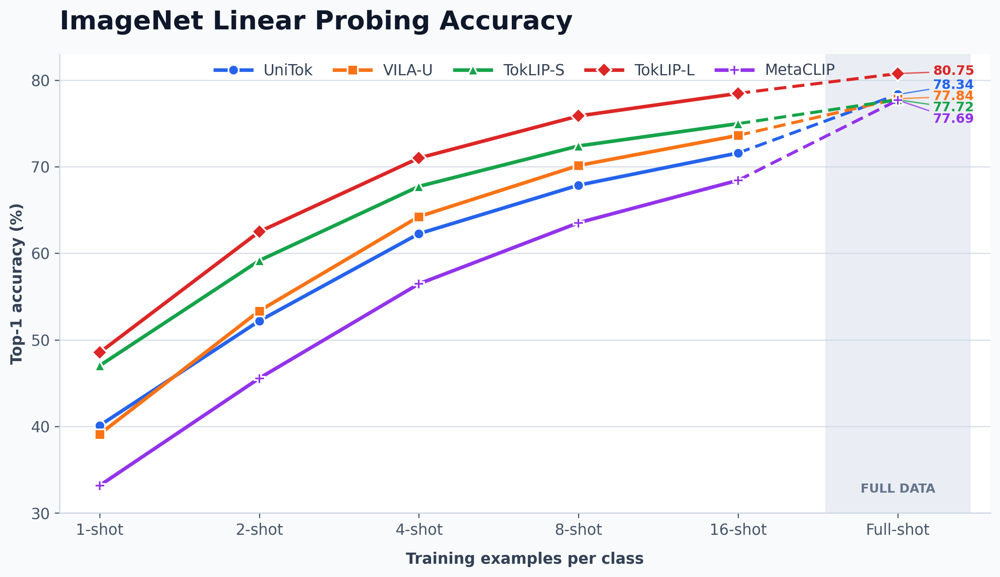

# Tokenizer linear-probing scores and rankings

All scores are percentages. ImageNet k-shot results use seed 0. Rankings are
computed independently within each task over the five tokenizers; rank 1 is
best. DTD contains an exact stored-score tie between UniTok and TokLIP-S.

## Scores

| Tokenizer | ImageNet-1K full | CIFAR100 | Food101 | OxfordPets | Flowers102 | StanfordCars | FGVCAircraft | DTD | SUN397 | Caltech101 | IN 1-shot | IN 2-shot | IN 4-shot | IN 8-shot | IN 16-shot | VOC2007 multi-label |
|---|---:|---:|---:|---:|---:|---:|---:|---:|---:|---:|---:|---:|---:|---:|---:|---:|
| UniTok | 80.62 | 86.48 | 92.81 | 93.08 | 97.27 | 92.15 | 52.36 | 81.01 | 82.63 | 95.93 | 40.10 | 52.19 | 62.26 | 67.86 | 71.58 | 88.76 |
| VILA-U | 83.58 | 86.39 | 94.23 | 94.41 | 99.27 | 93.46 | 63.85 | 83.35 | 83.41 | 95.71 | 39.10 | 53.34 | 64.23 | 70.14 | 73.61 | 88.73 |
| TokLIP-S | 77.72 | 84.35 | 89.40 | 93.32 | 98.21 | 93.41 | 62.86 | 81.01 | 80.67 | 93.18 | 47.01 | 59.15 | 67.72 | 72.39 | 74.97 | 90.32 |
| TokLIP-L | 80.75 | 82.36 | 92.70 | 94.60 | 98.88 | 94.01 | 67.54 | 82.71 | 82.69 | 93.50 | 48.53 | 62.49 | 71.00 | 75.86 | 78.47 | 91.85 |
| MetaCLIP | 80.60 | 86.31 | 91.74 | 93.02 | 97.19 | 92.14 | 62.89 | 81.33 | 82.47 | 97.77 | 33.17 | 45.56 | 56.47 | 63.52 | 68.43 | 90.04 |

## Rankings

| Tokenizer | ImageNet-1K full | CIFAR100 | Food101 | OxfordPets | Flowers102 | StanfordCars | FGVCAircraft | DTD | SUN397 | Caltech101 | IN 1-shot | IN 2-shot | IN 4-shot | IN 8-shot | IN 16-shot | VOC2007 multi-label |
|---|---:|---:|---:|---:|---:|---:|---:|---:|---:|---:|---:|---:|---:|---:|---:|---:|
| UniTok | 3 | 1 | 2 | 4 | 4 | 4 | 5 | 4= | 3 | 2 | 3 | 4 | 4 | 4 | 4 | 4 |
| VILA-U | 1 | 2 | 1 | 2 | 1 | 2 | 2 | 1 | 1 | 3 | 4 | 3 | 3 | 3 | 3 | 5 |
| TokLIP-S | 5 | 4 | 5 | 3 | 3 | 3 | 4 | 4= | 5 | 5 | 2 | 2 | 2 | 2 | 2 | 2 |
| TokLIP-L | 2 | 5 | 3 | 1 | 2 | 1 | 1 | 2 | 2 | 4 | 1 | 1 | 1 | 1 | 1 | 1 |
| MetaCLIP | 4 | 3 | 4 | 5 | 5 | 5 | 3 | 3 | 4 | 1 | 5 | 5 | 5 | 5 | 5 | 3 |

## ImageNet k-shot curve

## ImageNet k-shot and 10-epoch full-shot curve

