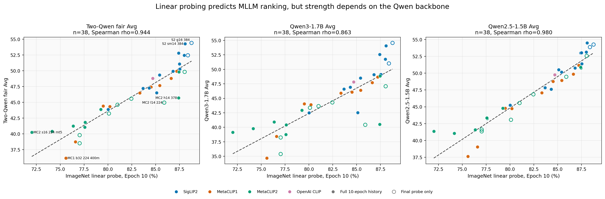
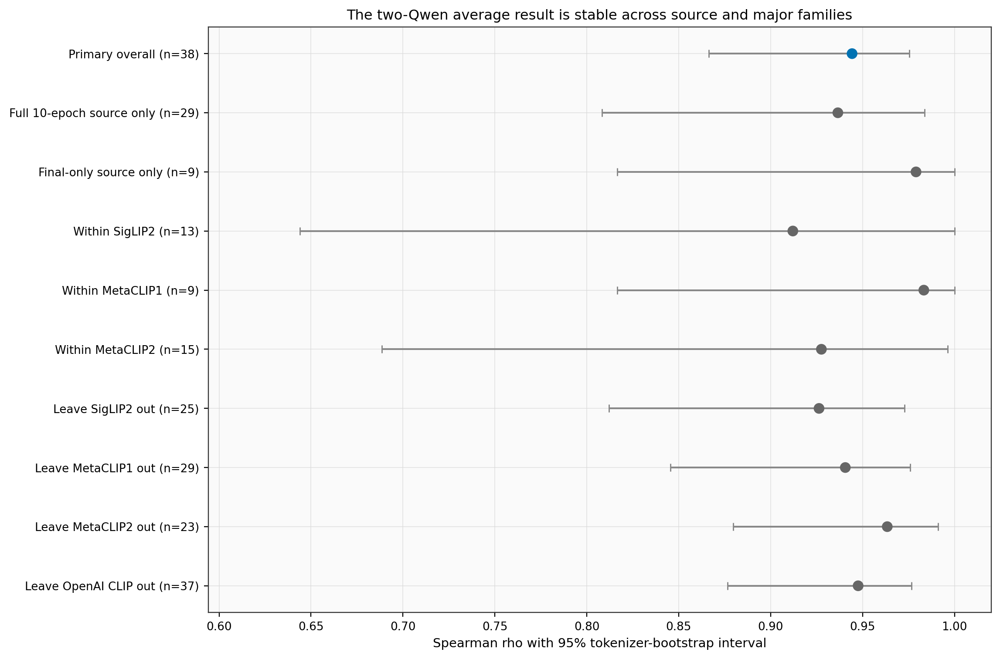
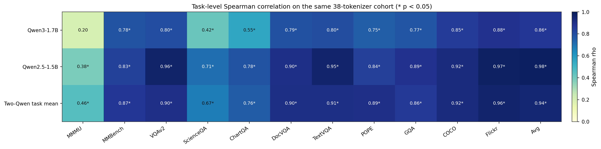
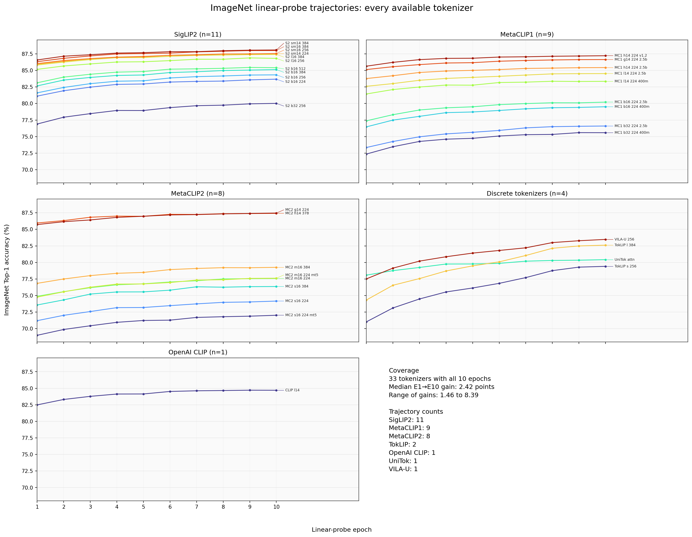
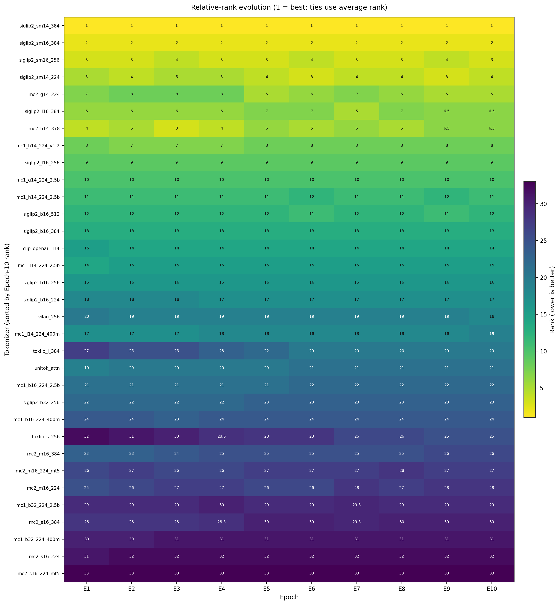
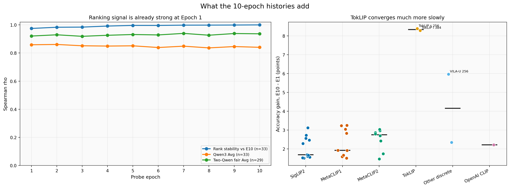
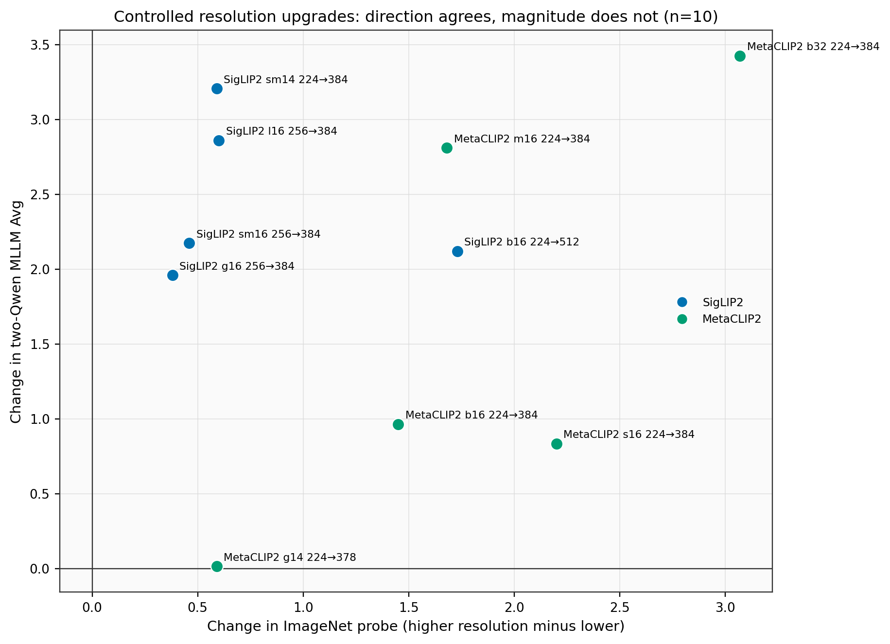
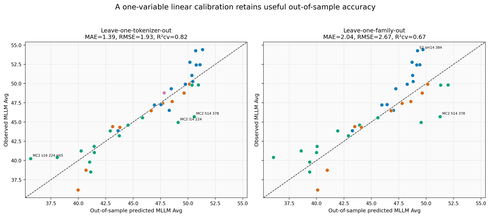

# Linear probing 对 MLLM 表现的预测力

## 结论先行

在公平的主队列上，ImageNet Epoch-10 linear probing 对两个 Qwen MLLM 的平均排名预测力很强：**n=38，Spearman rho=0.944**（tokenizer 自助法 95% CI [0.866, 0.975]），Pearson r=0.922，Kendall tau-b=0.822，置换检验 p=2.0e-05。这就是“约 0.94”的正确口径。

但结论需要加两个限定：

- 这 38 个点全是 **continuous tokenizer**；4 个 discrete tokenizer 都缺 Qwen2.5，因此 0.944 不能直接外推到 discrete。
- 预测强度对 MLLM backbone 敏感：在完全相同的 38 个 tokenizer 上，Qwen3 rho=0.863，Qwen2.5 rho=0.980，差 0.116（配对 bootstrap 95% CI [0.025, 0.269]）。两者均为强相关，但 Qwen2.5 更贴合 probing 排名。



## 数据口径与样本数

| 用途 | 使用数 | 公平性口径 | 排除 |
|---|---:|---|---|
| 主分析：probing × 两 Qwen 公平 Avg | 38 | probing、Qwen3、Qwen2.5 都完整；Avg 为两个 backbone Avg 等权平均 | 2 个无 probing；6 个缺 Qwen2.5；DINOv3 缺两个 MLLM |
| Qwen3 最大覆盖 | 44 | 仅要求 probing + Qwen3 | 2 个无 probing；DINOv3 无 MLLM |
| Qwen2.5 分析 | 38 | 仅要求 probing + Qwen2.5 | 同主队列；现有 Qwen2.5 均为 continuous |
| 10-epoch 轨迹可视化 | 33 | 必须 10 轮全齐 | 12 个只有最终 probing；2 个 probing 全缺 |
| 10-epoch × 两 Qwen Avg | 29 | 轨迹和两 backbone 都完整 | 上述双重完整病例交集 |

主表有 47 个 tokenizer：45 个有最终 probing，33 个有全部 10 轮。完整排除列表在 [`data/exclusions.csv`](data/exclusions.csv)，逐 tokenizer 的合并审计表在 [`data/analysis_cohort.csv`](data/analysis_cohort.csv)。

- probing 完全缺失（2）：`siglip2_sm16_512`, `siglip2_l16_512`。
- 有最终 probing，但前 9 轮不在 epoch 文件（12）：`siglip2_g16_384`, `siglip2_g16_256`, `mc2_g14_378`, `mc2_b16_384`, `mc2_l14_224`, `mc2_b16_224`, `mc2_b32_384`, `mc2_b32_224`, `mc2_b32_224_mt5`, `I-JEPA`, `raev2`, `dinov3`。
- Qwen2.5 整块缺失（7）：`unitok_attn`, `vilau_256`, `toklip_s_256`, `toklip_l_384`, `I-JEPA`, `raev2`, `dinov3`。
- Qwen3 整块缺失（1）：`dinov3`。

## 主相关性与稳健性

| 目标/子集 | n | Spearman rho | 95% CI | Pearson r | Kendall tau-b |
|---|---:|---:|---:|---:|---:|
| 两 Qwen 公平 Avg（主结果） | 38 | 0.944 | [0.866, 0.975] | 0.922 | 0.822 |
| Qwen3 Avg（同一主队列） | 38 | 0.863 | [0.707, 0.950] | 0.831 | 0.724 |
| Qwen2.5 Avg（同一主队列） | 38 | 0.980 | [0.947, 0.989] | 0.960 | 0.890 |
| Qwen3 Avg（最大覆盖） | 44 | 0.792 | [0.604, 0.907] | 0.739 | 0.638 |
| Qwen3 Avg（continuous only） | 40 | 0.818 | [0.638, 0.929] | 0.756 | 0.674 |
| Qwen3 Avg（discrete only） | 4 | 0.000 | [-1.000, 1.000] | -0.337 | 0.000 |
| 两 Qwen Avg（10-epoch 子集） | 29 | 0.937 | [0.808, 0.984] | 0.923 | 0.826 |
| 两 Qwen Avg（只有最终 probing 的子集） | 9 | 0.979 | [0.817, 1.000] | 0.941 | 0.930 |

“完整历史”子集 rho=0.937，“只有最终分数”子集 rho=0.979，说明 0.944 不是由两类 probing 数据源混合才人为造成的。但后者仅 n=9，区间会更不稳定。

高相关也不依赖任务的原始分数量纲：22 个任务单元直接平均 rho=0.944，先对每个任务 z-score 再平均为 0.943，任务内 rank 再平均为 0.937，z-score 中位数为 0.941。每次留掉 22 个任务中的一个，rho 只在 [0.932, 0.950] 之间，因此不是某一个任务单独驱动。逐项结果见 [`data/task_aggregation_robustness.csv`](data/task_aggregation_robustness.csv)。

再逐一删除 tokenizer，rho 范围为 [0.940, 0.960]，主结果不由任何单点驱动。



## 具体 Qwen backbone 与任务

为了直接比较两个 Qwen，热图固定用同一批 n=38 tokenizer；CSV 表另外保留 Qwen3 的最大覆盖口径（通常 n=44）。

- Qwen3：任务级 rho 从 MMMU=0.201 到 Flickr=0.884，11 项中 10/11 在未校正 p<0.05。
- Qwen2.5：从 MMMU=0.379 到 Flickr=0.975，11/11 在未校正 p<0.05。
- 两 backbone 的同名任务先平均后，从 MMMU=0.456 到 Flickr=0.955。
- 同队列下，Qwen2.5 在 11/11 个任务上的 rho 都高于 Qwen3。Flickr、COCO、TextVQA/VQAv2 等任务与视觉 tokenizer 表征质量的相关性最高；MMMU 最弱，说明多学科推理能力的瓶颈不只是视觉表征。这是相关性解释，不是因果结论。

按各 backbone 的最大可用队列对 22 个任务检验统一做 Benjamini-Hochberg 校正后，21/22 仍显著。



完整数值、自助区间、p 值与 22 项检验的 Benjamini-Hochberg q 值见 [`data/task_correlations.csv`](data/task_correlations.csv)。Qwen3/ScienceQA 的最大覆盖分析保守排除了 I-JEPA，因为该行存在明确的 Avg/任务均值冲突；匹配 n=38 队列本来就不含 I-JEPA。Qwen3 Avg 最大覆盖的结果对此不敏感：含 I-JEPA 时 rho=0.792，排除后 rho=0.788。

## 10 个 epoch：分数、排名与早停信号





33 条完整轨迹中，E1→E10 提升的中位数是 2.42 个点。Epoch 1 与 Epoch 10 排名已有 rho=0.975，到 Epoch 9 为 0.999。对完整两-Qwen 子集，Epoch 1 对 MLLM Avg 的 rho=0.921，Epoch 10 为 0.937，差 0.016（配对 bootstrap 95% CI [-0.015, 0.068]）。区间跨 0，没有证据说 10 轮比 1 轮更能预测 MLLM；且相关不随 epoch 单调提升。

这表明：在当前 continuous 模型范围内，**1 个 epoch 已经可以做粗筛排名**；但不能用它替代最终分数。toklip_s_256 和 toklip_l_384 从 E1 到 E10 都上升了 7 个名次，且 TokLIP 的 E1→E10 增益分别约 8.3 点；早停对这类收敛慢的 discrete tokenizer 不公平。



轨迹的“增益”本身与 MLLM Avg 负相关（rho=-0.811），主要因为低起点模型可上升空间更大；gain 与 E10-only 全样本线性拟合所得 MLLM 残差的 rho=-0.001，几乎无关。LOOCV 也一致：E1-only MAE=1.31，E10-only MAE=1.30，E10+增益 MAE=1.38；目前没证据说 10 轮动力学比单个准确率能额外预测 MLLM。

## 家族内部与受控对比

| 家族 | n | 家族内 Spearman rho | 95% CI |
|---|---:|---:|---:|
| SigLIP2 | 13 | 0.912 | [0.644, 1.000] |
| MetaCLIP1 | 9 | 0.983 | [0.817, 1.000] |
| MetaCLIP2 | 15 | 0.928 | [0.688, 0.996] |

把全局秩在家族内去均值后，pooled family-adjusted 关联仍为 rho=0.935（n=37，家族内置换 p=2.0e-05）。所以整体高相关不只是 SigLIP2/MetaCLIP 家族均值之间的差异。OpenAI CLIP 只有 1 个点，不能算家族内相关。

不过，当只在高分段做精细选型时，关系会因取值范围收窄而变弱：probing 排名前半 n=19 的 rho=0.770；probing≥87 的 n=11 个点中 rho=0.592，p=0.055。所以 0.944 更适合解读为跨较广质量范围的排名 proxy，不是顶尖模型之间细微差异的完美判别器。

更严格地固定架构、只比较分辨率升级时，10/10 对都同时提高 probing 和 MLLM Avg；但两种增益幅度的 Spearman 只有 0.164（n=10，p=0.650）。因此 probing 对“方向”很好，却不宜解读为局部改动的精确增益估计器。n=10 且对比对来自两个家族，这一点应视为探索性结论。



## “预测”而不只是同样本相关

用一元线性校准 `MLLM Avg ~ probing`：

- leave-one-tokenizer-out（n=38）：MAE=1.39，RMSE=1.93，R²cv=0.824；不用 probing 的训练集均值 baseline MAE=3.94。
- leave-one-family-out（只评估三个有重复样本的主家族，n=37）：MAE=2.04，RMSE=2.67，R²cv=0.669；baseline MAE=5.07。

这说明 probing 不只能在全样本上“拟合得好看”；对留出点、甚至留出整个家族仍有明显预测信号。但家族只有 SigLIP2、MetaCLIP1、MetaCLIP2 三个大组加一个单点 CLIP，leave-family-out 数字仍需要新家族验证。

- Top-3 重合 2/3。
- Top-5 重合 4/5。
- Top-10 重合 8/10。

全部 701 个非并列 tokenizer pair 中，639 对的 probing 与 MLLM 排序方向一致，即 91.2%；另有 2 对至少一边并列。



## 数据质量问题与不可越过的边界

1. **不能直接用主表 `Avg` 列的缺失行。** 6 个只有 Qwen3 的 tokenizer 被写成 `Qwen3 Avg / 2`，DINOv3 两个 MLLM 都缺却写成 0.00。脚本已将这些值当 NA，只在两 backbone 都齐时重算公平 Avg。
2. **I-JEPA 行内不一致。** 11 个 Qwen3 任务的算术均值是 35.09，CSV Avg 是 36.56，差 1.47；其 VQAv2 和 ScienceQA 又恰好都为 47.08，建议回查原始日志。主 n=38 分析不含 I-JEPA，因此不受影响。
3. **完整 epoch 与最终分数来源。** 33 个 epoch 表的 E10 与主表逐项完全一致；另有 12 个只有主表最终分数，以及 2 个完全没有 probing。脚本不伪造前 9 轮，轨迹分析只用真实 33 个点。
4. **不是因果证明。** 容量、预训练数据、分辨率和 tokenizer 家族同时影响 probing 与 MLLM；家族内分析能缓解，不能消除所有混杂。
5. **相关性不代表差值可直接换算。** 整体排名很强，但局部分辨率增益的幅度相关很弱，且个别残差可超过 4 个 MLLM 分数点。

## 文件索引与复现

- [`analyze.py`](analyze.py)：唯一分析脚本；解析、审计、统计、画图和报告生成都在这里。
- [`data/analysis_cohort.csv`](data/analysis_cohort.csv) 与 [`data/exclusions.csv`](data/exclusions.csv)：47 个 tokenizer 的合并口径、入选标记与逐项排除原因。
- [`data/correlation_summary.csv`](data/correlation_summary.csv)：主相关性与不同队列。
- [`data/task_aggregation_robustness.csv`](data/task_aggregation_robustness.csv)：任务标准化、rank 聚合与 leave-one-task-out。
- [`data/task_correlations.csv`](data/task_correlations.csv)：两个 Qwen 的逐任务结果。
- [`data/family_robustness.csv`](data/family_robustness.csv)：家族内、留一家族和来源敏感性。
- [`data/epoch_metrics.csv`](data/epoch_metrics.csv)：逐 epoch 排名稳定性与 MLLM 相关性。
- [`data/prediction_metrics.csv`](data/prediction_metrics.csv) 与 [`data/prediction_diagnostics.csv`](data/prediction_diagnostics.csv)：样本外误差及逐 tokenizer 残差。
- [`data/controlled_comparisons.csv`](data/controlled_comparisons.csv)：分辨率、预训练规模和 MT5 的成对对比。

复现命令（需 NumPy、SciPy、Matplotlib）：

```bash
conda run -n TokBench python result/tokenizer_mllm_analysis/analyze.py
```

所有 bootstrap/permutation 都使用固定种子 20260810，重跑可得到相同结果。
