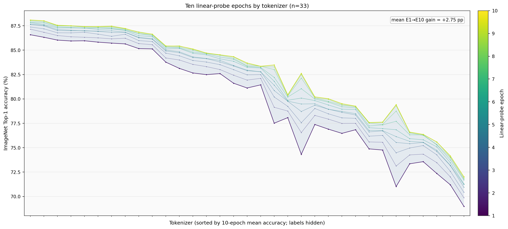

# Linear probing 对 MLLM 表现的预测力（新版完整数据）

## 结论先行

新版公平主队列使用所有同时具备 ImageNet Epoch-10 probing、Qwen3 Avg 和 Qwen2.5 Avg 的 tokenizer。当前是 **n=45，Spearman rho=0.811**（tokenizer bootstrap 95% CI [0.609, 0.931]），Pearson r=0.721，Kendall tau-b=0.669，置换检验 p=2.0e-05。

这仍是很强的全局排序信号，但不再是旧版完整病例的 0.94。旧版对应的 CLIP-like 四类家族子集现在仍为 n=38、rho=0.944；把新补齐的 discrete、I-JEPA、RAE-v2、DINOv3 纳入后，主结果变成 rho=0.811。所以变化主要说明 **跨新 tokenizer 家族的泛化比家族内排序难**，不是旧数据或计算突然失效。

- 同一 n=45 队列上，Qwen3 rho=0.739，Qwen2.5 rho=0.833；后者高 0.094，配对 bootstrap 95% CI [0.002, 0.221]。
- continuous tokenizer（n=41）rho=0.834；discrete（n=4）rho=0.200，但后者仅 4 点，只能描述，不能据此判定“没有关系”。
- I-JEPA 的 Qwen3 Avg 存在行内不一致。排除它后 rho=0.813；统一从 22 个任务重算双 Qwen Avg 后 rho=0.810，主结论基本不变。
- DINOv3 与 RAE-v2 是合法但明显的跨家族残差点；仅作敏感性诊断，分别删除时 rho=0.866 与 0.858，不作为主分析排除规则。

## 数据覆盖与公平口径

| 项目 | 可用数 | 说明 |
|---|---:|---|
| 原始 tokenizer | 47 | 两个 CSV 名称集合与 Family 完全一致，按 tokenizer 名称关联 |
| Qwen3 / Qwen2.5 全任务与 Avg | 47 / 47 | 两套 11 个任务均已补齐；Qwen3 缺失 0，Qwen2.5 缺失 0 |
| 最终 ImageNet probing | 45 | 仍有 2 个完全缺 probing |
| 主分析：probing × 两 Qwen 公平 Avg | 45 | 两个 backbone Avg 等权平均；只排除无 probing 的点 |
| 完整 10-epoch 轨迹 | 33 | 10 轮固定同一 tokenizer 队列 |
| 10-epoch × 两 Qwen Avg | 33 | 当前所有轨迹点都有两套 MLLM 数据 |

- probing 完全缺失：siglip2_sm16_512, siglip2_l16_512。
- 有最终 probing、但没有前 9 轮：siglip2_g16_384, siglip2_g16_256, mc2_g14_378, mc2_b16_384, mc2_l14_224, mc2_b16_224, mc2_b32_384, mc2_b32_224, mc2_b32_224_mt5, I-JEPA, raev2, dinov3。
- 旧版因 MLLM 缺失排除的 UniTok、VILA-U、TokLIP、I-JEPA、RAE-v2、DINOv3 已全部补齐，不再排除。
- 完整逐项口径见 [analysis_cohort.csv](data/analysis_cohort.csv)，排除原因见 [exclusions.csv](data/exclusions.csv)。

## 总体相关性、分组与稳健性

| 目标/子集 | n | Spearman rho | 95% CI | Pearson r | Kendall tau-b |
|---|---:|---:|---:|---:|---:|
| 两 Qwen 公平 Avg（主结果） | 45 | 0.811 | [0.609, 0.931] | 0.721 | 0.669 |
| Qwen3 Avg（同队列） | 45 | 0.739 | [0.522, 0.883] | 0.638 | 0.594 |
| Qwen2.5 Avg（同队列） | 45 | 0.833 | [0.633, 0.956] | 0.774 | 0.713 |
| continuous only | 41 | 0.834 | [0.638, 0.954] | 0.730 | 0.708 |
| discrete only（探索性） | 4 | 0.200 | [-1.000, 1.000] | -0.115 | 0.000 |
| CLIP-like benchmark families | 38 | 0.944 | [0.868, 0.976] | 0.922 | 0.822 |
| 完整 10-epoch 来源 | 33 | 0.903 | [0.785, 0.961] | 0.870 | 0.756 |
| 只有最终 probing 来源 | 12 | 0.613 | [-0.058, 0.978] | 0.551 | 0.504 |

完整轨迹与 final-only 两组的家族组成不同，因此两者差异不能归因为“协作者数据质量”。它更像一个来源与模型家族共同变化的敏感性分析。

从 22 个详细任务直接重算均值时，rho=0.810；先逐任务 z-score 再平均为 0.817；逐任务 rank 后平均为 0.807；z-score 中位数为 0.800。每次留掉一个 backbone-task 单元，rho 范围 [0.799, 0.817]，说明结果不是单一任务或量纲驱动。完整表见 [task_aggregation_robustness.csv](data/task_aggregation_robustness.csv)。

逐一删除 tokenizer 后，主 rho 范围为 [0.798, 0.866]。上界来自删除强跨家族残差点，说明新版结论比旧版更依赖“是否要求跨家族泛化”，应保留这个限定。

## 具体 backbone 与任务

逐任务热图尽量使用全部 probing 可用点：通常 n=45；Qwen3 ScienceQA 及其双模型任务均值因 I-JEPA 疑似复制单元保守用 n=44。因此热图的任务级 n 范围为 44–45，每个格子的精确 n 在 [task_correlations.csv](data/task_correlations.csv)。

- Qwen3：从 MMMU=0.196 到 Flickr=0.762；10/11 个任务未经多重校正时 p<0.05。
- Qwen2.5：从 MMMU=0.330 到 Flickr=0.847；11/11 个任务未经多重校正时 p<0.05。
- 两 backbone 同名任务等权平均后，从 MMMU=0.401 到 Flickr=0.824。
- Qwen2.5 在 11/11 个任务上的 rho 高于 Qwen3。对 22 个 backbone-task 检验统一做 Benjamini-Hochberg 校正后，21/22 仍显著。
- Flickr、COCO 等任务与 probing 关联最强，MMMU 最弱。合理解释是多学科推理还受语言与推理瓶颈限制；这只是相关性解释，不是因果证明。

## 10 个 epoch：逐轮 Spearman 表

以下每一轮都固定使用同一批 n=33 tokenizer，同时计算 Qwen3、Qwen2.5 和两者公平平均，因此跨 epoch 和跨 backbone 可直接比较。

| Epoch | Qwen3 Avg rho | Qwen2.5 Avg rho | 两 Qwen公平 Avg rho | 与 Epoch-10 probing 排名 rho |
|---:|---:|---:|---:|---:|
| 1 | 0.859 | 0.945 | 0.917 | 0.975 |
| 2 | 0.861 | 0.947 | 0.920 | 0.983 |
| 3 | 0.852 | 0.945 | 0.913 | 0.984 |
| 4 | 0.849 | 0.945 | 0.914 | 0.992 |
| 5 | 0.851 | 0.941 | 0.914 | 0.996 |
| 6 | 0.839 | 0.944 | 0.909 | 0.996 |
| 7 | 0.849 | 0.941 | 0.913 | 0.998 |
| 8 | 0.836 | 0.938 | 0.904 | 0.998 |
| 9 | 0.846 | 0.936 | 0.909 | 0.999 |
| 10 | 0.841 | 0.930 | 0.903 | 1.000 |

完整 p 值、每轮均值/中位准确率和样本数见 [epoch_metrics.csv](data/epoch_metrics.csv)。

下图按同一批 tokenizer 的 10 轮平均准确率排序，横轴不写 tokenizer 名；每条细线上的 10 个小点就是 Epoch 1–10。

E1→E10 的 probing 增益中位数为 2.42 pp；E1 与 E10 的全体排名 rho=0.975。对 MLLM 公平 Avg，E1 rho=0.917，E10 rho=0.903，变化 -0.014（配对 bootstrap 95% CI [-0.076, 0.039]）。区间跨 0，不能声称训练到第 10 轮会显著提高对 MLLM 的排序预测；当前数据中 E1 数值反而略高。

这不等于 E1 可以替代 E10：TokLIP 等慢收敛 discrete tokenizer 的绝对 probing 会继续大幅上升。轨迹 LOOCV 中 E1-only MAE=1.41，E10-only MAE=1.75，E10+gain MAE=1.48。gain 与 MLLM Avg 的 rho=-0.843，与 E10-only 线性拟合残差的 rho=-0.221；目前没有稳定的额外动力学预测收益。

## 家族内部、局部选型和受控对比

| 家族 | n | 家族内 Spearman rho | 95% CI |
|---|---:|---:|---:|
| SigLIP2 | 13 | 0.912 | [0.644, 1.000] |
| MetaCLIP1 | 9 | 0.983 | [0.817, 1.000] |
| MetaCLIP2 | 15 | 0.928 | [0.688, 0.996] |

三大主家族内部仍分别很强。把全局秩在所有至少有 2 点的家族内中心化后，pooled family-adjusted rho=0.931（n=39，家族内置换 p=2.0e-05）。单点家族不能贡献家族内证据，这正是 RAE-v2、DINOv3 等新家族外推仍不确定的原因。

在 probing 排名前半 n=22 中 rho=0.760；probing≥87 的 n=11 中 rho=0.592（p=0.055）。范围收窄后区分力下降，不能把全局 rho 直接理解成顶尖模型之间细微差值的精确预测。

固定架构、只比较分辨率时，10/10 对的 probing 与 MLLM Avg 同方向增加；但增益幅度的 rho=0.164（p=0.650）。因此 probing 更适合判断整体方向，不适合把局部 probing 增益一比一换算成 MLLM 增益。

## 真正的样本外预测

一元线性校准 MLLM Avg ~ probing 的结果：

| 验证方式 | n | MAE | RMSE | CV R² | 不用 probing 的 baseline MAE |
|---|---:|---:|---:|---:|---:|
| Leave-one-tokenizer-out | 45 | 2.58 | 3.82 | 0.478 | 4.51 |
| Leave-one-family-out（全部家族） | 45 | 3.62 | 4.69 | 0.211 | 5.13 |
| Leave-one-major-prefix-family-out（三大主家族） | 37 | 2.04 | 2.67 | 0.669 | 5.07 |

Leave-one-tokenizer-out 仍明显优于均值 baseline，但把整个家族留出后误差上升、R²下降。这和相关性部分一致：probing 是很好的表内排序 proxy，但遇到 RAE/DINO 一类新表征范式时，单变量校准不够。

- Top-3 重合 2/3，Top-5 重合 4/5，Top-10 重合 8/10。
- 全部非并列 pair 中，825/988 方向一致，即 83.5%；另有 2 对并列。

## 数据质量与边界

1. 新主表总 Avg 已修复：47/47 都等于两个 backbone Avg 的等权平均（仅有两位小数舍入），检测到异常行数 0。
2. I-JEPA/Qwen3 仍不一致：11 个任务均值 35.09，而 reported Avg 36.56，差 1.47；VQAv2 与 ScienceQA 又同为 47.08。当前检测到相关异常 1 条。主分析保留 reported Avg，并同时给出排除与任务重算敏感性；Qwen3 ScienceQA 单格分析保守排除 I-JEPA。
3. 33 条完整轨迹的 E10 与主表逐项一致；12 个 tokenizer 只有最终 probing，2 个完全缺 probing。脚本不补造前 9 轮。
4. 相关性不是因果证明。预训练数据、容量、分辨率和 tokenizer 范式会同时影响 probing 与 MLLM。
5. discrete 只有 4 点，I-JEPA/RAE-v2/DINOv3 等多个家族只有单点，跨家族结论仍需更多同类 tokenizer 验证。

## 文件与复现

- [analyze.py](analyze.py)：唯一分析脚本，按双行表头解析字段并按 tokenizer 名称关联。
- [correlation_summary.csv](data/correlation_summary.csv)：总体、连续/离散、旧 CLIP-like 子集和异常点敏感性。
- [task_correlations.csv](data/task_correlations.csv)：逐 backbone、逐任务结果与 BH 校正。
- [epoch_metrics.csv](data/epoch_metrics.csv)：10 个 epoch 各自与下游 MLLM 的 Spearman 和 p 值。
- [family_robustness.csv](data/family_robustness.csv)：家族内、留一家族和来源敏感性。
- [prediction_metrics.csv](data/prediction_metrics.csv)：LOOCV 与两种 leave-family-out 预测误差。
- [analysis_cohort.csv](data/analysis_cohort.csv) / [exclusions.csv](data/exclusions.csv)：逐 tokenizer 入选与排除口径。
- 其余结构化结果均在 data/，九张图均在 figures/。

复现命令：

    conda run -n TokBench python result/tokenizer_mllm_analysis/analyze.py

所有 bootstrap/permutation 使用固定种子 20260810。
