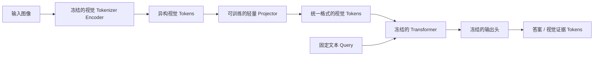
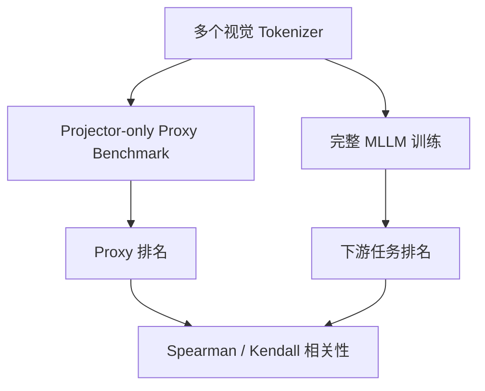

# Tokenizer–Transformer 接口兼容性 Benchmark

## 1. 问题

现有视觉 tokenizer 评测大致分为两类：

- **重建评测**：使用原生 decoder 还原图像，计算 PSNR、LPIPS、rFID、OCR 等指标。
- **下游 MLLM 评测**：将 tokenizer encoder 输出接入 projector 和语言模型，通过完整训练评估 VQA、OCR、caption 等任务。

两者之间存在明显缺口：

1. 下游 MLLM 通常只使用 encoder，不使用 tokenizer 的原生 decoder。
2. 重建结果同时受 encoder 和 decoder 影响，无法单独反映 encoder 质量。
3. 完整 MLLM 训练成本高，不适合作为大规模 tokenizer 筛选方法。
4. linear probing 只能测简单可分性，不能充分反映视觉 token 是否容易被 Transformer 读取和组合。

因此，目标不是再做一个重建 benchmark，而是低成本测量：

> 视觉 tokenizer 的输出能否通过一个轻量接口，被固定 Transformer 有效读取。

---

## 2. 核心设计

对每个待测 tokenizer，仅训练一个受限 projector，其余模块全部冻结。



形式化表示为：

\[
\hat y =
H_{\mathrm{fixed}}
\left(
T_{\mathrm{fixed}}
\left(
P_i(E_i(x)), q
\right)
\right)
\]

其中：

- \(E_i\)：第 \(i\) 个视觉 tokenizer 的 encoder；
- \(P_i\)：该 tokenizer 对应的轻量 projector；
- \(T_{\mathrm{fixed}}\)：固定的小型 Transformer；
- \(H_{\mathrm{fixed}}\)：固定语言头或分类头；
- \(q\)：固定格式的任务 query；
- \(\hat y\)：答案 token 或结构化视觉证据。

训练时只更新 \(P_i\)。

---

## 3. 输出形式

最终输出不应是图像，也不应是无监督隐藏向量，而应是带有明确监督目标的结果，例如：

- OCR 字符或文本 token；
- 物体类别与属性；
- 数量；
- 左右、上下、遮挡等空间关系；
- 简短 VQA 答案；
- 区域对应的离散语义标签。

这样可以避免两个问题：

- 输出图像会重新退化为重建 benchmark；
- 输出隐藏向量缺少统一目标，难以直接比较。

---

## 4. Projector 约束

不同 tokenizer 的 token 数量、通道维度和空间结构不同，因此每个 tokenizer 需要独立 projector，但其能力必须严格受限。

建议统一为：

```text
输入维度适配
→ LayerNorm
→ Token-wise Linear
→ 固定插值或轻量 Resampler
→ 统一长度和维度
```

统一输出形状：

\[
P_i(E_i(x))\in\mathbb{R}^{B\times N_0\times d}
\]

需要控制：

- projector 架构；
- 参数量；
- 初始化；
- 训练数据；
- 训练步数；
- 优化器与学习率；
- 输出 token 数 \(N_0\)；
- 输出维度 \(d\)。

若 projector 过强，它可能自行完成大部分视觉建模，使评测失去意义。

---

## 5. 任务划分

### Local Evidence

关注细节信息：

- 场景文字；
- 小物体；
- 局部颜色与属性；
- 字符、数字和符号。

对应下游：

- TextVQA；
- DocVQA；
- ChartQA；
- OCRBench。

### Structural Evidence

关注 token 之间的组合关系：

- 数量；
- 相对位置；
- 区域匹配；
- 表格和文档布局；
- 局部到全局的关系组合。

### Semantic Evidence

关注高层视觉语义：

- 物体和场景类别；
- 简短描述；
- 通用 VQA；
- 属性与关系判断。

---

## 6. 数据集设计

与 ImageNet “一张图对应一个类别”不同，下面多数数据集为一张图提供多层结构化标注，例如物体框、像素 mask、文字转录、场景图或表格结构。Benchmark 将它们统一转换为：

\[
(x, q, y, m)
\]

其中 \(x\) 是图像，\(q\) 是固定格式的 query，\(y\) 是简短目标标签，\(m\) 保存原始框、mask 或生成程序等证据。数据预算按唯一图像或页面计算，而不是按 QA 数量计算。

### 6.1 数据配比

| 数据来源 | 数量 | 主要能力 |
|---|---:|---|
| [Open Images V7](https://storage.googleapis.com/openimages/web/factsfigures_v7.html) | 4k | 对象、属性、小目标、真实关系 |
| [ADE20K](https://github.com/CSAILVision/ADE20K) | 2k | 场景区域、部件、密集空间结构 |
| [HierText](https://github.com/google-research-datasets/hiertext) + 合成文字 | 4k | OCR、文字位置、局部细节 |
| [CLEVR/CoGenT](https://web.eecs.umich.edu/~justincj/clevr/) + [CVR](https://github.com/serre-lab/CVR) | 4k | 计数、关系、组合泛化 |
| [PlotQA](https://iitmnlp.github.io/PlotQA/) + [FigureQA](https://www.microsoft.com/en-us/research/project/figureqa-dataset/) | 3k | 图表元素、数值、坐标关系 |
| [DocLayNet](https://github.com/DS4SD/DocLayNet) + [PubTables-1M](https://github.com/microsoft/table-transformer) | 3k | 文档布局、表格结构 |
| **合计** | **20k** | |

### 6.2 每个数据集的原始标签与评测目标

| 数据集 | 一张图原本带有什么标注 | 转换成的样本示例 |
|---|---|---|
| Open Images V7 | 图像级多标签，例如 `{Person, Dog, Ball}`；物体类别和框；部分图像还有 mask 与 `(Person, holds, Ball)` 关系三元组 | `EXISTS(Dog) → yes`；`LOCATE(Ball) → grid_7`；`RELATION(Person, Ball) → holds` |
| ADE20K | 每个像素的物体或 stuff 类别，例如 `wall/floor/chair/window`；对象实例、轮廓和部件层级 | `LABEL_AT(grid_6) → chair`；`PART_OF(backrest) → chair`；`AREA_COMPARE(window, door) → smaller` |
| HierText | word、line、paragraph 三层 polygon，每个单词的真实转录和层级归属，例如某个框内是 `STOP` | `READ_WORD(region_3) → STOP`；`TEXT_LOCATE(STOP) → grid_2`；`READ_CHAR(region_3, 2) → T` |
| 合成文字 | 渲染字符串、每个字符的内容与精确位置，以及字体、大小、透视和噪声参数 | `READ_WORD → A7K9`；`CHAR_AT(3) → K`；`COUNT_CHAR → 4` |
| CLEVR/CoGenT | 完整场景图；每个物体的 `shape/color/size/material/3D position`，以及 `left/right/front/behind` 关系 | `COUNT(red cube) → 2`；`ATTRIBUTE(object_2) → metal`；`RELATION(a,b) → left` |
| CVR | 四幅抽象图构成一道 odd-one-out 题，同时给出所属的组合规则 ID | 随机打乱四幅图后，`ODD_ONE_OUT → A/B/C/D`。原数据的异常项固定在第四位，因此打乱是必需的 |
| PlotQA | plot 图像、底层数据表、标题/坐标轴/图例文字，以及基于数据表生成的问题和答案 | `VALUE(series_A, 2010) → 37`；`COMPARE(A_2010, B_2010) → greater`；`ARGMAX(series_A) → 2014` |
| FigureQA | 合成图表的结构化元数据，以及图形关系陈述的 yes/no 标签 | `IS_ABOVE(red, blue) → yes`；`HAS_MAXIMUM(green) → no` |
| DocLayNet | 页面中 11 类布局区域的框和类别，如 `Title/Text/Table/Picture/Formula/Caption` | `REGION_TYPE(grid_4) → Table`；`LOCATE(Title) → top`；`ORDER(Title, Text) → before` |
| PubTables-1M | 表格框、行、列、单元格、列表头、投影行表头和跨行/跨列单元格的框 | `ROW_COUNT → 6`；`CELL_POSITION(region_5) → row_2_col_3`；`IS_COLUMN_HEADER(region_1) → yes` |

因此，这里的直接类比是：ImageNet 的目标可能是 `cat`，而本 benchmark 中的目标依据任务可能是 `dog`、`yes`、`2`、`left`、`STOP`、`grid_7` 或 `Table`。目标仍然是明确的监督标签，只是由固定 query 指定当前需要读出图像的哪一部分信息。

### 6.3 样本抽取约束

- 4k HierText + 合成文字默认各占 2k；CLEVR/CoGenT 占 3k，CVR 占 1k。
- PlotQA/FigureQA 和 DocLayNet/PubTables-1M 在各自 3k 预算内默认各占一半。
- 每个唯一图像在一个预算子集中只计一次，并固定一个主 query，避免将同一张图的大量 QA 误当成大量独立样本。
- \(1k/5k/20k\) 使用同一个分层排序 manifest 的前缀，保证 \(D_{1k}\subset D_{5k}\subset D_{20k}\)。
- Open Images 仅在原标注明确时使用关系或属性标签；不从 caption 或外部模型猜测新标签。计数任务主要使用 CLEVR，避免真实图像漏标造成错误数量。

---

## 7. 评测指标

不只比较最终准确率，还应比较 projector 的学习效率。

在不同数据预算下训练：

\[
n\in\{1k, 5k, 20k\}
\]

记录：

- Accuracy / ANLS / VQA Score；
- validation loss；
- 达到固定性能所需样本数；
- 性能—数据量曲线下面积。

定义：

\[
\mathrm{InterfaceScore}_i
=
\operatorname{AUC}_{\log n}
\left[
\mathrm{Performance}_i(n)
\right]
\]

该指标衡量：

> 一个 tokenizer 的视觉 token 是否能被固定 Transformer 以较低样本和较小接口成本读懂。

---

## 8. 与完整 MLLM 的验证

Benchmark 的目标不是单独获得高分，而是预测完整 MLLM 下游表现。

实验流程：



建议分别验证：

\[
\text{Local Score}
\leftrightarrow
\text{OCR 类下游}
\]

\[
\text{Structural Score}
\leftrightarrow
\text{关系与图表类下游}
\]

\[
\text{Semantic Score}
\leftrightarrow
\text{VQA 与 Caption 类下游}
\]

同时进行：

- 单任务相关性；
- 分组任务相关性；
- 总体排名相关性；
- leave-one-tokenizer-family-out；
- 跨 Transformer 验证。

---

## 9. 创新边界

“冻结视觉 encoder 和语言模型，只训练 projector”本身不是新结构。真正的贡献应放在：

1. 面向异构 visual tokenizer 的统一接口协议；
2. 将 Transformer 可读性定义为独立评测对象；
3. 使用受限 projector 的低样本学习曲线衡量接口兼容性；
4. 系统验证该指标对完整 MLLM 排名的预测能力；
5. 分离局部细节、结构关系和高层语义三类能力。

---

## 10. 一句话定位

> 冻结视觉 tokenizer 与 Transformer，仅训练统一规格的轻量 projector，通过标准化视觉证据任务测量 token 的 Transformer 可读性，并用其低成本预测完整 MLLM 的下游表现。
